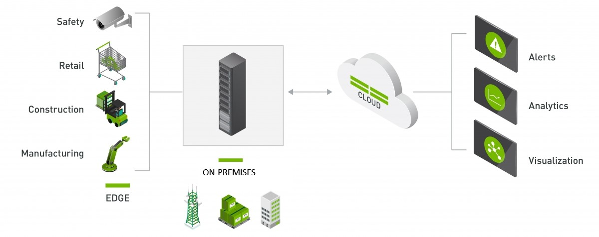

Every day, video cameras produce volumes of data in popular business domains.  These areas include hospital, manufacturing, retail, and smart city environments. Many of these deployments can be enhanced further with the addition of Artificial Intelligence that operates on the data produced by these camera sensors in real-time.  Imagine having the ability to monitor enforcement of health advisories, adherence to safety protocols at job sites, adapting to customer demographics, or responding to traffic events in an automated fashion.  All of these scenarios can be accomplished using video-based solutions that apply Artificial Intelligence to Internet of Things devices deployed at the edge.

We refer to these types of solutions as Intelligent Video Analytics (IVA) applications, whose aim is to extract actionable insights through enactment of computer vision algorithms that operate on live video frames.  The types of computer vision algorithms employed can include object detection, image classification, and object tracking:  

| Computer Vision Algorithm  | Capabilities  |
|---|---|
| **Object Detection**  | Object detection models are trained to classify individual objects within an image, and identify their location with a bounding box. For example, a traffic monitoring solution might use object detection to identify the location of different classes of vehicle.  |
| **Image Classification**  | Image classification involves training a machine learning model to classify images based on their contents. For example, in a traffic monitoring solution you might use an image classification model to classify images based on the type of vehicle they contain, such as taxis, buses, cyclists, and so on.  |
| **Object Tracking**   |  Object tracking can be applied to an object detected using object detection, where it is assigned an identity that can be referenced through successive inference passes in an IVA pipeline, for example counting unique instances of people in an area.  |

We can perform powerful assessments using these algorithms in combination with each other to achieve functionality known as "cascading inference".  An example of this technique could like the following: identify a vehicle along with its location in the frame using object detection, employ a tracker that assigns the vehicle a unique ID to provide a count of the number of vehicles that have entered the area, then apply an image classification model to determine the vehicle's color.

Once we are able to generate insights in this fashion, we can employ more services to make use of this data by offloading to cloud services in Microsoft Azure where data can be live-processed, trigger automation tasks, or archived for historic analysis.  

## Enabling Development of Intelligent Video Analytics Applications with NVIDIA DeepStream and Microsoft Azure

NVIDIA DeepStream enables the development of Intelligent Video Analytics applications using a multi-platform framework that can be deployed on the edge and connect to cloud services.  This framework can enable you to visually define IVA pipelines using an included development tool called the "NVIDIA Graph Composer".  This tool can allow you to define video sources from File, Local Camera, or Networked RTSP video streams that can feed directly into single or cascading inference operations. These operations produce insights that can then be forwarded on to cloud services for further processing.  By performing the computationally heavy inference tasks locally at the edge, we can reduce the amount of data needed to transmit insights and telemetry to the cloud.

## Hardware and Operating System Requirements

In order to proceed with this module, it is required that you have access to an X86/AMD64 based machine running [Ubuntu 18.04](http://releases.ubuntu.com/18.04/). You will want to ensure that your development machine that has one of the following graphics cards installed and present:

### DeepStream 6.0 Compatible GPUs

* [RTX2080](https://www.nvidia.com/en-us/geforce/graphics-cards/rtx-2080/)  
* [RTX3080](https://www.nvidia.com/en-us/geforce/graphics-cards/30-series/rtx-3080-3080ti/)
* [Tesla T4](https://www.nvidia.com/en-us/data-center/tesla-t4/)
* [Ampere A100](https://www.nvidia.com/en-us/data-center/a100/)

    >[!NOTE]
    >If you intend on using a Virtual Machine to satisfy these requirements, it is possible that you may encounter issues later on in this learning path when attempting to launch the NVIDIA Graph Composer application if you are connecting to your VM over a remote session.  You will still be able to proceed through the learning modules, but we want to ensure that you are aware of this [issue](https://forums.developer.nvidia.com/t/graph-composer-unable-to-start-during-rdp-session-on-azure-vm-with-tesla-t4/186966) should you be considering this option.

### Try this

Consider scenarios where computer vision could be employed to aid in automating a task or simplifying a traditionally complex process.  What would your video feeds need to see?  What computer vision algorithms would need to be employed to satisfy your solution (object detection, image classification, object tracking)?
