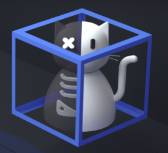

In this module you are going to learn how to build a quantum random number
generator, which happens to be a perfect example to introduce the Quantum 
Development Kit to combine quantum and classical programs.

One of most direct the applications of quantum devices is the generation of 
verified random numbers. We can perform measurements on quantum systems to 
obtain pure random values.

 

In Schrödinger's cat thought experiment, if we open the box to check if the
cat is dead or alive, the quantum state of the cat randomly collapses into one 
of the two classical states. Since the state of the cat can be encoded with a
single bit (0 -> Alive, 1 -> Dead), when we open the box we're generating a
random bit.

We can encode any random integer or float into a bit-string, depending on the
number of decimals and size of our number. Therefore, to generate pure random
numbers we just need to generate many pure random bits.

In real life, cats can't be put in a quantum superposition (and of course we
don't want to possibly kill many cats to generate a random number). However, the
basic elements of quantum computers, the qubits, can be driven to a quantum
superposition and measured like when we open the cat's box.

## Learning objectives

In this module, you will:

- Learn to build a quantum random number generator with the QDK.
- Learn to combine Q# programs with a classical host program in Python.
- Learn to put qubits in superposition with Q#.
- Learn to perform qubit measurements with the QDK.