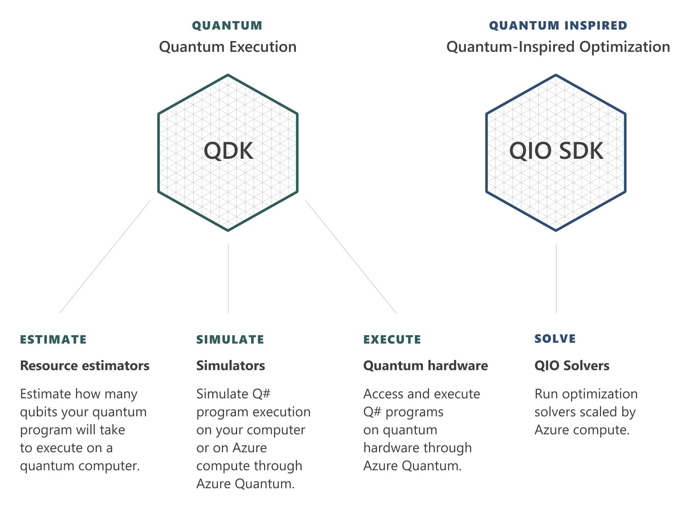

Keep in mind that the programs you ran here use a _simulator_ to mimic quantum behavior. It is a perfect way to experiment with and verify your quantum algorithms before you run your programs on real quantum hardware.

When you're ready to run your programs on real quantum hardware, there's Azure Quantum, a quantum computing service that runs on Azure.

Azure Quantum is currently in private preview, available for running compute jobs. It will be made available for the public soon. Here's a preview of what to expect.

## What's included on Azure Quantum?

**Quantum-inspired solutions**: If you want the ability to solve large, complex optimization problems at scale, then you can explore quantum-inspired solvers from Microsoft and partners such as 1QBit.

These techniques emulate certain processes from quantum physics using classical hardware today.

**Quantum software**: If you're interested in developing quantum software, then Azure Quantum offers a suite of tools that help you express your algorithms using the Quantum Development Kit and Q#.

There are tools for simulating your programs so that you can test the behavior and performance of your code. In addition, there are tools such as the resource estimator, which helps you understand the resources that your code would require. In terms of a quantum program, this tells you the types of quantum gates you use, and how many.

Using these tools together helps you understand the features of a quantum computer that you'd need in order to run your program, such as the number of qubits. From a software engineering perspective, it also helps you iterate and improve your code, so that you can reduce the resource requirements necessary to run it.

For more detail on how this is done in practice, check out Dave Wecker's talk on [Achieving Practical Quantum Computing](https://cloudblogs.microsoft.com/quantum/2018/06/01/achieving-practical-quantum-computing/?azure-portal=true).

**Quantum hardware**: After you have a quantum program that you'd like to run on quantum hardware, you can choose from a range of compute options that best fits your needs.

For example, there are trapped ion quantum computers from IonQ and Honeywell. There are also quantum computers built from superconducting circuits from QCI.

## What are Azure Quantum Workspaces?

**TODO:** "Workspaces" (capital 'W') or "workspaces"?

Like other Azure services, you need to deploy an Azure Quantum resource into your Azure subscription in order to use the service.

This resource is called a _workspace_, and is a collection of assets that are associated with executing a quantum or quantum-inspired workload, such as the problem format, data, and compute target.

Here's a brief overview of some of the terminology that's associated with a quantum workspace.

**Target**: The type of target you use depends on the type of program you want to run.

For quantum programs, your target will either be quantum hardware or a quantum simulator. For quantum-inspired problems, your target will typically be the solvers, you wish to run.

**Provider**: Once you've decided on the type of target you need to use, you can enable different providers in your workspace who offer that target.

For example, if you need quantum hardware, you could choose to enable IonQ, Honeywell, and QCI in your workspace and run your Q# program on each of their respective hardware types.

Every workspace comes with the Microsoft provider always enabled, and you can select which third party providers you'd like to add.

**Jobs**: When you execute a quantum program or solve a QIO problem on Azure Quantum, you're creating and running a job.

A job consists of:

* An ID that's unique within your workspace.
* The provider that you want to execute your job.
* The target that you want to execute your job on.
* A name that you choose to help you organize your jobs.
* Any input parameters that your target requires.

Azure Quantum provides information about the state of your job and its execution history.

**Billing**: When you enable a provider in your workspace, you also select the billing plan for that provider. The billing plan defines how you're billed for jobs against that provider.

Each provider may have different billing plans and methods available. While you may only select a single billing plan for a specific provider in a single workspace, you can deploy to multiple workspaces within your Azure subscription.

