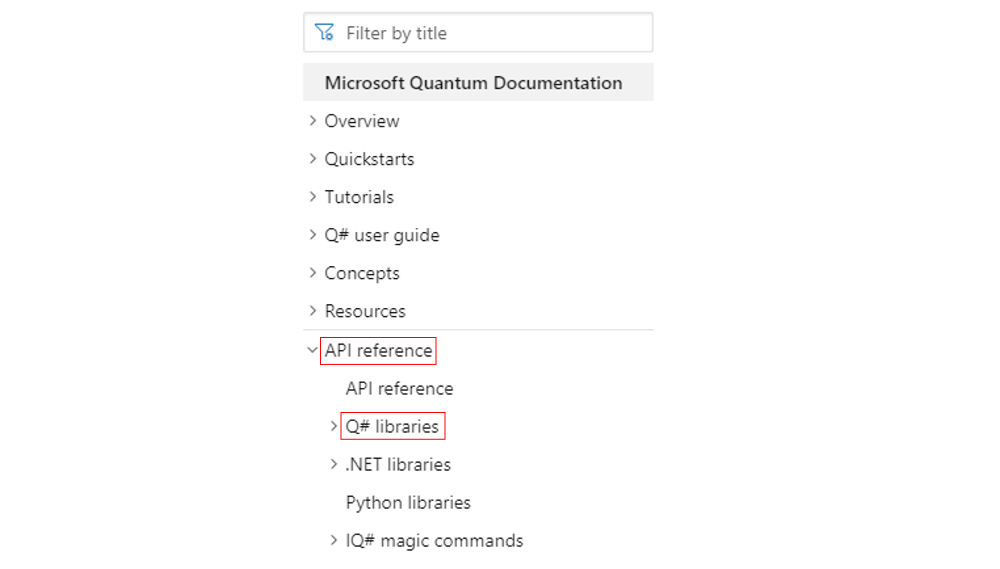

When working with nearly any programming language, one of the most important development tools at your disposal is the API documentation itself.
In this unit, you will familiarize yourself with the Q# API documentation: where to find it and how to read it. 

## Where is it?

The official documentation for the Q# libraries can be found from the [Microsoft Quantum Documentation](https://docs.microsoft.com/quantum/?view=qsharp-preview) homepage, under the **API reference** tab in the table of contents:



### Other API references

Alongside **Q# libraries**, notice there are a few other sets of API documentation. 
We won't focus on them here, but note that they concern various other parts of the QDK:
- *.NET libraries* contains references for the trace simulator target machine and the *.NET* quantum chemistry library (those parts of the quantum chemistry library which are represented outside the Q# program).
- *Python libraries* contains details regarding integration with Python as a host program.
- *IQ# magic commands* contains the magic commands that can be used in Jupyter Notebooks (e.g. `%package` used to add a package to the workspace).

### Q# library API references

In the **Q# libraries** dropdown, you find the documentation for all of the Q# libraries (i.e. the operations, functions, and user-defined types) organized by namespace:


> [!NOTE]
> QUESTION TO REVIEWERS: Should we mention that namespaces don't necessarily correspond directly to library? Or at least specify what namespaces are part of the standard libs?

### Looking for something in particular?

Looking for a specific callable or type? 
Use the *Filter by title* box above the table of contents—it includes the API references and can take you straight to the right page.
We'll be using the `ControlledOnInt` function later in the module, so lets take it as our example:


## Where does it come from?

The API documentation is automatically generated from the documentation comments within the Q# source code. 
For the Q# libraries, this is located in the GitHub repository [microsoft/QuantumLibraries](https://github.com/microsoft/QuantumLibraries).

To see how the generation translates from the source, let's keep getting familiar with `ControlledOnInt`.
Compare the [API reference page](https://docs.microsoft.com/qsharp/api/qsharp/microsoft.quantum.canon.controlledonint?view=qsharp-preview) to the corresponding [source code](https://github.com/microsoft/QuantumLibraries/blob/main/Standard/src/Canon/Utils/ControlledOnBitString.qs):

```qsharp
    /// # Summary
    /// Returns a unitary operator that applies an oracle on the target register
    /// if the control register state corresponds to a specified positive integer.
    ///
    /// # Input
    /// ## numberState
    /// Positive integer.
    /// ## oracle
    /// Unitary operator.
    ///
    /// # Output
    /// A unitary operator that applies `oracle` on the target register if the
    /// control register state corresponds to the number state `numberState`.
    ///
    /// # Remarks
    /// The value of `numberState` is interpreted using a little-endian encoding.
    function ControlledOnInt<'T>(numberState : Int, oracle : ('T => Unit is Adj + Ctl))
    : ((Qubit[], 'T) => Unit is Adj + Ctl) {
        return ApplyControlledOnInt(numberState, oracle, _, _);
    }
```

## What does it tell me?

Video explanation instead of this and above?


