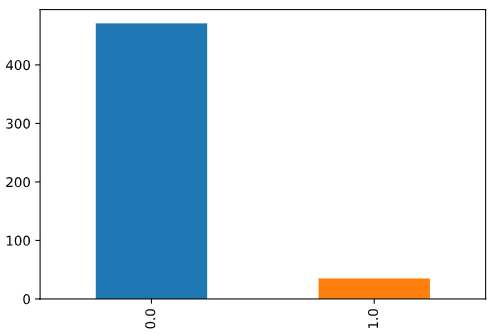
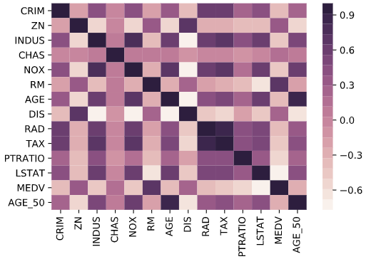
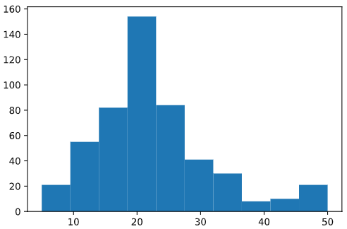
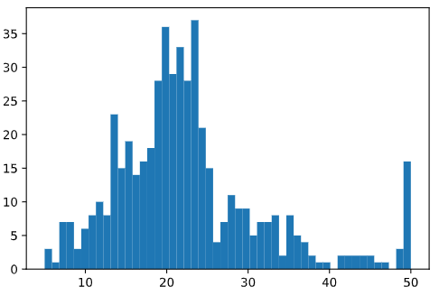
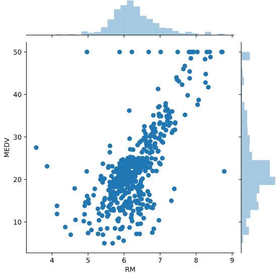
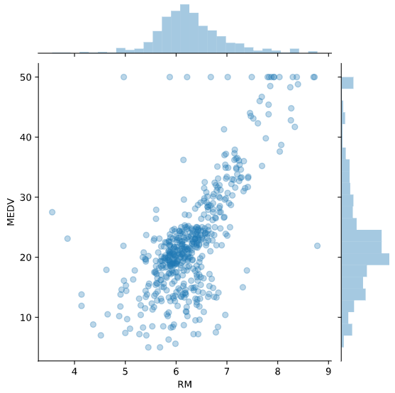
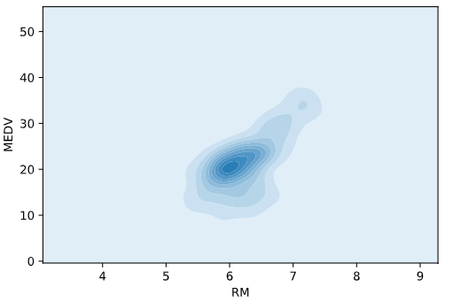
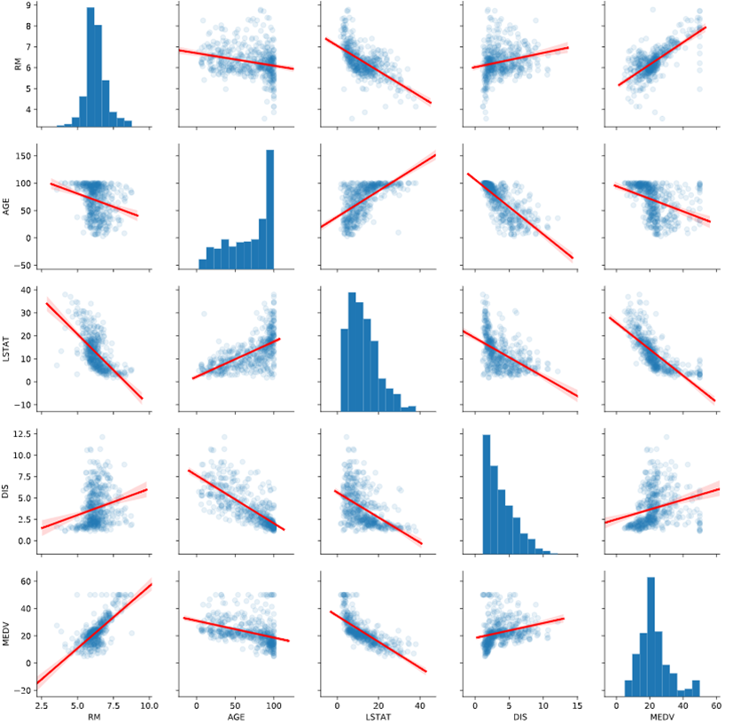

An old joke goes: “What does a data scientist see when they look at a dataset? A bunch of numbers.” There is more than a little truth in that joke. Visualization often is the key to finding patterns and correlations in your data. Although a visualization often can't deliver precise results, it can point you in the right direction to ask better questions and efficiently find value in the data.

Often when probing a new dataset, it's invaluable to get high-level information about what the dataset holds. Earlier in this module, we discussed using methods like `DataFrame.info`, `DataFrame.head`, and `DataFrame.tail` to examine some aspects of a DataFrame. Although these methods are critical, on their own they often are insufficient to get enough information to know how to approach a new dataset. This is where exploratory statistics and visualizations for datasets come in.

To see what we mean in terms of gaining exploratory insight—both visually and numerically—let's dig into one of the datasets that come with the scikit-learn library, the Boston Housing Dataset. First, load the dataset from a CSV file:

```python
df = pd.read_csv('Data/housing_dataset.csv')
df.head()
```

Here's what is returned:


This dataset contains information that was collected from the U.S Census Bureau about housing in the area of Boston, Massachusetts. The dataset was first published in 1978. The dataset has 14 columns:

* **`CRIM`**: Per-capita crime rate by town
* **`ZN`**: Proportion of residential land zoned for lots larger than 25,000 square feet
* **`INDUS`**: Proportion of non-retail business acres per town
* **`CHAS`**: Charles River dummy variable (= 1 if tract bounds river; 0 otherwise)
* **`NOX`**: Nitric oxides concentration (parts per 10 million)
* **`RM`**: Average number of rooms per dwelling
* **`AGE`**: Proportion of owner-occupied units built before 1940
* **`DIS`**: Weighted distances to five Boston employment centers
* **`RAD`**: Index of accessibility to radial highways
* **`TAX`**: Full-value property tax rate per \$10,000
* **`PTRATIO`**: Pupil-teacher ratio by town
* **`LSTAT`**: Percent of lower-status portion of the population
* **`MEDV`**: Median value of owner-occupied homes in \$1,000s

One of the first methods we can use to better understand this dataset is `DataFrame.shape`. 

To find out how many rows and columns the dataset contains, run this command:

```python
df.shape
```

Here's the output:

```output
(506, 13)
```

The dataset has 506 rows and 13 columns.

To get a better idea of the contents of each column, we can use `DataFrame.describe`. `DataFrame.describe` returns the maximum value, minimum value, mean, and standard deviation of numeric values in each column, and the quartiles for each column:

```python
df.describe()
```

Here's the output, which shows all the values:


Because a dataset can have only so many columns, often it can be useful to transpose the results of `DataFrame.describe` to use them better.

Note that you can also examine specific descriptive statistics for columns without invoking `DataFrame.describe`.

To get the mean of the median value of owner-occupied homes in the dataset (in $1,000s), run this command:

```python
df['MEDV'].mean()
```

Here's the output:

```output
22.532806324110698
```

The mean of the median value of a home is approximately $22,500.

To get the maximum of the median value of owner-occupied homes in the dataset (in $1,000s), run this command:

```python
df['MEDV'].max()
```

Here's the output:

```output
50.0
```

The maximum of the median value is around $50,000.

Next, to get the median of `AGE`, the proportion of owner-occupied units built before 1940, run this command:

```python
df['AGE'].median()
```

The output shows that 77.5% is the median of `AGE`:

```output
77.5
```

### Try it yourself

> [!NOTE]
> **To Sarah** - TBD: Could you provide the hint or solution for this exercise?

Now, find the maximum value in `df['AGE']`.

<details>
  <summary>Hint <i>(expand to reveal)</i></summary>
  
Add hint... TBD.
</details>

Other information that you often will want to see is the relationship between different columns. To do this, use the `DataFrame.groupby` method. For example, you could examine the average `MEDV` (median value of owner-occupied homes) for each value of `AGE` (proportion of owner-occupied units built prior to 1940):

```python
df.groupby(['AGE'])['MEDV'].mean()
```

Here's the output:

```output
AGE
2.9      26.600000
6.0      24.100000
6.2      23.400000
6.5      24.700000
6.6      24.750000
6.8      29.600000
7.8      23.250000
8.4      42.800000
8.9      24.800000
9.8      23.700000
9.9      31.100000
10.0     29.000000
13.0     24.400000
13.9     32.900000
14.7     24.600000
15.3     34.900000
15.7     42.300000
15.8     34.900000
16.3     25.200000
17.0     46.700000
17.2     22.600000
17.5     23.950000
17.7     33.100000
17.8     23.500000
18.4     25.150000
18.5     21.150000
18.8     29.100000
19.1     20.900000
19.5     20.600000
20.1     22.500000
           ...    
95.8     18.800000
96.0     13.500000
96.1     25.450000
96.2     27.966667
96.4     14.900000
96.6     11.700000
96.7     17.050000
96.8     50.000000
96.9     13.500000
97.0     14.033333
97.1     19.800000
97.2     17.100000
97.3     17.533333
97.4     24.133333
97.5     50.000000
97.7     19.600000
97.8     11.800000
97.9     18.250000
98.0      8.100000
98.1     10.400000
98.2     24.150000
98.3     10.000000
98.4     16.350000
98.5     19.400000
98.7     14.100000
98.8     14.500000
98.9     13.066667
99.1     10.900000
99.3     17.800000
100.0    16.920930
Name: MEDV, Length: 356, dtype: float64
```

### Try it yourself

> [!NOTE]
> **To Sarah** - TBD: Could you provide the hint or solution for this exercise?

Now try to find the median value for `AGE` for each value of `MEDV`.

<details>
  <summary>Hint <i>(expand to reveal)</i></summary>
  
Add hint... TBD.
</details>

You can also apply a lambda function to each element of a DataFrame column by using the `apply` method. For example, say you wanted to create a new column that flagged a row if more than 50 percent of owner-occupied homes were build before 1940:

```python
df['AGE_50'] = df['AGE'].apply(lambda x: x>50)
```

Once applied, you also can see how many values returned `true` and how many `false` by using the `value_counts` method:

```python
df['AGE_50'].value_counts()
```

Here's the output:

```output
True     359
False    147
Name: AGE_50, dtype: int64
```

You can also examine figures from the `groupby` statement you created earlier:

```python
df.groupby(['AGE_50'])['MEDV'].mean()
```

Here's the output:

```output
AGE_50
False    26.693197
True     20.829248
Name: MEDV, dtype: float64
```

You can also group by more than one variable, such as `AGE_50` (the one you just created), `CHAS` (whether a town is on the Charles River), and `RAD` (an index that measures access to the Boston-area radial highways), and then evaluate each group for the average median home price in that group:

```python
groupby_twovar=df.groupby(['AGE_50','RAD','CHAS'])['MEDV'].mean()
```

You can then see what values are in this stacked group of variables:

```python
groupby_twovar
```

Here's the output:

```output
AGE_50  RAD   CHAS
False   1.0   0.0     24.666667
              1.0     50.000000
        2.0   0.0     33.300000
        3.0   0.0     26.505556
        4.0   0.0     25.376744
              1.0     32.900000
        5.0   0.0     26.302857
              1.0     46.000000
        6.0   0.0     23.575000
        7.0   0.0     28.563636
        8.0   0.0     29.220000
        24.0  0.0     20.766667
True    1.0   0.0     20.185714
        2.0   0.0     24.170588
        3.0   0.0     29.350000
              1.0     27.950000
        4.0   0.0     17.879661
              1.0     21.560000
        5.0   0.0     25.124638
              1.0     25.610000
        6.0   0.0     19.822222
        7.0   0.0     24.433333
        8.0   0.0     32.321429
              1.0     26.000000
        24.0  0.0     15.306612
              1.0     31.362500
Name: MEDV, dtype: float64
```

Let's take a moment to analyze these results in more depth. The first row reports that communities with less than half of houses built before 1940, with a highway-access index of 1, and that are not situated on the Charles River have a mean house price of $24,667 (1970s dollars). The next row shows that communities that are similar to the first row, except for being located on the Charles River, have a mean house price of $50,000.

One insight that pops out from continuing down this is that, all else being equal, being located next to the Charles River can significantly increase the value of newer housing stock. The story is more ambiguous for communities dominated by older houses: proximity to the Charles significantly increases home prices in one community (and that one presumably farther away from the city). For all others, being situated on the river either provided a modest increase in value or actually decreased mean home prices.

Although groupings like this can be a great way to begin to interrogate your data, you might not care for the tall format it comes in. In that case, you can unstack the data into a wide format:

```python
groupby_twovar.unstack()
```

Here's the output:

ktoliver TO DO/in progress

### Try it yourself

> [!NOTE]
> **To Sarah** - TBD: Could you provide the hint or solution for this exercise?

How could you use `groupby` to get a sense of the proportion of residential land zoned for lots larger than 25,000 sq.ft., the proportion of non-retail business acres per town, and the distance of towns from employment centers in Boston?

<details>
  <summary>Hint <i>(expand to reveal)</i></summary>
  
Add hint... TBD.
</details>

It's often valuable to know how many unique values a column has in it by using the `nunique` method:

```python
df['CHAS'].nunique()
```

Here's the output:

```output
2
```

Complementary to that, you also likely will want to know what those unique values are, which is where the `unique` method helps:

```python
df['CHAS'].unique()
```

Here's the output:

```output
array([0., 1.])
```

You can use the `value_counts` method to see how many of each unique value there are in a column:

```python
df['CHAS'].value_counts()
```

Here's the output:

```output
0.0    471
1.0     35
Name: CHAS, dtype: int64
```

Or you can easily plot a bar graph to visually see the breakdown:

```python
df['CHAS'
%matplotlib inline
df['CHAS'].value_counts().plot(kind='bar')
```

Here's the output:

```output
<matplotlib.axes._subplots.AxesSubplot at 0x12cddbed0>
```



> [!NOTE]
> The IPython magic command `%matplotlib inline` enables you to view the chart inline.

Let's pull back from the dataset as a whole for a moment. Two major things that you will look for in almost any dataset are trends and relationships. A typical relationship between variables to explore is the Pearson correlation, or the extent to which two variables are linearly related. The `corr` method will show this in table format for all of the columns in a DataFrame:

```python
df.corr(method='pearson')
```

Here's the output:


Suppose you want to look only at the correlations between all the columns and one variable? Let's examine only the correlation between all other variables and the percentage of owner-occupied houses build before 1940 (`AGE`). We will do this by accessing the column by index number:

```python
corr = df.corr(method='pearson')
corr_with_homevalue = corr.iloc[-1]
corr_with_homevalue[corr_with_homevalue.argsort()[::-1]]
```

Here's the output:

```output
AGE_50     1.000000
AGE        0.870348
NOX        0.597644
INDUS      0.516001
LSTAT      0.468146
TAX        0.381395
RAD        0.361191
CRIM       0.254574
PTRATIO    0.236216
CHAS       0.088659
RM        -0.164465
MEDV      -0.289750
ZN        -0.590769
DIS       -0.673813
Name: AGE_50, dtype: float64
```

With the correlations arranged in descending order, it's easy to start to see some patterns. Correlating `AGE` with a variable we created from `AGE` is a trivial correlation. However, it is interesting to note that the percentage of older housing stock in communities strongly correlates with air pollution (`NOX`) and the proportion of non-retail business acres per town (`INDUS`). This tells us that, at least in 1978 metro Boston, older towns are more industrial.

Graphically, we can see the correlations by using a heatmap from the Seaborn library:

```python
import seaborn as sns
sns.heatmap(df.corr(),cmap=sns.cubehelix_palette(20, light=0.95, dark=0.15))
```

Here's the output:

```output
<matplotlib.axes._subplots.AxesSubplot at 0x12e168ad0>
```



Histograms are another valuable tool for investigating your data. For example, what is the overall distribution of prices of owner-occupied houses in the Boston area?

```python
import matplotlib.pyplot as plt
plt.hist(df['MEDV'])
```

Here's the output:

```output
(array([ 21.,  55.,  82., 154.,  84.,  41.,  30.,   8.,  10.,  21.]),
 array([ 5. ,  9.5, 14. , 18.5, 23. , 27.5, 32. , 36.5, 41. , 45.5, 50. ]),
 <a list of 10 Patch objects>)
```



The default bin size for the matplotlib histogram (essentially big of buckets of percentages that you include in each histogram bar in this case) is pretty large and might mask smaller details. To get a finer-grained view of the AGE column, you can manually increase the number of bins in the histogram:

```python
plt.hist(df['MEDV'],bins=50)
```

Here's the output:

```output
(array([ 3.,  1.,  7.,  7.,  3.,  6.,  8., 10.,  8., 23., 15., 19., 14.,
        16., 18., 28., 36., 29., 33., 28., 37., 21., 15.,  4.,  7., 11.,
         9.,  9.,  5.,  7.,  7.,  8.,  2.,  8.,  5.,  4.,  2.,  1.,  1.,
         0.,  2.,  2.,  2.,  2.,  2.,  1.,  1.,  0.,  3., 16.]),
 array([ 5. ,  5.9,  6.8,  7.7,  8.6,  9.5, 10.4, 11.3, 12.2, 13.1, 14. ,
        14.9, 15.8, 16.7, 17.6, 18.5, 19.4, 20.3, 21.2, 22.1, 23. , 23.9,
        24.8, 25.7, 26.6, 27.5, 28.4, 29.3, 30.2, 31.1, 32. , 32.9, 33.8,
        34.7, 35.6, 36.5, 37.4, 38.3, 39.2, 40.1, 41. , 41.9, 42.8, 43.7,
        44.6, 45.5, 46.4, 47.3, 48.2, 49.1, 50. ]),
 <a list of 50 Patch objects>)
```



Seaborn has a somewhat more attractive version of the standard matplotlib histogram: the distribution plot. This is a combination histogram and kernel density estimate (KDE) plot (essentially a smoothed histogram):

```python
sns.distplot(df['MEDV'])
```

Here's the output:

```output
<matplotlib.axes._subplots.AxesSubplot at 0x12dde6bd0>
```


Another commonly used plot is the Seaborn `jointplot`, which combines histograms for two columns along with a scatterplot:

```python
sns.jointplot(df['RM'], df['MEDV'], kind='scatter')
```

Here's the output:

```output
<seaborn.axisgrid.JointGrid at 0x12e0f35d0>
```



Unfortunately, many of the dots print over each other. You can help address this by adding some alpha blending, a figure that sets the transparency for the dots so that concentrations of them drawing over one another will be apparent:

```python
sns.jointplot(df['RM'], df['MEDV'], kind='scatter', alpha=0.3)
```

Here's the output:

```output
<seaborn.axisgrid.JointGrid at 0x12e760510>
```



Another way to see patterns in your data is with a two-dimensional KDE plot. Darker colors represent a higher concentration of data points:

```python
sns.kdeplot(df['RM'], df['MEDV'], shade=True)
```

Here's the output:

```output
<matplotlib.axes._subplots.AxesSubplot at 0x11c455650>
```



Note that although the KDE plot is very good at showing concentrations of data points, finer structures like linear relationships (such as the clear relationship between the number of rooms in homes and the house price) are lost in the KDE plot.

Finally, `pairplot` in Seaborn allows you to see scatterplots and histograms for several columns in one table. Here, we have played with some of the keywords to produce a more sophisticated and easier-to-read `pairplot` that incorporates both alpha blending and linear regression lines for the scatterplots:

```python
sns.pairplot(df[['RM', 'AGE', 'LSTAT', 'DIS', 'MEDV']], kind="reg", plot_kws={'line_kws':{'color':'red'}, 'scatter_kws': {'alpha': 0.1}})
```

Here's the output:

```output
<seaborn.axisgrid.PairGrid at 0x12eb4dd10>
```



Visualization is the start of the really cool, fun part of data science. So play around with these visualization tools and see what you can learn from the data!