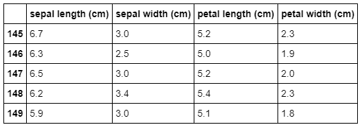

> [!div class="alert is-tip"]
> ### Learning goal
>
> By the end of this module, you should be comfortable finding general information about the data that's stored in pandas DataFrames.

After you load your data into pandas, the data most likely will be in a DataFrame. However, if the data set in your DataFrame has 60,000 rows and 400 columns, how do you even begin to get a sense of what you're working with? Fortunately, pandas provides some convenient tools to quickly look at overall information about a DataFrame and the first few and last few rows.

By the end of this module, you should be comfortable finding general information about the data stored in pandas DataFrames.

To explore DataFrames in pandas, we will import the Python scikit-learn library and use an iconic dataset that every data scientist has seen hundreds of times: British biologist Ronald Fisher's Iris dataset that Fisher used in his 1936 paper *The use of multiple measurements in taxonomic problems*.

First, import pandas and import the Python scikit-learn dataset:

```python
import pandas as pd
from sklearn.datasets import load_iris
 
iris = load_iris()
iris_df = pd.DataFrame(data=iris['data'], columns=iris['feature_names'])
```

## `DataFrame.info`

Let's take a look at this dataset to see what we have:

```python
iris_df.info()
```

From the output, we know that the Iris dataset has 150 entries in four columns. All of the data is stored as 64-bit floating-point numbers.

> [!NOTE]
> 
> **SARAH** - It seems like we would need to display the output in the module. Would you agree?

## `DataFrame.head`

Next, let's see what the first few rows of our DataFrame look like:

```python
iris_df.head()
```

This is what the output looks like:


### Exercise

By default, `DataFrame.head` returns the first five rows of a DataFrame. In the code cell below, can you figure out how to get it to show more?

> [!TIP]
> Consult the documentation by using `iris_df.head`.

## `DataFrame.tail`

The flip side of `DataFrame.head` is `DataFrame.tail`, which returns the last five rows of a DataFrame:

```python
iris_df.tail()
```

This is what the output looks like:



In practice, it's useful to be able to easily examine the first few rows or the last few rows of a DataFrame, particularly when you are looking for outliers in ordered datasets.

> [!div class="alert is-tip"]
> ### Takeaway
>
> Even just by looking at the metadata about the information in a DataFrame or the first and last few values in one, you can get an immediate idea about the size, shape, and content of the data you are dealing with.