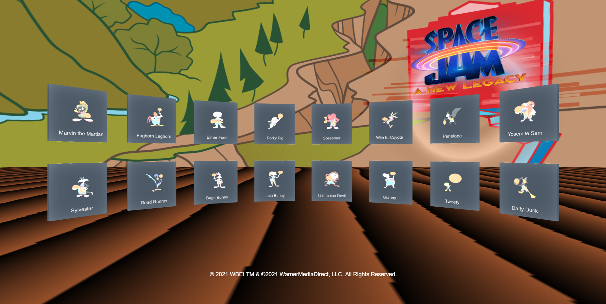

To make a Mixed Reality project for the web, you need a couple of key frameworks. This project will use WebXR and Babylon.js.

## WebXR

WebXR is a technology that you can use to create Virtual Reality (VR) and Augmented Reality (AR) experiences in the browser by taking advantage of WebGL. WebGL allows the browser to use the GPU and enables you to build 3D experiences. 

Some Cross Reality applications are specific to a device or platform, but WebXR isn't. WebXR is cross-platform, so it will work on multiple devices and platforms. All you need to create a WebXR app is JavaScript with a little HTML and CSS. You'll see this when we get started building our WebXR project in the next unit.

## Babylon.js

A few WebXR frameworks are available. We're going to use one called [Babylon.js](https://www.babylonjs.com/?azure-portal=true).

Babylon.js is a complete JavaScript framework for building 3D games and experiences with HTML5, WebGL, WebVR, and Web Audio. Babylon now has Babylon Native, which lets you bring these experiences beyond the browser.

The ability to use JavaScript to create 3D experiences makes building new metaverse worlds even more accessible to all types of developers. A great way to get started building and learning with Babylon.js is by checking out the [Babylon.js Playground](https://playground.babylonjs.com/?azure-portal=true). The playground allows you to try out your creation in the browser without downloading anything.

We're going to build a scene to display the characters in *Space Jam: A New Legacy*. We'll display an icon for each character that gives a player efficiency rating (PER) when you select it. Now let's start building out the following *Space Jam: A New Legacy* scene with Babylon.js!

© 2021 Warner Bros. Ent. All Rights Reserved.
