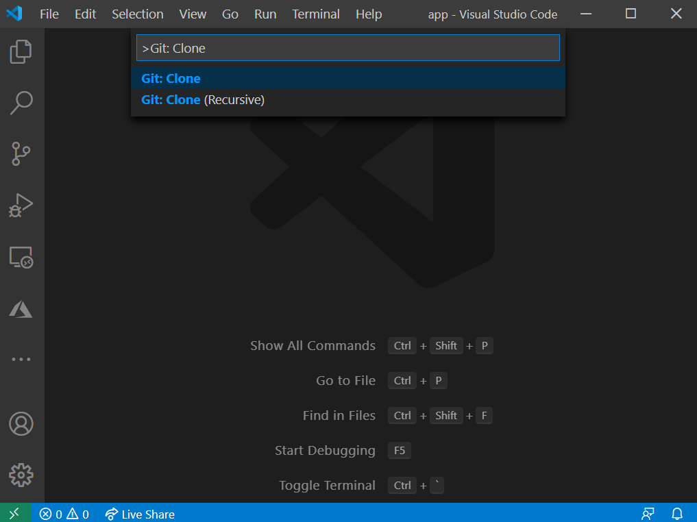
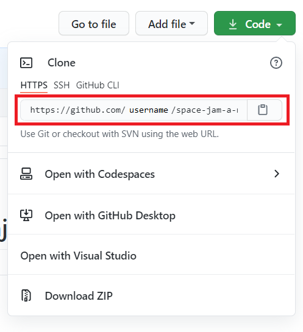
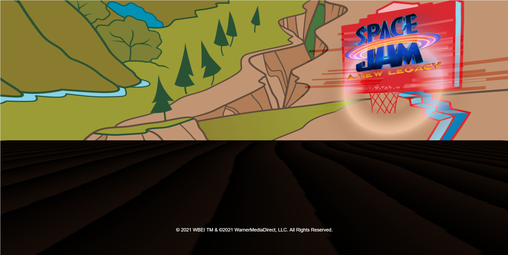

To get started building this mixed reality project we will need to first setup our project. While you can create a BabylonJS WebXR project using just JavaScript, HTML and CSS, We will be using [WebPack](https://webpack.js.org/guides/installation/?azure-portal=true), [NodeJS](https://nodejs.org/?azure-portal=true), and [TypeScript](https://typescriptlang.org?azure-portal=true). This allows for better project architecture, type safety and project growth potential.

There are two ways to continue through this Learn module:

- Use [CodeTour in VSCode](https://marketplace.visualstudio.com/items?itemName=vsls-contrib.codetour&azure-portal=true) to explore a completed version and add your own personalization.
- Start with a vanilla BabylonJS project and write all of the code following this module.

Either will lead you to the same place, and regardless this module will guide you through the process of breaking down an XR experience into testable units.

## Option 1: Create the *Space Jam: A New Legacy* XR experience using a GitHub Template

To get started, you'll need to create a repo based on this app. Go to [the page to create a repository based on the template](https://aka.ms/LearnWithBasketball/BabylonsJS?azure-portal=true) and fill in the form. Name your repo space-jam-a-new-legacy-babylonjs. You can make this repo public or private, but be sure to include all branches:

## Option 2: Create a BabylonJS vanilla XR experience using a GitHub Template

To get started, you'll need to create a repo based on this app. Go to [the page to create a repository based on the template](https://github.com/cassieview/babylonjs-webpack-typescript-starter-project/generate?azure-portal=true) and fill in the form. Name your repo space-jam-a-new-legacy-babylonjs. You can make this repo public or private, but be sure to include all branches:

## Clone your repo by using Visual Studio Code

> [!NOTE]
> You might be prompted to sign in to GitHub throughout the remaining steps in this unit. If so, follow the instructions to authorize Visual Studio Code to access this specific repository if you feel comfortable doing so. This is necessary to complete the module.

After your repo is created, you can clone it (make a copy on your local computer) by using Visual Studio Code. First, open a new Visual Studio Code window: select File > New Window.

Open the command palette, you can use the Ctrl+Shift+P shortcut, and type "Git: Clone":

Then, back on [GitHub.com](https://github.com?azure-portal=true) in your space-jam-a-new-legacy-babylonjs repo, select the Clone button and copy the HTTPS URL:

Back in Visual Studio Code, paste the URL you copied at the command prompt and press Enter. If prompted, choose a location for your code to be downloaded. If prompted, choose to open the code in your current window.

## Build and run the starter project

Whether you're starting with the completed project template from GitHub or your starting from the vanilla BabylonJS project template, you should make you have all of the packages installed and the project builds.

Since we are using node we have a packages.json file the defines the packages needed. Run the below commands to install the packages, run the build and start the project.

To do this, you can open the terminal in Visual Studio code and run each command one at a time.

Install packages
`npm install`

Build Project
`npm run build`

Run the project
`npm start`

After you start the project and navigate to `http://localhost:8080/` and depending on which option you chose above, you should see the below scene:

**Option 1:**  

**Option 2:**  

With these basic scenes you're ready to get started rendering your Mixed Reality experience!

© 2021 Warner Bros. Ent. All Rights Reserved.
