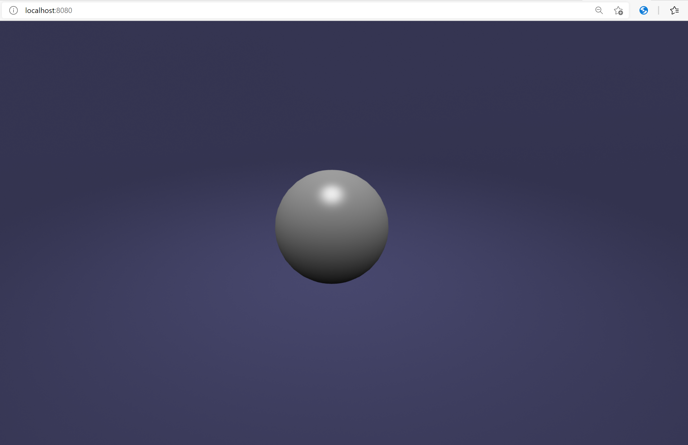

To start building this project, you first need to set it up. You can create a Babylon.js WebXR project by using just JavaScript, HTML, and CSS. But instead, we'll use [WebPack](https://webpack.js.org/guides/installation/?azure-portal=true), [Node.js](https://nodejs.org/?azure-portal=true), and [TypeScript](https://typescriptlang.org?azure-portal=true) in this module. This choice allows for better project architecture, type safety, and growth potential.

## Two options

There are two ways to continue through this module. Either will lead you to the same place. This module will guide you through the process of breaking down an XR experience into testable units.

### Option 1: Create the *Space Jam: A New Legacy* XR experience by using a GitHub template

In this option, you use [CodeTour in Visual Studio Code](https://marketplace.visualstudio.com/items?itemName=vsls-contrib.codetour&azure-portal=true) to explore a nearly completed version and add your own personalization.

To get started, create a GitHub repository for this app. Go to [the page to create a repository based on the template](https://aka.ms/LearnWithBasketball/BabylonJS?azure-portal=true) and fill in the form. Name your repo *space-jam-a-new-legacy-babylonjs*. You can make this repo public or private, but be sure to include all branches.

### Option 2: Create a plain Babylon.js XR experience by using a GitHub template

In this option, you start with a plain Babylon.js project and write all of the code after this module.

To get started, create a GitHub repo for this app. Go to [the page to create a repository based on the template](https://github.com/cassieview/babylonjs-webpack-typescript-starter-project/generate?azure-portal=true) and fill in the form. Name your repo *space-jam-a-new-legacy-babylonjs*. You can make this repo public or private, but be sure to include all branches.

## Clone your repo by using Visual Studio Code

> [!NOTE]
> You might be prompted to sign in to GitHub throughout the remaining steps in this unit. If so, follow the instructions to authorize Visual Studio Code to access this specific repository. This authorization is necessary to complete the module.

After your repo is created, clone it (make a copy on your local computer) by using Visual Studio Code. 

1. Open a new Visual Studio Code window by selecting **File** > **New Window**.

1. Open the command palette by using the Ctrl+Shift+P shortcut, and then enter `Git: Clone`.

   

1. On [GitHub.com](https://github.com?azure-portal=true), in your *space-jam-a-new-legacy-babylonjs* repo, select the **Clone** button and copy the HTTPS URL.

   

1. In Visual Studio Code, paste the URL that you copied at the command prompt and select the Enter key. If you're prompted, choose a location for your code to be downloaded. If you're prompted, choose to open the code in your current window.

## Build and run the starter project

Whether you're starting with the completed project template from GitHub or you're starting from the plain Babylon.js project template, make sure that you have all of the packages installed and the project builds.

Because we're using Node.js, a *packages.json* file defines the needed packages. Run the following commands to install the packages, run the build, and start the project.

1. Open the terminal in Visual Studio Code.

1. Enter the following command to install packages:

   `npm install`

1. Enter the following command to run the build: 
  
   `npm run build`

1. Enter the following command to start the project:

   `npm start`

1. Go to `http://localhost:8080/`. 

   If you chose option 1 earlier, you should see the following scene.

   

   If you chose option 2, you should see the following scene.  

   

With these basic scenes, you're ready to get started rendering your Mixed Reality experience!

© 2021 Warner Bros. Ent. All Rights Reserved.
