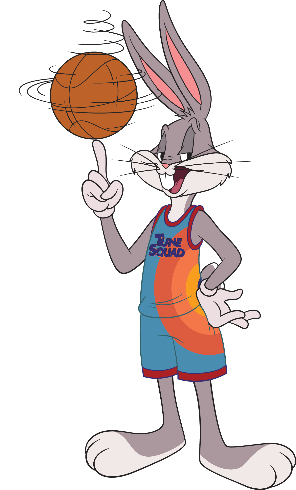

As mentioned in the last unit, the next two modules in this *Space Jam: A New Legacy* inspired learning path will explore the world of Mixed Reality using two different frameworks:

- BabylonJS
- Mixed Reality Toolkit

This unit will briefly introduce each of these frameworks and call out a couple of the key components that we will be using throughout the rest of the themed Mixed Reality modules in this learning path.

## BabylonJS

[BabylonJS](https://www.babylonjs.com/?azure-portal=true) is a 3D engine that is rendered in the Web. With the power of this framework, plus a bit of JavaScript and HTML, you can have an immersive, interactive 3D experience right in your browser. This framework also pairs with WebXR, which is what elevates this experience to a Mixed Reality experience.

Creating 3D objects is a complex task that takes a lot of practice, and while there are 3D models available for purchase or for free on the Web, BabylonJS has built in mesh models and procedural textures that you can use without having to do any modeling!

Especially if you're building a prototype, or just want to get started creating 3D games or Mixed Reality experiences, being able to start with 2D images and have them be handled and moved to 3D for you saves a lot of hassle.

Even still, the Tune Squad characters that we want to show in our basketball fan stat card experience are very complex. So rather than creating a 3D model out of this image of Bugs Bunny, for example:

We will start by creating a 3D grid with 16 areas (for each of the Tune Squad players) and then add the 2D image of each player into each space within the grid.

One aspect of learning new frameworks is learning how to work with them to create your unique Mixed Reality experience. When prototyping or just beginning your learning journey, it's OK to start by having your 3D space filled with 2D icons. Overtime, as you learn more about the Framework you can swap them out for 3D models or more detailed 2D images.

## Mixed Reality Toolkit

The Windows [Mixed Reality Toolkit](/windows/mixed-reality/mrtk-unity/?view=mrtkunity-2021-05?azure-portal=true) (often written MRTK) is framework that provides a set of components and features that support you while you create cross-platform Mixed Reality applications using Unity.

Since the MRTK is dependent on Unity, we get a an entire platform that was specifically built to create 2D and 3D interactive games and experiences to support our learning. In Unity, for example, every single thing that you want to do is part of an object in a scene. Common objects include:

- Light sources
- Cameras
- Prefabs

We will be using a lot of prefabs in the MRTK module inspired by the film. Prefabs are already created 3D models that can be customized. An example of how we will use them is by creating a simple, grey cube from the Unity prefabs. That cube will then get customized to show the image of the Tune Squad player. Then, using the MRTK framework, we will add simple scripts to that cube object/prefab to track when the object has been clicked in 3D space (for example, when your actual finger "clicks" the cube if you have a headset on) and the interface of the cube will change to show the player's name and PER (player efficiency rating) value.

So in Unity, the prefab of the Cube gets various components added to it that make it display and make it clickable.

The Mixed Reality Toolkit elevates that Unity already does by providing scripts and features that work when you're wearing a Mixed Reality headset, like the Hololens! The best part though? With MRTK and Unity you don't even have to have a Mixed Reality headset to test out your Mixed Reality experiences! Unity and MRTK work together to provide you with a playspace on your desktop where your mouse can act as your finger and head.

© 2021 Warner Bros. Ent. All Rights Reserved.
