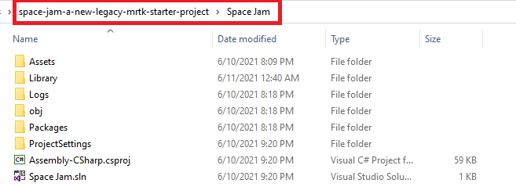
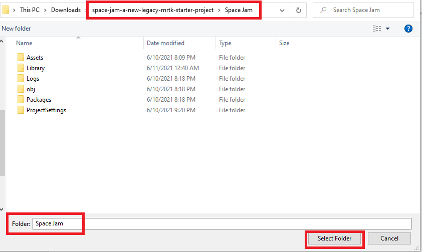

A sample project is available, which includes a pre-configured application. You are tasked to create the button prefabs that will be instantiated when the app starts. Before you can begin creating the prefab, you'll need to clone the project on GitHub and configure Unity for Windows Mixed Reality development.

## Download the starter project

Download the [Mixed Reality starter project](https://sjanlassets.blob.core.windows.net/assets/space-jam-a-new-legacy-mrtk-starter-project.zip?azure-portal=true) from Azure. You will find a zip folder called **space-jam-a-new-legacy-mrtk-starter-project**. Extract the contents of this zip file, and save to your computer:

## Open the project in Unity

In the Unity Hub, add the sample project, which is the **space-jam-a-new-legacy-mrtk-starter-project/SpaceJam/** folder.

If necessary, allow Unity to upgrade the project to your installed version.

Next, open the project in Unity.

In the **Project** panel, open the **Scenes** folder. Next, select and open the **PlayerRoster** scene.

In the **Hierarchy** panel, you should now see the **PlayerRoster** scene. The scene includes the lighting, the **MixedRealityToolkit**, and the **MixedRealityPlayspace**, which contains the camera.

© 2021 Warner Bros. Ent. All Rights Reserved.
