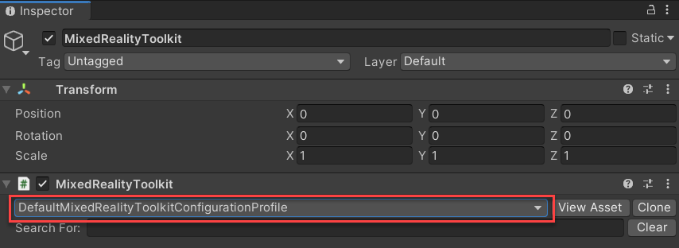
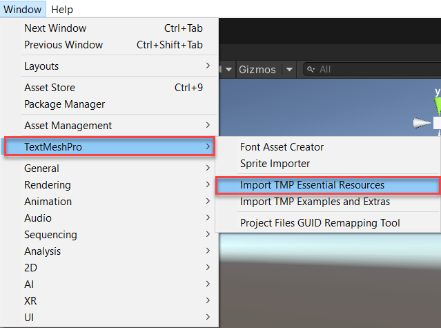

The first step to creating an immersive experience for Windows Mixed Reality requires configuring your Unity project for Windows Mixed Reality development. Configuring Unity for Windows Mixed Reality development is a manual process, which must be completed whenever you create a new Unity project or open a project shared with you. Once your project is configured, your app will be able to do basic holographic rendering and spatial input.

To configure Unity for Windows Mixed Reality development, follow these steps:

1. Go to **File** &gt; **Build Settings** to switch **Build Platform** to **Universal Windows Platform**.

1. In the **Build Settings** window, select **Player Settings**. In the **Player** section, expand **XR Settings**. Enable **Virtual Reality Supported** and add the **Windows Mixed Reality SDK**.

1. Optimize XR Settings as follows:

   - Set Windows Mixed Reality **Depth Format** to **16-bit depth**.
   - Select the Windows Mixed Reality **Enable Depth Buffer Sharing** check box.
   - Set **Stereo Rendering Mode** to **Single Pass Instanced**.

   

## Add MRTK to the scene and configure

Typically, if you were to start this project from scratch, you'd need to use the [Mixed Reality Feature Tool](/windows/mixed-reality/develop/unity/welcome-to-mr-feature-tool?azure-portal=true) to import the Mixed Reality Toolkit Foundation package. However, this sample project contains the Mixed Reality Toolkit Foundation package.

Before you can use the MRTK features, you'll need to add MRTK to the scene and configure.

In the Unity menu, select **Mixed Reality Toolkit** &gt; **Add to Scene and Configure...** to add MRTK to your current scene.

Two new objects are added to the Hierarchy: **MixedRealityToolkit** and **MixedRealityPlayspace**.

The **MixedRealityToolkit** object contains the toolkit itself. The **MixedRealityPlayspace** object ensures the headset/controllers and other required systems are managed correctly in the scene.

The **Main Camera** object is moved as a child to the **MixedRealityPlayspace** object. This allows the playspace to manage the camera simultaneously with the SDKs.

## Select the Configuration Profile

One of the main ways that MRTK is configured is through the many profiles available in the Foundation package. Profiles configure the behavior of MRTK core components. The **MixedRealityToolkit** object contains the active profile and can be viewed in the Inspector window.

When MRTK is added to the scene, the **DefaultMixedRealityToolkitConfigurationProfile** is preselected.

MRTK provides additional default profiles, which cover most platforms and scenarios that MRTK supports. Because **DefaultMixedRealityToolkitConfigurationProfile** is a general use profile, it isn't optimized for any particular use case. If you want to use settings optimized for a specific platform, consider selecting the respective default profile.

> [!NOTE]
> This module uses the **DefaultHoloLens2ConfigurationProfile**.

## Import TextMesh Pro Essential Resources

Some MRTK prefabs and assets require TextMesh Pro. TextMesh Pro is Unity's default text component. TextMesh Pro uses advanced text rendering techniques along with a set of custom shaders to deliver visual quality improvements. TextMesh Pro also provides greater flexibility for text styling and texturing. The TextMesh Pro assets must be added to your project by importing TMP Essential Resources.

In the Unity menu, select **Window** &gt; **TextMeshPro** &gt; **Import TMP Essential Resources**.

In the **Import Unity Package** window, click the **All** button to ensure all the assets are selected, then click the **Import** button to import the assets.

© 2021 Warner Bros. Ent. All Rights Reserved.
