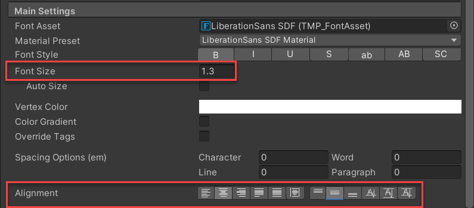
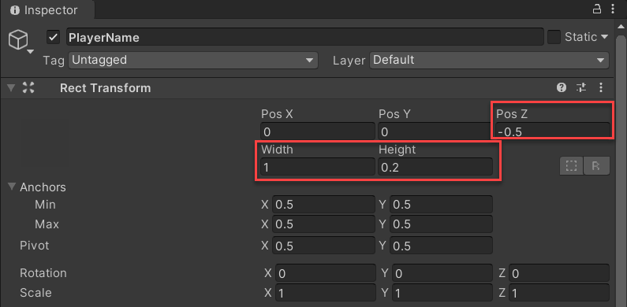
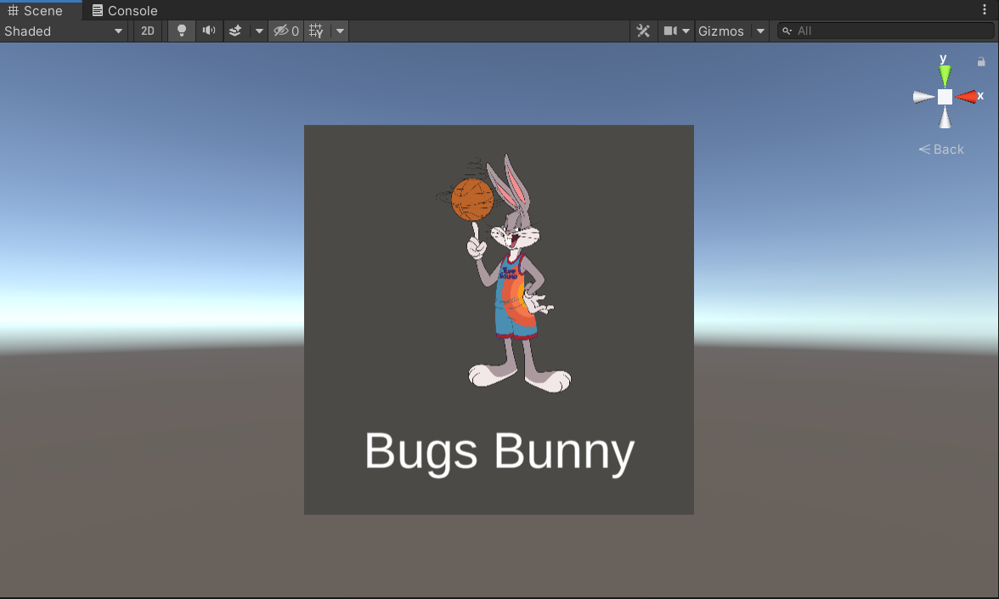

The button UI is dynamic in the sense that the values for each text field come from the PlayerDataStats.json file. Rather than hard-code the data for each player onto the game object, you can use a JSON file and Unity's utility functions for working with JSON data. This is called `JSONUtility`.

You only need to create the UI objects and place wherever you'd like the text to appear.

## Create the player name object

1. In the **Hierarchy** window, right-click the **PlayerButton** object and select **3D Object** > **Text - TextMeshPro**. This creates a text object that you'll use for the player's name.

    Ensure that the **Text (TMP)** object is created as a child of the **PlayerButton** object.

1. Select the **Text (TMP)** object in the **Hierarchy** window. In the **Inspector** window, rename the object **PlayerName**.

1. You'll now modify parameters for the **TextMeshPro - Text** properties. In **TextMeshPro - Text**, enter **Bugs Bunny**. Although the data will pull from the JSON file, it's helpful to have sample text for placement purposes.

    

1. In the **Main Settings** properties, modify the following to adjust the size and text placement:

    - **Font Size**: 1.3
    - **Alignment**: Center
    - **Alignment**: Middle

    

1. In the **Rect Transform** properties, modify the following to adjust the text box size and position of the text:

    - **Pos Z**: -0.5
    - **Width**: 1
    - **Height**: 0.2

    

1. Using the **Move Tool**, select the up and down arrows to drag the text onto the bottom middle of the cube.

    

## Create the player image object

1. In the **Hierarchy** window, right-click the **PlayerButton** object, and select **2D Object** > **Sprite**. This creates an object for a 2D graphic.

    Ensure that the **New Sprite** object is created as a child of the **PlayerButton** object.

1. Select the **New Sprite** object in the **Hierarchy** window. In the **Inspector** window, rename the object **PlayerImage**.

1. All character images are created as a *sprite* (a 2D graphic). The sprites are within the **Resources** folder of the project. In the **Project** window, go to the **Resources** folder, and drag the **BugsBunny** sprite to the **Sprite** property for the **SpriteRenderer** component.

    

    You'll use this sprite for placement purposes.

1. You'll now modify parameters for the **Transform** properties. In **Transform**, change the **Position** to **0, 0.12, -0.5**. This places the image above the **PlayerName** object, and slightly in front of the cube.

1. Next, change the **Scale** to **0.025, 0.025, 0.025**. This sets the size for all sprites to a smaller version that fits properly within the cube.

    Feel free to adjust the **PlayerImage** position and scale as needed.

You should now have a completed `PlayerButton` object that includes a picture of a player and their name.

© 2021 Warner Bros. Ent. All Rights Reserved.
