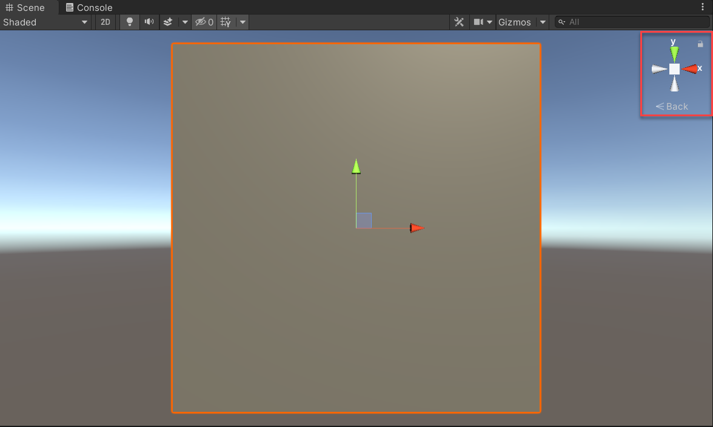
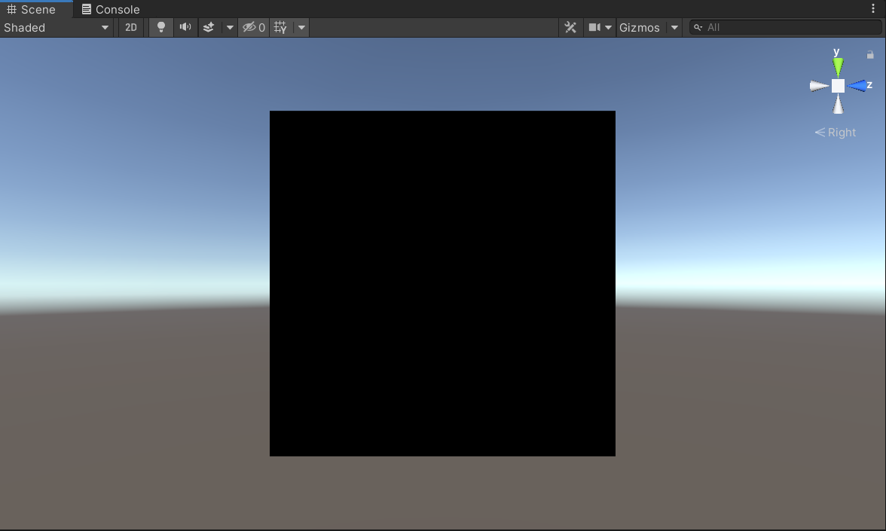

Now that you've created a button for the player, the next step is to create a card that appears when the player button is pressed. The card will display the player's stats provided in the JSON file.

## Create a container for the stats card

The stats card object will be a child of the `PlayerButton` object. All objects for the stats card will be contained within a `StatsCard` object.

1. In the **Hierarchy** window, right-click the **PlayerButton** object and select **Create Empty**. Ensure that the empty game object is created as a child of the **PlayerButton** object.

1. In **Hierarchy**, select **GameObject**. In the **Inspector** window, you see the **GameObject** properties. In **Inspector**, rename the object **StatsCard**.

1. In **Inspector**, select the triple dots to the right of the **Transform** component, and select **Reset**. This resets the position of the container to 0, 0, 0. Next, change the **StatsCard** object **Position** to **0, 0, -0.1**.

## Create the stats card background

Unity provides primitives that you can use in your projects as placeholders and prototypes for testing purposes. For this unit, you'll create the stats card by using a quad primitive. A quad resembles a plane, and can be used as a flat surface in an app.

1. In the **Hierarchy** window, right-click the **StatsCard** object, and select **3D Object** > **Quad**. Ensure that the quad is created as a child of the **StatsCard** object.

1. Select the **Quad** object in the **Hierarchy** window. In the **Inspector** window, rename the object **Background**.

1. When the `PlayerButton` object is pressed, the card should be shown in front of the button. Right now, the **Background** and **PlayerButton** objects have the same position (0, 0, 0). Therefore, the quad appears in the middle of the button. To position the **Background** object to display in front of the **PlayerButton** object, change the **Background** position to **0, 0, -0.7**.

    To view the `Background` object's position relative to the `PlayerButton` object, rotate the **Scene Gizmo** on the **X** axis to view the side of the cube.

    

    From this angle, you can view the distance of the `Background` object and the `PlayerButton` object.

    

    Be sure to change the **Scene Gizmo** back to it's prior position before completing the next step.

1. By default, the quad is a solid gray color. You can use a shader to give the `Background` object another color. In the **Project** window, enter **MRTK_Standard_Black** into the search bar. Below the search bar, next to **Search**, select **In Packages**. This enables you to search in the **Packages** folder, which is where the MRTK shaders are located.

    Select the **MRTK_Standard_Black** shader, and drag the shader into the **Inspector** window for the **Background** object. The color of the quad changes to black.

    

© 2021 Warner Bros. Ent. All Rights Reserved.
