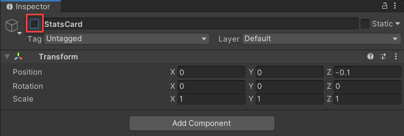
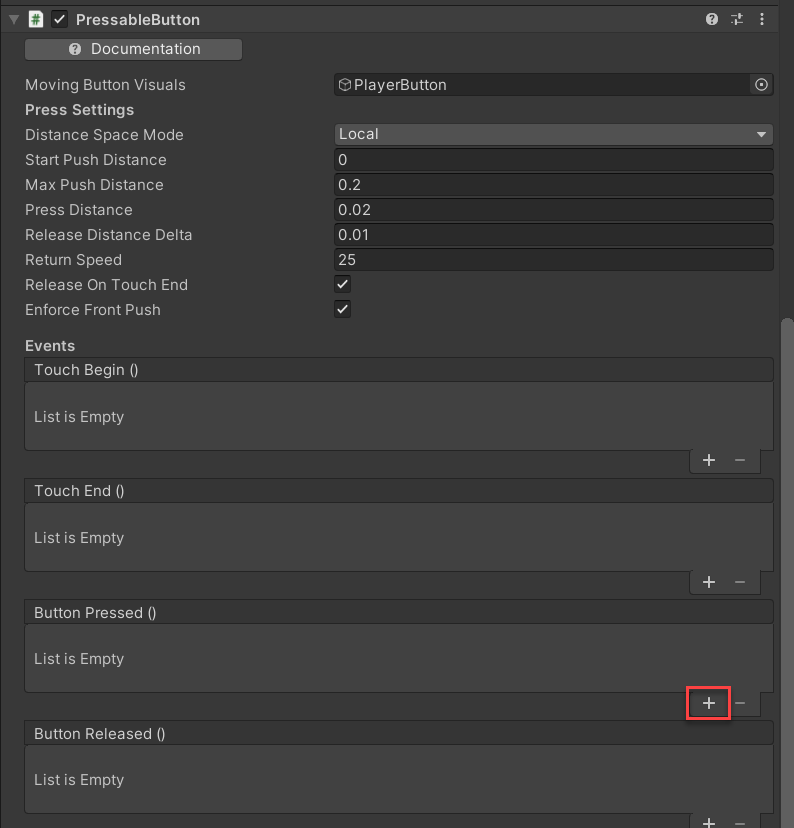
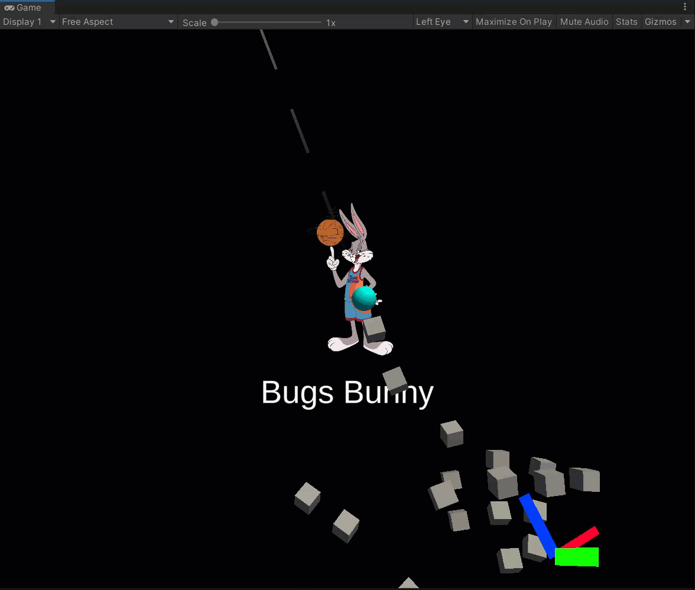

So far, you've created all of the buttons that are needed for this project. However, the buttons have not been configured to perform any action when pressed. In this unit, you will create a button press event that triggers an action when a button is pressed.

Each button created has 4 **Events** properties that can be configured to trigger an action:

- **Touch Begin()** - Triggers an action when an object is initially touched
- **Touch End ()** - Triggers an action when the touch of an object ends
- **Button Pressed ()** - Triggers an action when a button is pressed
- **Button Released ()** - Triggers an action on the release of a button pressed

 For this unit, you'll focus on the **Button Pressed()** event.

Right now, if you were to enter **Play** mode, the **StatsCard** object would block the **PlayerButton** object. Furthermore, if you were to press the **CloseCardButton** object, no particular action would occur.

You can try this out for yourself by using the in-editor input simulation. To enter into **Play** mode, press the play button at the top of the editor. Once you're in **Play** mode, use the guidance below to interact with the objects:

**How to move around in the scene**

- Use **W/A/S/D** keys to move the camera forward/left/back/right.
- Use **Q/E** to move the camera vertically.
- Press and hold the **right mouse button** to rotate the camera.

**How to simulate hand input**

- Press and hold the **space bar** to enable the right hand.
- While holding the space bar, move your mouse to move the hand.
- Use the **mouse scroll wheel** to adjust the depth of the hand.

## Configure PlayerButton button pressed event

By default, objects within the scene are set to **active**. Whether an object is active is determined by a `true` or `false` value. You can manage whether an object is active in both the editor and with code.

In the **Inspector** window, you can control whether an object is active at start using the check box next to the object's name. Since the **StatsCard** object and it's children should not be active when the scene starts, uncheck the box so that the object is not visible.



There are some instances where managing whether an object is active requires writing a script. Although you can disable (or set inactive) objects within the **Inspector** window, a script is necessary to tell Unity how to make the object active again after the scene updates.

When the **PlayerButton** object is pressed, the **StatsCard** object should be set to **active**. The **PressableButton** component within the **PlayerButton** object provides **Events** that you can configure using functions provided by MRTK. A **SetActive** function is available which sets an object active when the button is pressed.

When creating a **Button Pressed ()** event, the object receiving the event is first assigned followed by the method. In this case, the **StatsCard** receives the event.

1. In the **Hierarchy** window, select the **PlayerButton** object.

1. In the **Inspector** window, within the **PressableButton** component, click the **+** button within the **Button Pressed ()** property.

    

1. In the section that appears, drag the **StatsCard** object to the **None (Object)** field.

    Once assigned, click the function drop-down that appears and select **GameObject** > **SetActive (bool)**.

    After the function is assigned, check the box next to the **StatsCard** object assignment.

    

Now that the **Button Pressed ()** event is added for the **PlayerButton** object, enter into **Play** mode. In the **Game** window, use simulated hand input to press the **PlayerButton** object to view the **StatsCard** object display.



## Configure CloseCard button pressed event

Although MRTK provides you with scripts that have functions that can be used for events, you could also write and use your own scripts.

When the **CloseCardButton** object is pressed, the **StatsCard** object and all it's children should be set to inactive. Since there is no existing function provided by MRTK for such logic, you can create your own script that uses the Unity `.SetActive()` function. This function is the underlying function that is being used to set objects active or inactive. The syntax is as follows:

```csharp
public void SetActive(bool value);
```

You will now have a chance to use it in your own script.

1. In the **Project** window, navigate to the **Scripts** folder.

1. In the **Project** window, click the **+** icon and select **C# Script**. Name the script **CloseCard**.

1. In the **Project** window, double-click the **CloseCard** script to open the script in Visual Studio.

1. The script that you're creating consists of a **Disable()** function. When called, the gameObject (e.g. **StatsCard**), will be set to inactive. As a reminder, whether an object is active is determined by a `true` or `false` value.

    In Visual Studio, replace the code within **CloseCard** with the following:

    ```csharp
    using System.Collections;
    using System.Collections.Generic;
    using UnityEngine;
    
    public class CloseCard : MonoBehaviour
    {
        public void Disable()
        {
            gameObject.SetActive(false);
        }
    }
    ```

1. Save the file and return to Unity.

Now that you have a function available to set an object to inactive, you can use the function in a **Button Pressed ()** event for the **StatsCard** object. However, before you can use the function, the function must be added as a component to the object that will receive the event.

1. In the **Hierarchy** window, select the **StatsCard** object. In the **Inspector** window, add the **CloseCard** script as a component. Alternatively, you could also drag the **CloseCard** script to the **StatsCard** in the **Hierarchy** window.

1. In the **Hierarchy** window, select the **CloseCardButton** object.

1. In the **Inspector** window, within the **Events** property, click the **+** button to create a new **Button Pressed()** event. In the section that appears, drag the **StatsCard** object to the **None (Object)** field.

    Once assigned, click the function drop-down that appears and select **CloseCard** > **Disabled ()**.

    

Now that the **Button Pressed ()** event is added for the **CloseCardButton** object, enter into **Play** mode and press the button to view the stats card close.


© 2021 Warner Bros. Ent. All Rights Reserved.
