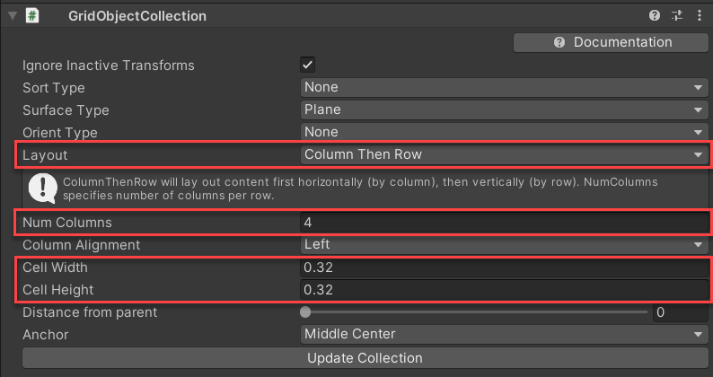
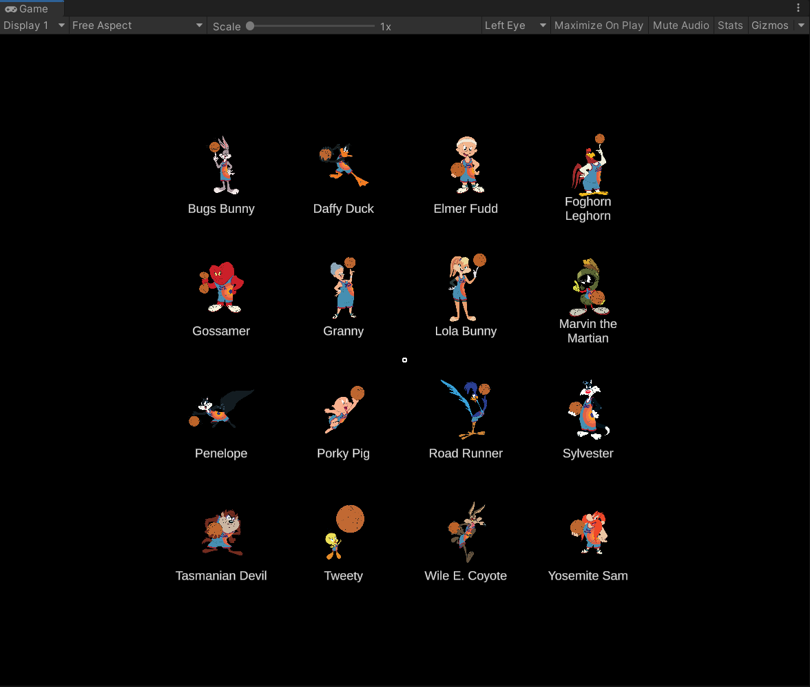
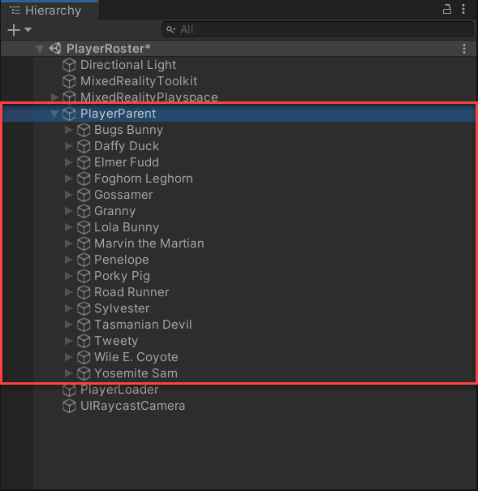

Now that you've configured the `PlayerContainer` object with the appropriate button functionality and UI for a player, you can create the object as a prefab. Then you can use the object for all players on the Tune Squad.

Rather than duplicate a `PlayerContainer` object for each player, you can create an instance of the object (or *instantiate*) for each player when the scene starts. This requires script logic that creates (or *spawns*) a `PlayerContainer` object for all players listed in the players.json file. Furthermore, you need script logic to relate the JSON data to the text and sprite objects within the `PlayerContainer` object. Such scripts have been provided for you in the project folder.

## Assign objects to JSON data

For each text and sprite object created in the `PlayerContainer` object, you must make a link to its corresponding value in the players.json file. The Player.cs script helps establish the connection.

1. In the **Hierarchy**, select the **PlayerButton** object.

1. In the **Inspector** window, add the **Player.cs** script as a component for the **PlayerButton** object.

1. In the **Inspector** window, assign the following for each property of the **Player (Script)** component:

    - **Player Name**: PlayerName (child of **PlayerButton**)
    - **Card Name**: PlayerName (child of **Background**)
    - **Player PER**: PER (child of **Background**)
    - **Player Img**: PlayerImage (child of **PlayerButton**)
    - **Atlas**: MySprites (in **Assets**)

    

## Create a prefab

For better project organization, place all your prefabs into a **Prefabs** folder. Then you can drag objects from the **Hierarchy** window into the **Project** window to create a prefab.

1. In the **Project** window, select **Assets**, and select the **+** button. Next, select **Folder**, and name the folder **Prefabs**.

1. In the **Hierarchy** window, drag the **PlayerContainer** object into the **Prefabs** folder. When an object is created as a prefab, a blue box icon appears next to the object.

    

    > [!NOTE]
    > You can edit a prefab by opening it. To open a prefab, double-click the prefab within the **Project** window. The prefab then appears in **Prefab Mode**. Any edits made to the prefab will update for all instances of the prefab within your scene.

1. Delete the **PlayerContainer** object from the scene. Your scene should now only consist of the following objects:

    - `Directional Light`
    - `MixedRealityToolkit`
    - `MixedRealityPlayspace`

## Create the PlayerParent

As mentioned, when the scene starts, a button for each player should be instantiated with the respective player data. To better organize the placement of each button, you can use an MRTK **Object Collection** script. These scripts help lay out an array of objects in predefined three-dimensional shapes. 

For this project, you'll arrange the buttons into a grid by using the GridObjectCollection.cs script. To use this script, all objects to be arranged must be children of the same parent. Therefore, each instantiated `PlayerContainer` prefab must be the child of the same parent object. To resolve for this, you can use script logic to create all players as the child of a defined object.

1. In the **Hierarchy**, select the **+** button, and select **Create Empty**.

1. Select the **GameObject** in the **Hierarchy** window. In the **Inspector** window, rename the object **PlayerParent**.

1. In the **Inspector** window, select the triple dots to the right of the **Transform** component, and select **Reset**. This resets the position of the object to 0, 0, 0.

1. In the **Inspector** window, add the **GridObjectCollection.cs** script as a component for the **PlayerParent** object.

1. In the **Inspector** window, change the **GridObjectCollection (Script)** properties to the following:

   - **Layout**: Column Then Row
   - **Num Columns**: 4
   - **Cell Width**: 0.32
   - **Cell Height**: 0.32

    

1. At the bottom of the **GridObjectCollection (Script)** component, select **Update Collection**.

## Create the PlayerLoader

The final step for this project is to create an object that loads the scene. This object consists of a script that will spawn each `PlayerContainer` prefab into the scene. The script also tells Unity to arrange the instantiated children within the `PlayerParent` object into a grid collection defined by the `PlayerParent` object.

1. In the **Hierarchy**, select the **+** button, and select **Create Empty**.

1. Select the **GameObject** in the **Hierarchy** window. In the **Inspector** window, rename the object **PlayerLoader**.

1. In the **Inspector** window, select the triple dots to the right of the **Transform** component, and select **Reset**. This resets the position of the object to 0, 0, 0.

1. In the **Inspector** window, change the **ParentLoader** object **Position** to **0, 0, 0.5**.

1. In the **Inspector** window, add the **SpawnPlayer** as a component for the **PlayerLoader** object.

1. In the **Inspector** window, assign the following for each property of the **SpawnPlayer** component:

    - **Parent**: PlayerParent
    - **Player Prefab**: PlayerContainer
    - **Collection**: PlayerParent

    

Now that the scene is configured, enter into **Play** mode to test out the app. At the start, a button is spawned for each player into a grid.

You'll notice that the `PlayerParent` object now has a child object for each Tune Squad player.

Give the app a try, and view the PER for each Tune Squad player:

Congratulations! You've created a mixed reality app that displays the Tune Squad player roster and their respective PER stats!

© 2021 Warner Bros. Ent. All Rights Reserved.
