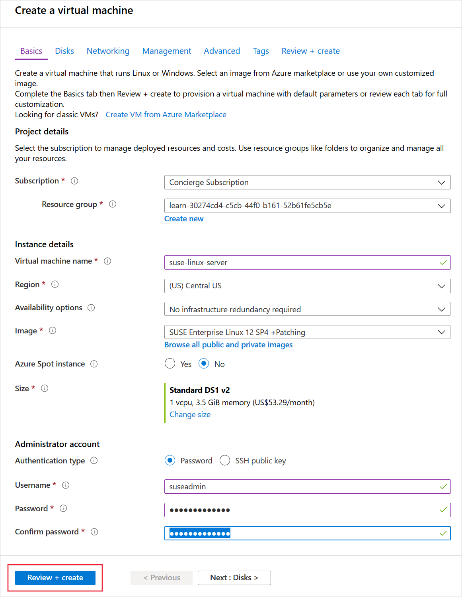

It's easy to install SQL Server on SUSE by using the `zypper` tool.

You are a database administrator at the wholesale company Wide World Importers. You want to benefit from SQL Server without having to change the server operating systems. You have decided to deploy SQL Server on a SUSE server and will configure the SQL Server package and install command-line tools so that SQL Server is ready to be used by your developers.

In this exercise, you will see how to deploy SQL Server on SUSE, install command-line tools, and create a database on SQL Server.

[!include[](../../../includes/azure-sandbox-regions-first-mention-note-friendly.md)]

## Create a SUSE Virtual Machine 

Let's start by creating a SUSE Virtual Machine (VM) in Azure:

1. In the [Azure portal](https://portal.azure.com/learn.docs.microsoft.com?azure-portal=true), click **+ Create a resource**.
1. In the **Search the Marketplace** textbox, type **SUSE**, and then press Enter.
1. Click the **SUSE Linux Enterprise Server (SLES) (Basic)** image, in the **Select a software plan** drop-down list, select **SUSE Linux Enterprise Server (SLES) 12 SP4**, and then click **Create**.
1. In the **Create a virtual machine** dialog, on the **Basics** page, enter these values, and then click **Review + create**:

    | Field | Value |
    | --- | --- |
    | Subscription | Concierge Subscription |
    | Resource group | <rgn>[sandbox resource group name]</rgn> |
    | Virtual machine name | Enter a unique name and make a note of it. |
    | Region | Select a region near you from the above list. |
    | Availability options | No infrastructure redundancy required |
    | Image | SUSE Linux Enterprise Server (SLES) 12 SP4 |
    | Size | Standard |
    | Authentication type | Password |
    | Username | suseadmin |
    | Password | Pa$$w0rdLinux |
    | | |

    

1. On the **Review + create** page, click **Create**.

## Connect to the SUSE VM

Now that we have a SUSE VM, ready to install SQL Server on, let's connect to it by using Secure Shell (SSH):

1. In the [Azure portal](https://portal.azure.com/learn.docs.microsoft.com?azure-portal=true), when the VM deployment is complete, click **All resources** and then click the VM you created.
1. In the top left of the **Overview** page, click **Connect**.
1. On the **SSH** tab, to the right of the **Login using VM local account** textbox, click the **Copy** button.

    

1. In the Cloud Shell on the right, right-click, click **Paste**, and then press Enter.
1. When asked if you're sure, type **yes** and then press Enter.
1. For the password, type **Pa$$w0rdLinux** and then press Enter. SSH connects to the VM and shows a bash shell.

## Install the SQL Server package

Let's install and configure SQL Server. The first task is installation:

1. To download the Microsoft SLES repository configuration file, run this command:

    ```bash
    sudo zypper addrepo -fc https://packages.microsoft.com/config/sles/12/mssql-server-2017.repo
    ```

1. If you are asked for a password, type **Pa$$w0rdLinux** and then press Enter.
1. To refresh your repositories, run this command:

    ```bash
    sudo zypper --gpg-auto-import-keys refresh
    ```

1. To install SQL Server, run this command, and type **y** to confirm:

    ```bash
    sudo zypper install mssql-server
    ```

## Configure SQL Server

Before you use SQL Server, you must specify the edition that you want and specify the system administrator password:

1. Type the following command and then press Enter:

    ```bash
    sudo /opt/mssql/bin/mssql-conf setup
    ```

1. If prompted, type your password, and then press Enter.
1. To select the Evaluation edition, press **1**, and then press Enter.
1. Type **Yes** and press Enter to accept the license terms.
1. For the system administrator password, type **Pa$$w0rd** and then press Enter.
1. Confirm the password and then press Enter.

## Install SQL Server tools

SQL Server is now installed. Let's install the administrative tools:

1. To add the Microsoft SQL Server tools repository to **zypper**, run these commands:

    ```bash
    sudo zypper addrepo -fc https://packages.microsoft.com/config/sles/12/prod.repo
    sudo zypper --gpg-auto-import-keys refresh
    ```

1. To install SQL Server command-line tools, run this command:

    ```bash
    sudo zypper install -y mssql-tools unixODBC-devel
    ```

1. Type **YES** and press Enter to accept the ODBC license terms.
1. Type **YES** and press Enter to accept the license terms.
1. To add the tools to the **PATH** environment variable, run these commands:

    ```bash
    echo 'export PATH="$PATH:/opt/mssql-tools/bin"' >> ~/.bash_profile
    echo 'export PATH="$PATH:/opt/mssql-tools/bin"' >> ~/.bashrc
    source ~/.bashrc
    ```

### Create a database

Now, you can use the newly installed **sqlcmd** tool to create a database. Follow these steps:

1. To check whether SQL Server is running, run this command:

    ```bash
    systemctl status mssql-server
    ```

1. If SQL Server is not active, run this command to start the server:

    ```bash
    sudo systemctl start mssql-server
    ```

1. Type the following command and press Enter to connect to SQL Server:

    ```bash
    sqlcmd -S localhost -U sa -P 'Pa$$w0rd'
    ```

1. To create a database, run these commands:

    ```sql
    CREATE DATABASE WideWorld1
    GO
    ```

1. To verify that the database was created, run these commands:

    ```sql
    SELECT name, database_id, create_date FROM sys.databases WHERE name = 'WideWorld1'
    GO
    ```

1. To exit the `sqlcmd` tool and SSH run the command `exit` twice.
