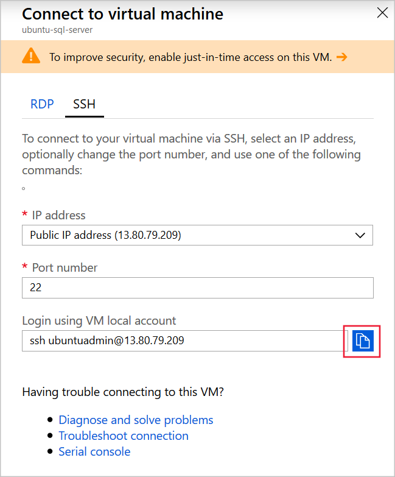

You can run SQL Server on a Docker host by using the Microsoft SQL Server 2017 image.

You are a database administrator at the wholesale company Wide World Importers and want to benefit from SQL Server without having to change the server operating systems. You have decided to deploy SQL Server in a container and use Docker to deploy and manage it.

In this unit, you will see how to deploy SQL Server on a container with Docker.

[!include[](../../../includes/azure-sandbox-activate.md)]

[!include[](../../../includes/azure-sandbox-regions-first-mention-note-friendly.md)]

<!-- ## Start the lab

Start by logging into the Red Hat server:

<!--YAML added to connect to https://labondemand.com/AuthenticatedLaunch/47218?providerId=4 ->
1. Sign into the VM with a Microsoft account, or create a new account.
1. Click **Commands**, click **CTRL+ALT+DEL**, and then login with the username **student**, and the password **Pa55w.rd**.
1. Close the Server Manager window.

-->

## Connect to the Ubuntu VM

Before you can run any containers, you must begin by installing the Docker container host software. Follow these steps:

1. In the [Azure portal](https://portal.azure.com/learn.docs.microsoft.com?azure-portal=true), click **All resources**, and then click the Ubuntu VM you created in unit 3.
1. In the top left of the **Overview** page, click **Connect**.
1. On the **SSH** tab, to the right of the **Login using VM local account** textbox, click the **Copy** button.

    

1. In the Cloud Shell on the right, right-click, click **Paste**, and then press Enter.
1. When asked if you're sure, type **yes** and then press Enter.
1. For the password, type **Pa$$w0rdLinux** and then press Enter. SSH connects to the VM and shows a bash shell.

## Install Docker

To install Docker, add the Docker repository and then use the `apt-get` tool:

1. To add the Docker GPG key to your Ubuntu system, run this command:

    ```bash    
    curl -fsSL https://download.docker.com/linux/ubuntu/gpg | sudo apt-key add -
    ```

1. To add the Docker repository to the Ubuntu sources, run this command:

    ```bash
    sudo add-apt-repository "deb [arch=amd64] https://download.docker.com/linux/ubuntu $(lsb_release -cs) stable"
    ```

1. To update your package database, run this command:

    ```bash
    sudo apt-get update
    ```

1. Now, you can install Docker. Run this command:

    ```bash
    sudo apt-get install -y docker-ce
    ```

<!--
> [!NOTE]
> These steps are for Red Hat Enterprise Linux, but the steps will be very similar for other Linux distros.

1. To enable the RHEL Server repository, run this command:

    ```bash
    sudo subscription-manager repos --enable=rhel-7-server-rpms
    ```

1. To enable the RHEL Server extras repository, run this command

    ```bash
    sudo subscription-manager repos --enable=rhel-7-server-extras-rpms
    ```

1. To enable the RHEL Server optional repository, run this command:

    ```bash
    sudo subscription-manager repos --enable=rhel-7-server-optional-rpms
    ```

1. To install Docker and the dependent packages, run this command:

    ```bash
    sudo yum install docker device-mapper-libs device-mapper-event-libs
    ```

    > [!NOTE]
    > If you are asked for confirmation, press **y** and **Enter** each time.

1. To start Docker, run this command:

    ```bash
    sudo systemctl start docker.service
    ```

1. To enable Docker, run this command:

    ```bash
    sudo systemctl enable docker.service
    ```
-->

## Pull and run the container image

To use SQL Server in Docker containers, the easiest method is to use the Microsoft SQL Server on Linux image as a parent. In the following steps, you will download and run that image:

1. To check that Docker is running, run this command, and then press **q** to exit:

    ```bash
    systemctl status docker
    ```

1. To pull the SQL Server image from the Docker hub, run this command:

    ```bash
    sudo docker pull microsoft/mssql-server-linux:2017-latest
    ```

1. If you are asked for a password, type your password, and then press Enter.
1. To run the SQL Server Docker image, run this command:

    ```bash
    sudo docker run -e 'ACCEPT_EULA=Y' -e 'SA_PASSWORD=Pa55w.rd' \
    -p 1433:1433 --name sql-server-image \
    -d microsoft/mssql-server-linux:2017-latest
    ```

## Create a database

Now that SQL Server is running in the container, you can create a database in it. Follow these steps:

1. To create a bash shell inside your container, run this command:

    ```bash
    sudo docker exec -it sql-server-image "bash"
    ```

1. To start `sqlcmd` in the container, run this command:

    ```bash
    /opt/mssql-tools/bin/sqlcmd -S localhost -U SA -P 'Pa55w.rd'
    ```

1. To create a database, run this command:

    ```bash
    CREATE DATABASE WideWorld
    GO
    ```

1. To verify that the database has been created, run these commands:

    ```bash
    SELECT Name from sys.Databases
    GO
    ```

1. To close `sqlcmd`, run this command:

    ```bash
    quit
    ```

1. To exit the container and SSH, run the command `exit` twice