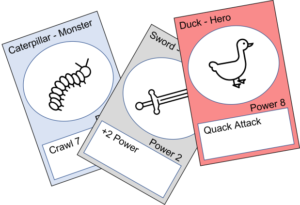

Modern applications, whether on a mobile device, in a browser on a laptop, or a connected application in your car's dashboard, use databases to store and retrieve information. But this data just isn't left in piles of text or images with no organization. No, these pieces of information are stored in data models that contain tables, relationships between the tables, and rule sets that keep this data consistent providing an exquisite user experience.

## Example scenario

You're the data architect for a company that produces a popular trading card game. You've been asked to create a data model for an online reference application that will store information about the cards in various sets and allow people to query on this set of data. The cards in the game have some general rules around naming, how much text can be on a card, the types and colors, and what art is used on each. Card sets are released five times a year so the application will also need to track which cards are in a specific set. The last requirement for the online reference application is that it needs to store multiple different language translations for each card so that it can be deployed globally.

Using these rules and stipulations, you need to create a data model that can scale to handle thousands of cards, prevent duplication of data, maintain data integrity, and provide the data to users as quickly as possible when searching.

## What will you be doing?

In this module, the task is to create a data model containing a set of tables that can store the card information for the online information reference application. Using the fictional scenario, you'll learn the following concepts:

- **Table Design Concepts**: How to design a data model containing tables that have relationships to each other.
- **Data Types**: See which data types best fit the type of information the application needs to store in the database.
- **Column Constraints**: Create specific rules defining what data can be entered into columns and rows in the tables.
- **Indexes**: Learn about table indexes and how they benefit information retrieval from a database.

## What is the main goal?

By the end of this session, you'll be able to create a data model containing database tables for your applications while taking into consideration what data needs to be stored, how to build relationships between tables, and methods to ensure only the data you want is allowed.