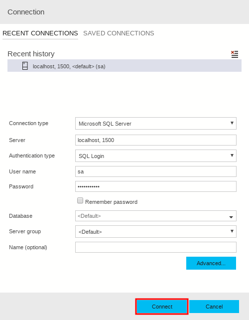

You are the system architect for a company that retails bicycle parts. Your customer-facing website has two servers: a front-end web server that hosts the website code and a SQL Server that hosts the product database.

You want to deploy containers in your integration testing environment to host both the website and the database. You want to be able to deploy both servers in a single step.

## Install Docker Compose

When you use Docker Compose, you can create a .yml file with instructions to deploy multiple containers. Start by installing Docker Compose. Follow these steps:

1. Open a new web browser tab and navigate to https://labondemand.com/AuthenticatedLaunch/51800?providerId=4.
1. Sign with a Microsoft account, or create a new account and start the virtual machine.
1. If using the virtual machine lab steps, scroll down to Exercise 7.
1. Log on, by clicking **Administrator**, typing the password **Pa$$w0rdLinux** and clicking **Sign In**.
1. At the top-left of the desktop, click **Applications**, click **System Tools** and then click **Terminal**.
1. To download Docker Compose, type the following command and then press Enter:

    ```Bash
    sudo curl -L https://github.com/docker/compose/releases/download/1.21.2/docker-compose-$(uname -s)-$(uname -m) -o /usr/local/bin/docker-compose
    ```

1. To mark the downloaded file as executable, type the following command and then press Enter:

    ```Bash
    sudo chmod +x /usr/local/bin/docker-compose
    ```

1. To create a link to the downloaded executable, type the following command and then press Enter:

    ```Bash
    sudo ln -s /usr/local/bin/docker-compose /usr/bin/docker-compose
    ```

## Complete a docker-compose.yml file

You have been supplied with a docker-compose.yml file. You want to ensure that all values in this file are correct before you use it to start the containers. Following these steps:

1. In the terminal, to change to the right folder, type the following command and then press Enter:

    ```Bash
    cd ~/containers/mssql-aspcore-example
    ```

1. To edit the docker-compose.yml file, type the following command and then press Enter:

    ```Bash
    nano docker-compose.yml
    ```

1. In the editor, replace the password **PASSWORD** with the password **Passw0rdSQL**.

    > [!IMPORTANT]
    > Do not use dollar signs in this password as in previous units. This is because dollar signs are interpreted differently in a YAML file.

1. To close the file, press Escape and then press CTRL-X. To save the changes, press **y** and then press **Enter**.
1. To edit the password in the **db-init.sh** file, type the following command and then press Enter:

    ```Bash
    nano ./mssql-aspcore-example-db/db-init.sh
    ```

1. In the editor, replace the password **PASSWORD** with the password **Passw0rdSQL**.
1. To close the file, press Escape and then press CTRL-X. To save the changes, press **y** and then press **Enter**.

## Start the containers

Now that you have created and configured the Docker Compose file, you can use it to start the two containers. Follow these steps:

1. In the terminal, to check that Docker is running, type the following command and then press Enter:

    ```Bash
    systemctl status docker
    ```

1. If the status is not **Active**, then type the following command and then press Enter:

    ```Bash
    sudo systemctl start docker
    ```

1. In the terminal, type the following command, and then press Enter:

    ```Bash
    sudo docker-compose up
    ```

   Docker Compose downloads the necessary images and starts the containers.

## Connect to the database by using Azure Data Studio

The two-container system is now up and running. You can check that the database is present by using Azure Data Studio:

1. To start a new instance of the terminal, click **Applications**, click **System Tools** and then click **Terminal**.
1. To start Azure Data Studio, type **azuredatastudio** and then press Enter.
1. In Azure Data Studio, in the top left, click the **Servers** icon and then click the **New Connection Icon**.

   

1. In the **Connection** window, in the **Server** textbox, type **localhost, 1500**.
1. In the **User name** textbox, type **sa**.
1. In the **Password** textbox, type **Passw0rdSQL** and then click **Connect**.

   

1. To check the tables in the new database, in the list of servers, under **localhost, 1500, &lt;default&gt; (sa)**, expand **Databases**, expand **ProductCatalog** and then expand **Tables**.

## Browse the website from the containers

We can check that the web server container is running by browsing the website that it hosts. Follow these steps:

1. To start Firefox, in the top left of the desktop, click **Applications**, click **Internet** and then click **Firefox**.
1. In the **Address** bar, type **localhost:5000** and then press Enter.
1. On the homepage, click **Product Catalog Demo**. Products are displayed. You can investigate individual products.
1. Close **Firefox** and **Azure Data Studio**.

## Shut down and remove the docker images

To stop and clean up the docker images, follow these steps:

1. To stop Docker Compose, Switch to the terminal and then press CTRL-C.
1. To remove the containers and images, type the following command and then press Enter:

    ```Bash
    sudo docker-compose down --rmi all
    ```