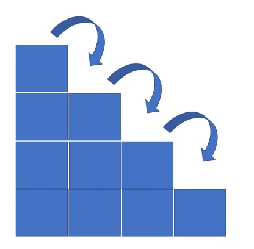

The optimizer in SQL Server will in some cases run pieces of the query plan called operators using parallelism with multiple concurrent threads. The number of threads used for a query plan operator is called Degree of Parallelism (DOP).

The Degree of Parallelism (DOP) that a query is executed can greatly affect its performance. Anytime a query is using parallelism, there's always the question of whether it's using the right amount of parallelism. Sometimes, if the DOP is too high, it can introduce inefficiencies into the query execution. If the DOP is too low, we may be missing some of the increase speed that parallelism can provide.  

SQL Server can control the maximum number of threads per operator using server, database, resource governor, or query settings called max Degree of Parallelism (MAXDOP). Setting the right MAXDOP for a SQL Server deployment can be a complex and sometimes difficult exercise.

## DOP enhancements in SQL Server 2022

In SQL Server 2022, we introduced a new feature called DOP feedback. The optimizer uses DOP feedback to find the parallel efficiency for a query. Parallel efficiency is the minimum DOP for a query that can result in the same overall query duration (factoring our common waits). This feature looks at any parallel query and determine if it might perform better with a lower Degree of Parallelism than currently being used. Reducing the DOP for a query can provide more threads and CPU resources for other queries of the application.  

DOP feedback never increases the DOP. At best, DOP feedback will revert to a stable previous DOP, and it works incrementally. Instead of trying to drastically lower the DOP all at once, DOP feedback tries a slightly lower DOP. If the DOP is good, it might try another slightly lower DOP. If the new, even lower DOP is good, DOP feedback might try to reduce again down to the DOP of two, although it will not make a parallel plan become serial. If the new, lower DOP isn't as good, we go back to the previous known good DOP and keep the query at that level.

## DOP feedback example

A query is compiled with a Degree of Parallelism of 8. If DOP feedback detects a fair amount of wait times between threads and CPU overhead, it suggests a lower DOP, such as DOP of 6. On the next execution, the query will execute with a DOP of 6. If the performance is better over the next several executions, the DOP of 6 will be considered stabilized. However, DOP feedback may then determine that there are still too many waits and further attempt a DOP of 4. Again, several executions are used to verify the feedback. DOP feedback may then try a DOP of 2. If after several executions the DOP 2 performance isn't determined to be better, then the system will return to suggesting a DOP of 4 as the most recent, stable, and verified DOP.

## DOP feedback architecture

:::image type="content" source="../media/degree-of-parallelism-feedback-architecture.png" alt-text="An image of Degree of Parallelism feedback architecture.":::

DOP feedback requires the Query Store to be enabled, database compatibility level 160, and a database setting called `DOP_FEEDBACK` to be enabled.  
With these settings, the optimizer will work in coordination with Query Store background tasks to look for repetitive and long-running queries that could benefit from a lower DOP. A feedback cycle is used to validate an adjusted query duration (factoring out waits) won't regress with a lower DOP value, and that lower overall CPU is observed for the query. After a period of validation, a lower DOP is considered stabilized and will be persisted in the Query Store. The optimizer continues to validate lower DOP values in a stepwise down fashion to find the best parallel efficiency or a minimum DOP, which is 2. DOP feedback will never increase DOP and will honor the MAXDOP setting for a query depending on server, database, resource governor, or query hint that has been applied.

## Simple setup and easy optimization with DOP feedback

With DOP feedback enabled, all of this is done without triggering query recompiles, and without user action.  

DOP feedback for SQL Server 2022 addresses a long-held challenge for our customers: finding the right Degree of Parallelism for each query without having to manually test and tweak each query for optimal performance.

For more information, see [Degrees of Parallelism (DOP) feedback](/sql/relational-databases/performance/intelligent-query-processing-feedback#degree-of-parallelism-dop-feedback).
