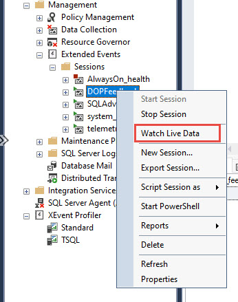
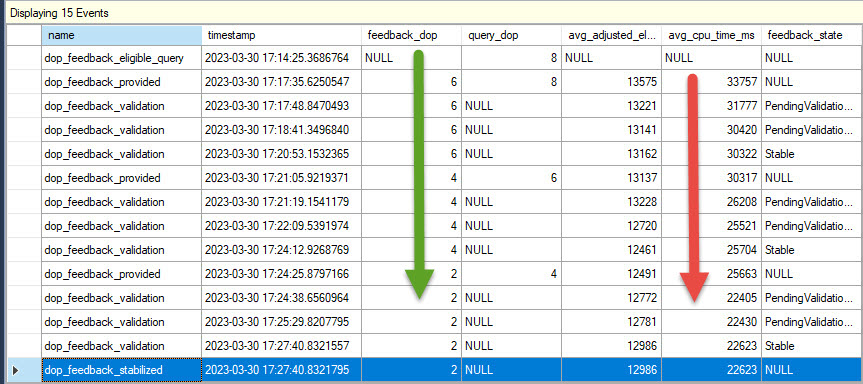
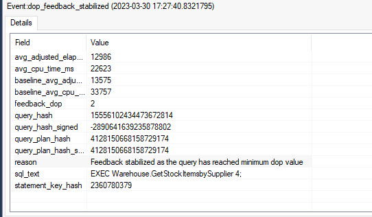
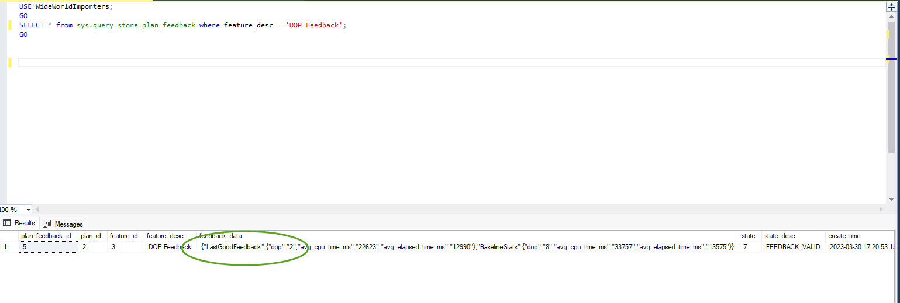
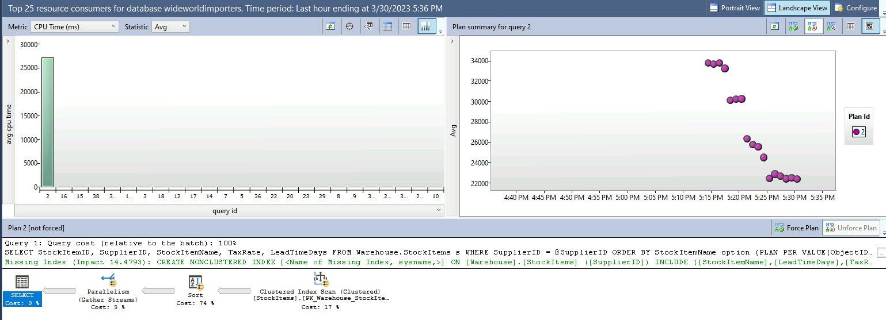

> [!NOTE]
> This exercise will be leveraging the following githib repository:
>
> https://github.com/microsoft/sqlworkshops-sql2022workshop/tree/main/sql2022workshop/03_BuiltinQueryIntelligence/dopfeedback
>
> Before continuing with the exercise, make sure that the prerequisites and setup has been completed.

As your role of a database administrator for the World Wide Importers Corporation, you have concerns about using the right amount of parallelism for the business unit queries. Looking through the release notes, you find that SQL Server 2022 has introduced a new feature called Degree Of Parallelism (DOP) feedback to find the parallel efficiency of a query.

In this exercise, we'll be evaluating the Degree of Parallelism feedback feature in SQL Server 2022.

You'll observe how this feature validates DOP values for an eligible query until the lowest possible DOP value is found that reduces CPU usage and achieves the *no harm* principle over time.

## Prerequisites

- SQL Server 2022 Evaluation or Developer Edition
- A virtual machine (VM) or computer with at minimum 8 CPUs and 24 GB of memory.
- Install the latest version of [SQL Server Management Studio (SSMS)](/sql/ssms/download-sql-server-management-studio-ssms).
- Download [ostress.exe](/troubleshoot/sql/tools/replay-markup-language-utility#tools-in-rml-utilities-for-sql-server) from https://aka.ms/ostress. Install using the RMLSetup.msi file that is downloaded. Use all defaults for the installation.

## Set up the exercise

1. Create a directory called `c:\sql_sample_databases` to store backups and files.

1. Download a backup of a customized version of the `WideWorldImporters` sample database for the DOP exercise from https://aka.ms/wwi_dop, and copy it into `c:\sql_sample_databases` directory.

   > [!NOTE]
   > If you try to restore the default sample `WideWorldImporters` database, you can use the [restorewwi.sql](https://github.com/microsoft/sqlworkshops-sql2022workshop/blob/main/sql2022workshop/03_BuiltinQueryIntelligence/dopfeedback/restorewwi.sql), [populatedata.sql](https://github.com/microsoft/sqlworkshops-sql2022workshop/blob/main/sql2022workshop/03_BuiltinQueryIntelligence/dopfeedback/populatedata.sql) and [rebuild_index.sql](https://github.com/microsoft/sqlworkshops-sql2022workshop/blob/main/sql2022workshop/03_BuiltinQueryIntelligence/dopfeedback/rebuild_index.sql) scripts to customize the database for the exercise.

1. [Restore](/sql/t-sql/statements/restore-statements-transact-sql) the customized version of the `WideWorldImporters` sample database to your SQL Server 2022 instance using SSMS. You may need to change the directory paths for the location of your backup and where you'll restore the database files.

    ```sql
    USE master;
    GO
    DROP DATABASE IF EXISTS WideWorldImporters;
    GO
    -- Edit the locations for files to match your storage
    RESTORE DATABASE WideWorldImporters FROM DISK = 'c:\sql_sample_databases\wwi_dop.bak' with
    MOVE 'WWI_Primary' TO 'c:\sql_sample_databases\WideWorldImporters.mdf',
    MOVE 'WWI_UserData' TO 'c:\sql_sample_databases\WideWorldImporters_UserData.ndf',
    MOVE 'WWI_Log' TO 'c:\sql_sample_databases\WideWorldImporters.ldf',
    MOVE 'WWI_InMemory_Data_1' TO 'c:\sql_sample_databases\WideWorldImporters_InMemory_Data_1',
    stats=5;
    GO
    ```

   > [!IMPORTANT]
   > If you have permission issues to restore the backup, you can try to copy the backup into the default `data` folder for your SQL Server installation and try the restore again. You'll need to edit the restore script accordingly. The default for most instances is `C:\Program Files\Microsoft SQL Server\MSSQL16.MSSQLSERVER\MSSQL\DATA.`

## Exercise - DOP feedback

1. Execute the following script in SSMS to configure MAXDOP to 0 for your SQL Server instance.

    ```sql
    sp_configure 'show advanced', 1;
    go
    reconfigure;
    go
    sp_configure 'max degree of parallelism', 0;
    go
    reconfigure;
    go
    ```

1. Execute the following script to create a stored procedure to query data that we'll use a query plan with parallelism.  

    ```sql
    USE WideWorldImporters;
    GO
    CREATE OR ALTER PROCEDURE [Warehouse].[GetStockItemsbySupplier]  @SupplierID int
    AS
    BEGIN
    SELECT StockItemID, SupplierID, StockItemName, TaxRate, LeadTimeDays
    FROM Warehouse.StockItems s
    WHERE SupplierID = @SupplierID
    ORDER BY StockItemName;
    END;
    GO
    ```

1. Create and run an XEvent session to watch live data and observe the events that get generated while the DOP feedback runs in the background.  

   Execute the following script to create and start an XEvent session.

    ```sql
    IF EXISTS (SELECT * FROM sys.server_event_sessions WHERE name = 'DOPFeedback')
    DROP EVENT SESSION [DOPFeedback] ON SERVER;
    GO
    CREATE EVENT SESSION [DOPFeedback] ON SERVER
    ADD EVENT sqlserver.dop_feedback_eligible_query(
        ACTION(sqlserver.query_hash_signed,sqlserver.query_plan_hash_signed,sqlserver.sql_text)),
    ADD EVENT sqlserver.dop_feedback_provided(
        ACTION(sqlserver.query_hash_signed,sqlserver.query_plan_hash_signed,sqlserver.sql_text)),
    ADD EVENT sqlserver.dop_feedback_reverted(
        ACTION(sqlserver.query_hash_signed,sqlserver.query_plan_hash_signed,sqlserver.sql_text)),
    ADD EVENT sqlserver.dop_feedback_stabilized(
        ACTION(sqlserver.query_hash_signed,sqlserver.query_plan_hash_signed,sqlserver.sql_text)),
    ADD EVENT sqlserver.dop_feedback_validation(
        ACTION(sqlserver.query_hash_signed,sqlserver.query_plan_hash_signed,sqlserver.sql_text))
    WITH (MAX_MEMORY=4096 KB,EVENT_RETENTION_MODE=NO_EVENT_LOSS,MAX_DISPATCH_LATENCY=1 SECONDS,MAX_EVENT_SIZE=0 KB,MEMORY_PARTITION_MODE=NONE,TRACK_CAUSALITY=OFF,STARTUP_STATE=OFF);
    GO
    -- Start XE
    ALTER EVENT SESSION [DOPFeedback] ON SERVER
    STATE = START;
    GO
    
    ```

1. Right-click the new **Extended Events** session in **Object Explorer** in SSMS and select **Watch Live Data**.

   
  
1. Execute the following script to set Query Store settings and database setting for DOP feedback.

    ```sql
    USE WideWorldImporters;
    GO
    -- Make sure QS is on and set runtime collection lower than default
    ALTER DATABASE WideWorldImporters SET QUERY_STORE = ON;
    GO
    ALTER DATABASE WideWorldImporters SET QUERY_STORE (OPERATION_MODE = READ_WRITE, DATA_FLUSH_INTERVAL_SECONDS = 60, INTERVAL_LENGTH_MINUTES = 1, QUERY_CAPTURE_MODE = ALL);
    GO
    ALTER DATABASE WideWorldImporters SET QUERY_STORE CLEAR ALL;
    GO
    -- You must change dbcompat to 160
    ALTER DATABASE WideWorldImporters SET COMPATIBILITY_LEVEL = 160;
    GO
    -- Enable DOP feedback
    ALTER DATABASE SCOPED CONFIGURATION SET DOP_FEEDBACK = ON;
    GO
    -- Clear proc cache to start with new plans
    ALTER DATABASE SCOPED CONFIGURATION CLEAR PROCEDURE_CACHE;
    GO
    ```

    The above script enables DOP feedback, set database compatibility to 160, and clear settings for the exercise. The `INTERVAL_LENGTH_MINUTES` setting on the Query Store has been set to 1 so that we could observe query statistics at a granular level.

1. Run **[workload_index_scan_users.cmd](https://github.com/microsoft/sqlworkshops-sql2022workshop/blob/main/sql2022workshop/03_BuiltinQueryIntelligence/dopfeedback/workload_index_scan_users.cmd)** from a Command Prompt.  

   > [!NOTE]
   > If you are using a named instance, edit **workload_index_scan_users.cmd** to use `-S .\<instance name>`

   The script takes around 15 minutes to run.

1. Once the script starts running, we can observe DOP feedback using the live data from Extended Events. Within the Live Data Viewer in SSMS, you can add columns to the default view to see the sequence of feedback. Right-click any field in the Details pane and select **Show Column in Table**.
  
   You should see a series of events like below.

   

   You should first see a `dop_feedback_eligible_query` event. The event takes several minutes to first appear. Then you'll see a series of `dop_feedback_provided` and `dop_feedback_validation` events until you see a final `dop_feedback_stabilized` event with a `feedback_dop value` of 2. Depending on your system, it's possible the system can stabilize at a DOP value of 4.

   The `dop_feedback_stabilized` event shows the reason for stabilization. In this case, the validation for DOP 2 stabilized because the query has reached the minimum DOP value.

   

   When feedback is provided and feedback state is stable, the feedback is persisted to Query Store.

1. Run the following script to see the changes in DOP and the resulting change in the query performance through query stats.

    ```sql
    USE WideWorldImporters;
    GO
    -- The hash value of 4128150668158729174 should be fixed for the plan from the workload
    SELECT qsp.query_plan_hash, avg_duration/1000 as avg_duration_ms, 
    avg_cpu_time/1000 as avg_cpu_ms, last_dop, min_dop, max_dop, qsrs.count_executions
    FROM sys.query_store_runtime_stats qsrs
    JOIN sys.query_store_plan qsp
    ON qsrs.plan_id = qsp.plan_id
    and qsp.query_plan_hash = CONVERT(varbinary(8), cast(4128150668158729174 as bigint))
    ORDER by qsrs.last_execution_time;
    GO
    ```

   You'll notice a small decrease in `avg_duration_ms` and decrease in needed CPU across the various `last_dop` values.

   

1. Run the following script to see the persisted DOP feedback.

    ```sql
    USE WideWorldImporters;
    GO
    SELECT * from sys.query_store_plan_feedback;
    GO
    ```

1. Examine the values in the `feedback_desc` field to see the `BaselineStats` and `LastGoodFeedback` values.  

   

1. You can also view the improvement in performance through the **Top Resource Consuming Queries** report. Open the **WideWorldImporters** > **Query Store** > **Top Resource Consuming Queries** in SSMS **Object Explorer** to open the report.  

   

1. Change **Statistic** to `Avg` and **Metric** to `Duration (ms)`. You can see the decrease in time until stabilization of DOP.

   

1. Change the **Metric** to `CPU Time (ms)` and observe. You can see the decrease in CPU.

   

   This above report shows you the real benefit of DOP feedback. There's a significant reduction in CPU resources required to achieve a similar or lower duration for the query without any user action.
