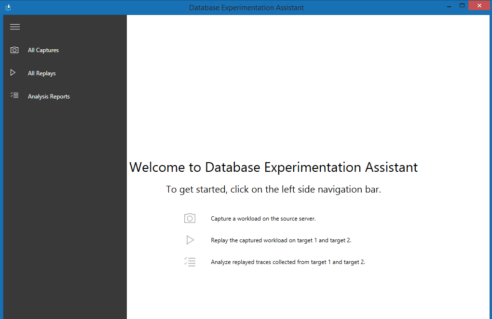

Use the **Microsoft Database Experimentation Assistant (DEA)** to test a database and create an analysis report that helps a company to review the impact of changes.

You provide database support to the customer call center at a telecommunications company. You've installed SQL Server 2019 on a non-production server. Now you want to test the current workload of the call center database on the new version. 

When the live database is upgraded, it's important that performance isn't severely reduced. You want to reassure management that customers won't wait on the phone because the call center software is slow to respond.

You hope to use the DEA to provide solid evidence that the database upgrade will maintain the current level of performance.

In this unit, you'll see how the DEA produces the evidence you need.

## What is the Microsoft Database Experimentation Assistant?

In practice, many developers will work continuously to make additions, improvements, and fixes to databases in a company. This scenario, along with natural data growth, makes it difficult to pinpoint precisely what causes a reduction in performance. The problem could be caused by one or more queries, a table that's grown too large, or the addition of a bad index. If a database slows down after multiple changes are applied, how do you know what caused the degradation? When you've control to change a single thing, it's easy to test the impact of that change: this operation is known as **A/B testing**.

The DEA is an A/B testing solution that monitors the impact of a change within your SQL Server environment. DEA captures a workload and reruns it against a target database that incorporates the change. For example, it might be the addition of a new table or index that you can't test in production. You can't know the effect of the new table until you run a typical workload on it.



The DEA is ideal for testing the impact of upgrading a database. It captures a workload, runs it against the upgraded database, then reports back on the performance impact. You can analyze the results of running queries against two databases, one of which incorporates the single change you've made. This procedure ensures the output reflects only the single change. The source and target databases supported by the DEA are SQL Server 2005 or above. You can replay the capture on Azure SQL Database, Azure SQL Managed Instance, and SQL Server on Linux.

When multiple developers are continually applying changes to databases within an organization, there may be no structured change log. Then it's difficult to find out what change caused the database performance to slow down. In a call center, where results must be instantaneous for customers waiting on the phone, an adverse change can be detrimental to the business. The DEA tests a change that might have an impact, and compares it to the unchanged database. You apply the A/B testing method to analyze one change at a time, helping you to clearly know its effect. The change might mean an improvement to performance, degradation, or maybe no performance difference, which is equally acceptable.

### Prepare for the exercises

Later, you'll be using a virtual machine for the exercises. Run these commands to set up the machine and connect to it.

1. In the Cloud Shell, create a VM. 

    ```azurecli
    PASSWORD=$(openssl rand -base64 32)
    az vm create \
        --name SQL2019Server \
        --image "MicrosoftSQLServer:sql2019-ws2019:sqldev:latest" \
        --size Standard_D2s_v3 \
        --admin-username azureadmin \
        --admin-password $PASSWORD \
        --nsg-rule RDP \
        --resource-group <rgn>[Sandbox resource group]</rgn>
    echo $PASSWORD
    ```
    
1. Make a note of this password as you'll need it to connect to the VM in the exercises.
1. Open the RDP port so you can connect to a Remote Desktop Connection.

    ```azurecli
    az vm open-port \
        --port 3389 \
        --name SQL2019Server \
        --resource-group <rgn>[Sandbox resource group]</rgn>
    ```
