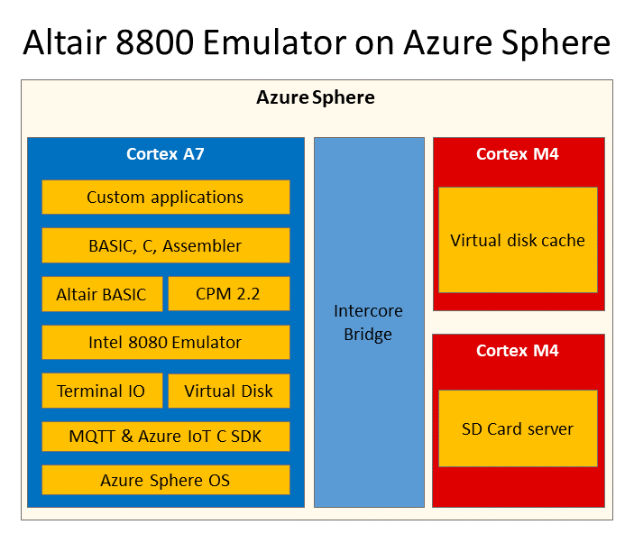

In this module, you will learn about the architecture of Azure Sphere and the application architecture of the Altair emulator. You will also learn how to deploy the emulator to your Azure Sphere.

## Azure Sphere Architecture

The Azure Sphere microcontroller unit (MCU) has three developer-accessible cores, a Cortex-A7 which runs a Linux kernel, and two Cortex-M4 cores that can run bare-metal code, or a real-time operating system such as Azure RTOS or FreeRTOS.

High-level applications running on the Cortex-A7 Linux kernel are used for less timing-sensitive tasks such as establishing network connections, negotiating security, updating device state, communicating with real-time core applications, and sending telemetry messages to cloud gateways such as IoT Hub and IoT Central.


## The Altair emulator application architecture

The Altair emulator consists of three applications, one high-level application, and two real-time applications.



1. The **AltairHL_emulator** high-level application is responsible for running the Altair emulator and managing communications.

    * The Altair project is a dual communications stack project. The built-in Azure IoT C SDK is used for communications with IoT Central. The Altair emulator's stdin, stdout and disk requests are passed over MQTT and a back-end MQTT Broker.

1. The **AltairRT_disk_cache_server** real-time application.

    * This application provides Cache-Aside services using a Least Recently Used eviction policy for the Altair emulator virtual file system. The Altair emulator uses the cache to improve remote disk performance. The cache-aside pattern is useful in a wide range of scenarios. For example, you could cache Price Look-Up codes for retail solutions, improving application performance, and application availability, and customer satisfaction.

1. The **AltairRT_enviromon** real-time application.

    * This is a bare metal real-time application responsible for sensing environmental data. If you are using the Avnet Azure Sphere then the onboard temperature and pressure sensor are used. If you are using the Seeed Studio Azure Sphere dev kits then random sensible environment data is generated. This data is available to BASIC apps running on the Altair emulator.

<!-- ## IoT Central IoT Plug and Play model

The IoT Plug and Play model for this learning module can be found in the **IoTPlugAndPlay** folder. This model has been uploaded to the public repository of IoT Plug and Play models. To learn more about IoT Plug and Play visit "[What is IoT Plug and Play](https://docs.microsoft.com/azure/iot-pnp/overview-iot-plug-and-play?azure-portal=true)".

The IoT Plug and Play model used by this learning module is declared in main.c.

```c
#define IOT_PLUG_AND_PLAY_MODEL_ID		"dtmi:com:example:azuresphere:altair;2"
```

IoT Central is an IoT Plug and Play enabled application. When your device first connects to IoT Central, the IoT Plug and Play Model ID is passed to IoT Central. IoT Central then retrieves the IoT Plug and Play model from the public repository of IoT Plug and Play models and creates a device template and default views. -->