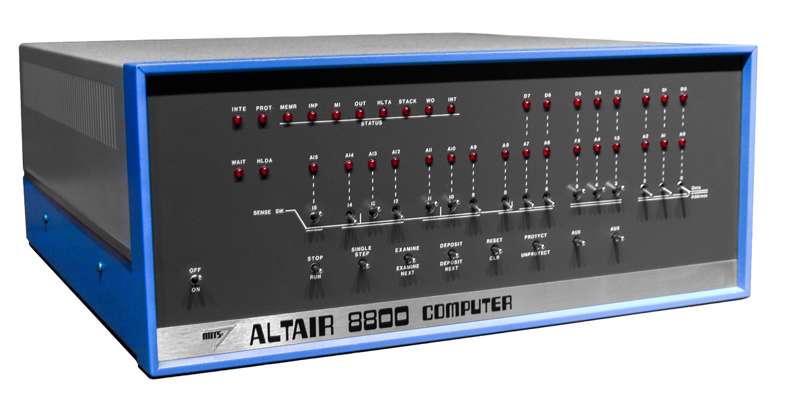

Welcome to the *Learn computing fundamentals with Altair 8800 emulator & Azure Sphere* learning path.

## Introduction to the Altair 8800

The Altair 8800 is considered to be the computer that kick-started the Personal Computer revolution. You can learn more about the Altair at https://en.wikipedia.org/wiki/Altair_8800.

[Altair 8800 image attribution - Smithsonian Museum](https://commons.wikimedia.org/wiki/File:Altair_8800,_Smithsonian_Museum.jpg)

The Altair 8800 was built on the [Intel 8080](https://en.wikipedia.org/wiki/Intel_8080) CPU, the second 8-bit microprocessor manufactured by Intel in 1974. By today's standards, it's a simple CPU design, perfect for learning computing fundamentals due to its small instruction set.

This learning path brings together the Open Source Altair 8800 emulator and Azure Sphere. You will learn about:

- Secure IoT
- Secure cloud services
- Computing fundamentals
- Caching strategies
- Programing the Altair with Intel 8080 opcodes, Assembly, C, and BASIC.

## Introduction to Azure Sphere

The traditional approach to IoT microcontroller (MCU) development is that you are responsible for integrating and maintaining all the bits of a solution. This approach includes the communications stack, security, authentication, certificates, identity, encryption libraries, update processes, your solution, and more. Not only are you a solution domain expert, but you are now responsible for tracking new and emerging security threats, mitigating, and updating to protect IoT devices.

Azure Sphere is a unique highly secure IoT platform. You focus on your solution, Azure Sphere deals with security, identity, certificates, reporting, tracking emerging attack vectors, mitigating, updating the platform, and application distribution to protect your solutions, customers, and reputations.

Azure Sphere consists of the following components:

- **Azure Sphere certified chips** from hardware partners include built-in Microsoft security technology to provide connectivity and a dependable hardware root of trust.
- **Azure Sphere OS** adds layers of protection and ongoing security updates to create a trustworthy platform for new IoT experiences.
- **Azure Sphere Security Service** brokers trust for device-to-cloud communication, detects threats, and renews device security.

Together these components implement [The Seven Properties of Highly Secure Devices](https://www.microsoft.com/research/publication/seven-properties-highly-secure-devices).

## Introduction to the cloud-connected Altair emulator on Azure Sphere

The core of the system is the Open Source Intel 8080 CPU emulator that runs compiled Intel 8080 binaries. Layered on the emulator is Altair BASIC and the CP/M operating system. On CP/M, three languages are available: BASIC, and C, and Assembly.

- The solution integrates several Azure cloud services including:
  - Azure IoT Central to configure the Altair emulator and reporting.
  - An Azure Static Web App for the Altair Web Terminal
  - An Azure Virtual Machine. The virtual machine runs the virtual disk and MQTT broker services.

- The Altair emulator running on the Azure Sphere is accessible via a web browser-based terminal.

- The Altair emulator runs on the Azure Sphere Cortex A7. Depending on your hardware configuration, a virtual disk cache or SD Card server is running on one of the real-time Cortex M4 cores.

## Introduction to Altair 8800 emulator on Azure Sphere

In this module, you will:

- Learn about the Altair 8800.
- Learn about Azure Sphere.
- Learn about the cloud-connected Altair emulator on Azure Sphere.

## Prerequisites

- A computer with an x86-64-based processor running:
  - Windows 10 Anniversary Update or later.
  - Or, 64-bit Ubuntu 20.04 LTS or Ubuntu 18.04 LTS.
- An Azure Sphere developer board. Either:
  - An Avnet Azure Sphere Starter Kit Rev 1 or 2.
  - Or, a Seeed Studio Azure Sphere MT3620 Development Kit.
