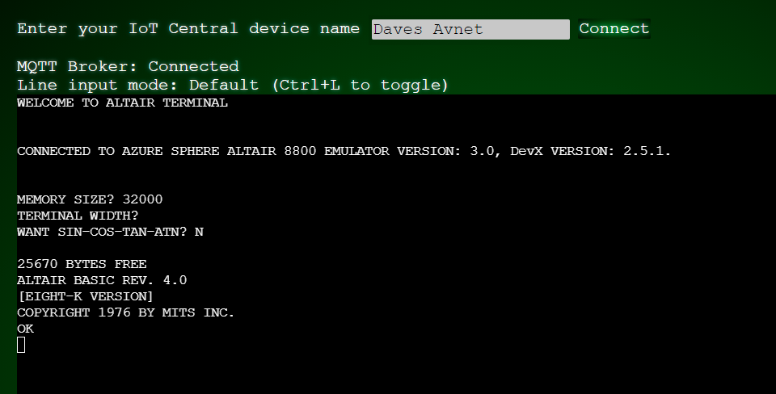

In this exercise, you'll learn how to write your first Altair BASIC application. Following that, you'll learn how to start CP/M and write applications with Basic, C, and Assembler.

## Altair Basic

On startup, the Altair emulator loads Altair BASIC. You'll be prompted for the following information:

* **MEMORY SIZE?** If you only plan to run Altair BASIC, press the Enter key. If you plan to boot into CP/M, then enter 32000 followed by the Enter key.
* **TERMINAL  WIDTH?** Press the Enter key to accept the default.
* **WANT SIN-COS-TAN-ATN?** Y or N

Altair BASIC will respond with the amount of memory and version information.

> [!div class="mx-imgBorder"]
> 

### Type your first program

```basic
10 for i = 1 to 1000
20 print i
30 next i
```

To run the program, type

```basic
run
```

and press Enter.

### Useful commands

* list
* new
* load

For more information about Altair BASIC, see the [Altair 8800 BASIC Reference Manual](https://altairclone.com/downloads/manuals/BASIC%20Manual%2075.pdf?azure-portal=true).

### Loading applications

There are six preloaded Altair BASIC applications:

* STARTREK.BAS
* TICTACTOE.BAS
* SIMPLE.BAS
* LOOPY.BAS
* WEATHER.BAS
* IOT.BAS

To load an application type **load** followed by the application name in speech marks. For example:

```basic
load "TICTACTOE.BAS"
```

Then run the application.

```text
run
```
