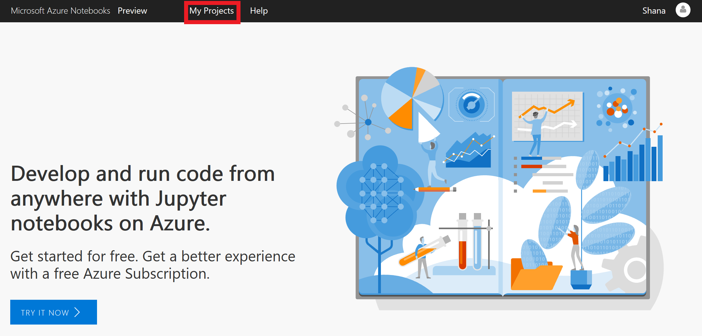
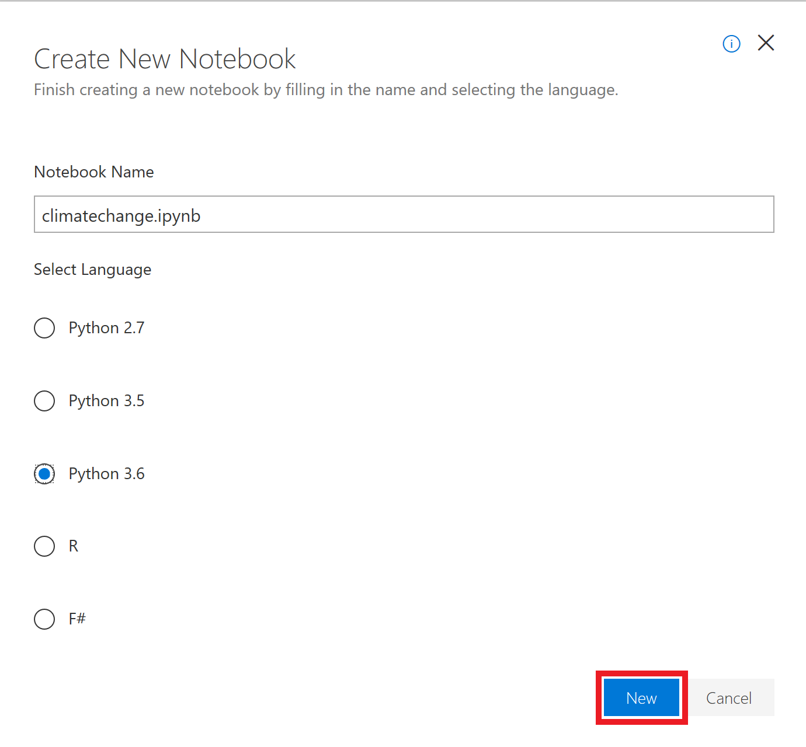
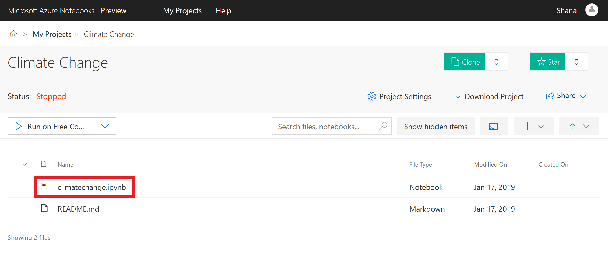

The first order of business is to create a new Azure Notebook. Azure Notebooks are contained in *libraries* whose primary purpose is to group related notebooks. In this exercise, you will create a new project and then create a notebook inside it.

1. Navigate to [https://notebooks.azure.com](https://notebooks.azure.com/?azure-portal=true) in your browser.

1. Sign in using your Microsoft account. 

1. Click **My Projects** in the top menubar.

    

    _Navigating to the Projects page_

1. Click **+ New Project**. Enter "Climate Change" (without quotation marks) for the project name and "climate-change" as the project ID. Uncheck the **Public project** box, and then click **Create**.

    

    _Creating a project_

1. Click the **+** sign to add a notebook to the project.

    

    _Adding a notebook to the project_

1. Name the notebook "climatechange.ipynb" and select **Python 3.6 Notebook** as the item type. This will create a notebook with a Python 3.6 kernel. One of the strengths of Jupyter notebooks is that you can use different languages by choosing different kernels.

    

    _Creating a notebook_

    If you're curious, the .ipynb file-name extension stands for "IPython notebook." Jupyter notebooks were originally known as IPython (Interactive Python) notebooks, and they only supported Python as a programming language. The name Jupyter is a combination of Julia, Python, and R — the core programming languages that Jupyter supports.

1. Click the new notebook. This will launch the notebook and allow you to start editing it.

    

    _Opening the notebook_

You can create additional projects and notebooks as you work with Azure Notebooks. Projects provide a means for grouping related notebooks. You can create notebooks from scratch, or you can upload existing notebooks. In the next exercise, you will build a notebook from scratch and learn the basics of working with cells.