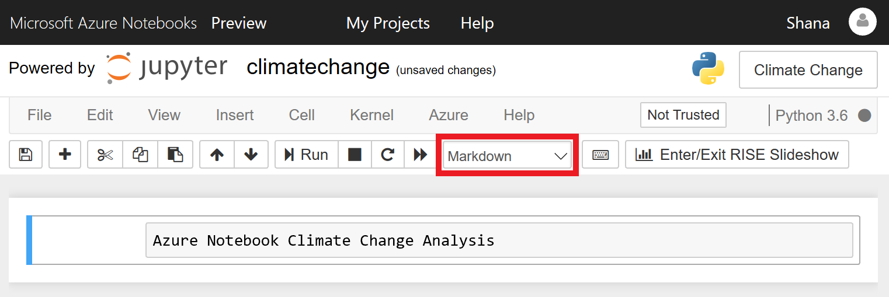
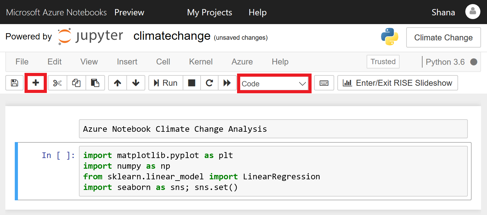
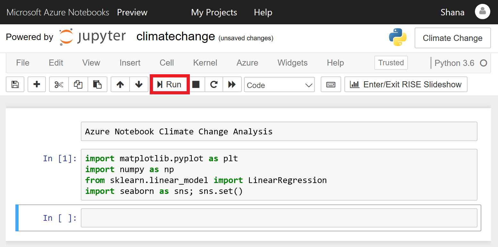
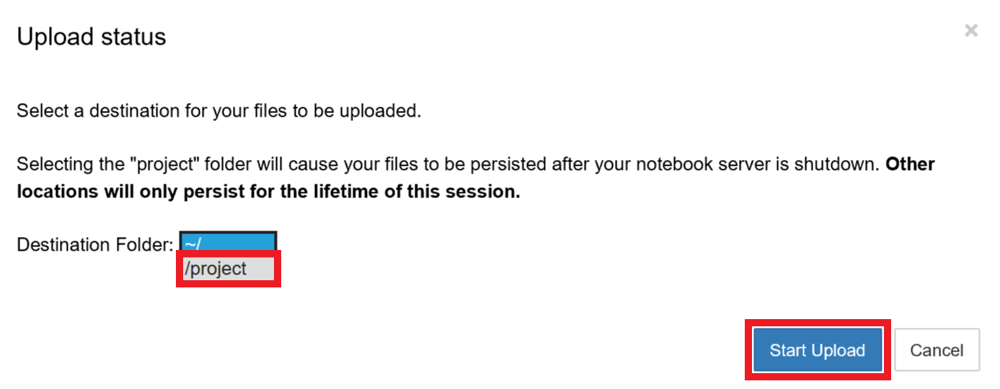

Jupyter notebooks are composed of *cells*. Each cell is assigned one of three types:

- **Markdown** for entering text in [markdown](https://github.com/adam-p/markdown-here/wiki/Markdown-Cheatsheet) format
- **Code** for entering code that runs interactively
- **Raw NBConvert** for entering data inline

Code entered into code cells is executed by a *kernel*, which provides an isolated environment for the notebook to run in. The popular IPython kernel supports code written in Python, but [dozens of other kernels](https://github.com/jupyter/jupyter/wiki/Jupyter-kernels) are available supporting other languages. Azure Notebooks support Python, R, and F# out of the box. They also support the installation of the many packages and libraries that are commonly used in research.

The notebook editor currently shows an empty cell. In this exercise, you will add content to that cell and add other cells to import Python packages such as [NumPy](https://www.numpy.org/), load a pair of NASA data files containing [climate data](https://data.giss.nasa.gov/gistemp/graphs_v3/), and create a scatter plot from the data.

1. In the first cell, set the cell type to **Markdown** and enter the "Azure Notebook Climate Change Analysis" into the cell itself:

    

    _Defining a markdown cell_

1. Click the **+** button in the toolbar to add a new cell. Make sure the cell type is **Code**, and then enter the following Python code into the cell:

    ```python
    import matplotlib.pyplot as plt
    import numpy as np
    from sklearn.linear_model import LinearRegression
    import seaborn as sns; sns.set()
    ```

    

    _Adding a code cell_

1. Now click the **Run** button to run the code cell and import the packages specified in the `import` statements. Ignore any warnings that are displayed as the environment is prepared for the first time.

    > You can remove the warnings by selecting the code cell and running it again.

    

    _Running a code cell_

1. Click **File** in the menu at the top of the page, and select **Upload** from the drop-down menu. Then upload the files named **5-year-mean-1951-1980.csv** and **5-year-mean-1882-2014.csv** from [this link](https://a4r.blob.core.windows.net/public/notebook-resources.zip).

    

    _Uploading data to the notebook_

1. Select **/project** as your **Destination Folder** to ensure your files persist. Click **Start Upload** to upload the files, and **OK** once they successfully upload.

    

    _Selecting destination folder for data_

1. Place the cursor in the empty cell at the bottom of the notebook. Enter "Import data" as the text and change the cell type to **Markdown**.

1. Now add a **Code** cell and paste in the following code.

    ```python
    yearsBase, meanBase = np.loadtxt('5-year-mean-1951-1980.csv', delimiter=',', usecols=(0, 1), unpack=True)
    years, mean = np.loadtxt('5-year-mean-1882-2014.csv', delimiter=',', usecols=(0, 1), unpack=True)
    ```

1. Click the **Run** button to run the cell and use NumPy's `loadtxt` function to load the data that you uploaded. The data is now in memory and can be used by the application.

    

    _Loading the data_

1. Place the cursor in the empty cell at the bottom of the notebook. Change the cell type to **Markdown** and enter "Create a scatter plot" as the text.

1. Add a **Code** cell and paste in the following code, which uses [Matplotlib](https://matplotlib.org/) to create a scatter plot.

    ```python
    plt.scatter(yearsBase, meanBase)
    plt.title('scatter plot of mean temp difference vs year')
    plt.xlabel('years', fontsize=12)
    plt.ylabel('mean temp difference', fontsize=12)
    plt.show()
    ```

1. Click **Run** to run the cell and create a scatter plot.

    

    _Scatter plot produced by Matplotlib_

The data set you loaded uses a 30-year mean between 1951 and 1980 to calculate a base temperature for that period, and then uses 5-year mean temperatures to calculate the difference between the 5-year mean and the 30-year mean for each year. The scatter plot shows the annual temperature differences.
