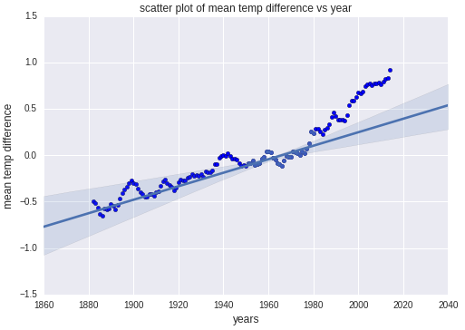

One of the cool things about Azure Notebooks — and Python in general — is that there are thousands of open-source libraries you can leverage to perform complex tasks without writing a lot of code. In this exercise, you will use [Seaborn](https://seaborn.pydata.org/), a library for statistical visualization, to plot the second of the two data sets you loaded, which covers the years 1882 to 2014. Seaborn can create a regression line accompanied by a projection showing where data points should fall based on the regression with one simple function call.

1. Place the cursor in the empty cell at the bottom of the notebook. Change the cell type to **Markdown** and enter "Perform linear regression with Seaborn" as the text.

1. Add a **Code** cell and paste in the following code.

    ```python
    plt.scatter(years, mean)
    plt.title('scatter plot of mean temp difference vs year')
    plt.xlabel('years', fontsize=12)
    plt.ylabel('mean temp difference', fontsize=12)
    sns.regplot(yearsBase, meanBase)
    plt.show()
    ```

1. Run the code cell to produce a scatter chart with a regression line *and* a visual representation of the range in which the data points are expected to fall.

    

    _Comparison of actual values and predicted values generated with Seaborn_

Notice how the how the data points for the first 100 years conform nicely to the predicted values, but the data points from roughly 1980 forward do not. It is models such as these that lead scientists to believe that climate change is accelerating.