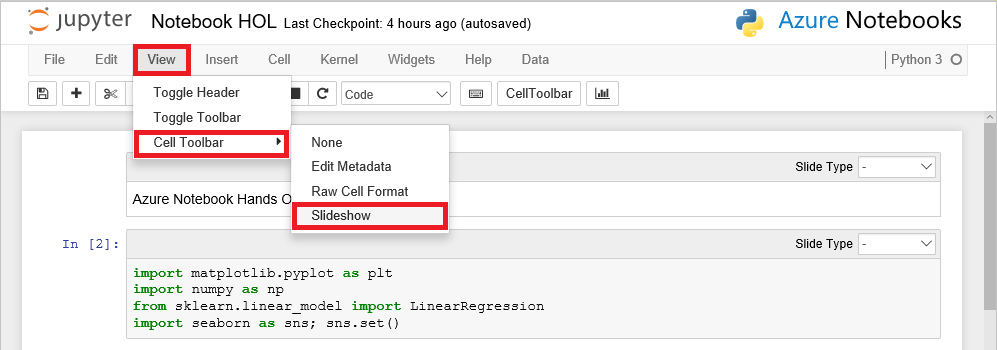
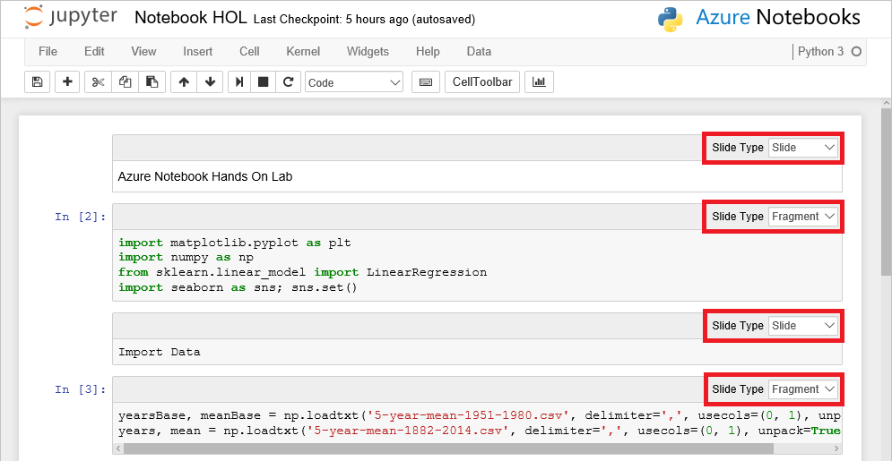
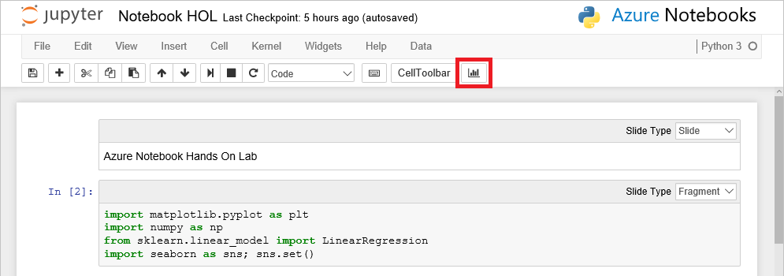
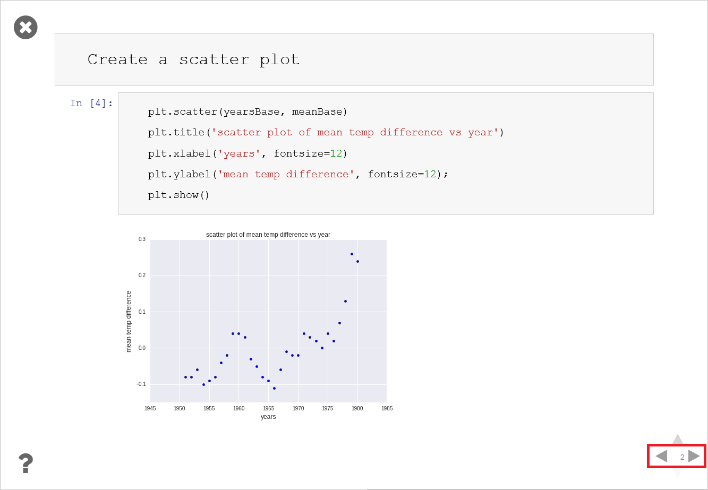

<!-- TODO: Creating slideshows in Azure Notebooks is currently broken. See https://github.com/Microsoft/AzureNotebooks/issues/445 -->

What if you wanted to take a notebook you've created and use it in a presentation? You can use create slide shows from the cells in a notebook and play them back when it's presentation time. In this exercise, you will create a slide show from the notebook you built in the previous exercises.

1. Scroll up to the top of the notebook. Then select **View** -> **Cell Toolbar** -> **Slideshow**. This will display a **Slide Type** drop-down in each cell for specifying how individual cells behave during a slide show.

    

    _Toggling the Slide Type display_

1. Set the **Slide Type** for each markdown slide in the notebook to **Slide**. Set the **Slide Type** for each code cell to **Fragment**.

    

    _Specifying the slide type for individual cells_

1. Click the **Slideshow** button to play the slide show.

    

    _Starting the slide show_

1. Maximize the browser window (or switch the browser to full-screen mode if your browser supports it). Then use the arrow buttons in the lower-right corner of the page (or the left and right arrows keys on the keyboard) to navigate backward and forward in the slide show.

    

    _Viewing the slide show_

1. When you're finished, click the **X** in the upper-left corner of the page to end the slide show.

Creating slide shows is easy. But what if you want to share a notebook with colleagues so they can use it, too? That is the subject of the next exercise.