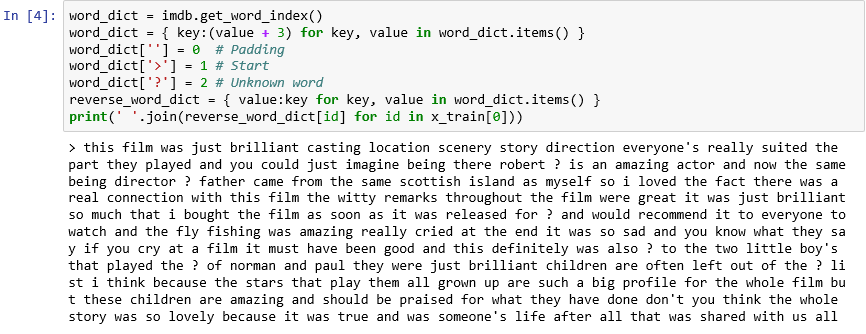
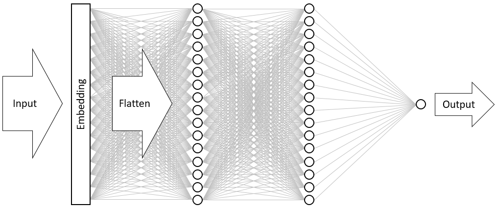
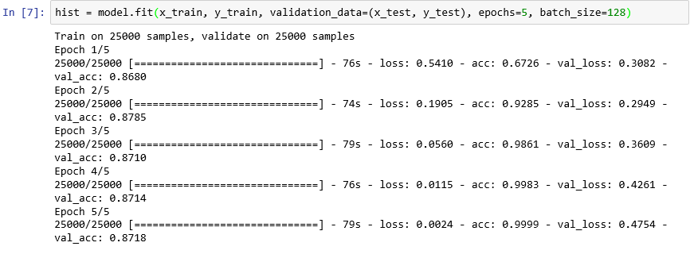

In this exercise, you will use Keras to build and train a neural network that analyzes text for sentiment. In order to train a neural network, you need data to train it with. Rather than download an external dataset, you will use the [IMDB movie reviews sentiment classification](https://keras.io/datasets/#imdb-movie-reviews-sentiment-classification) dataset that's included with Keras. The IMDB dataset contains 50,000 movie reviews that have been individually scored as positive (1) or negative (0). The dataset is divided into 25,000 reviews for training and 25,000 reviews for testing. The sentiment expressed in these reviews is the basis for which your neural network will analyze text presented to it and score it for sentiment.

> The IMDB dataset is one of several useful datasets included with Keras. For a complete list of built-in datasets, see <https://keras.io/datasets/.>

1. Type or paste the following code into the notebook's first cell and click the **Run** button (or press **Shift+Enter**) to execute it and add a new cell below it:

    ```python
    from keras.datasets import imdb
    top_words = 10000
    (x_train, y_train), (x_test, y_test) = imdb.load_data(num_words=top_words)
    ```

    This code loads the IMDB dataset that's included with Keras and creates a dictionary mapping the words in all 50,000 reviews to integers indicating the words' relative frequency of occurrence. Each word is assigned a unique integer. The most common word is assigned the number 1, the second most common word is assigned the number 2, and so on. `load_data` also returns a pair of tuples containing the movie reviews (in this example, `x_train` and `x_test`) and the 1s and 0s classifying those reviews as positive and negative (`y_train` and `y_test`).

1. Confirm that you see the message "Using TensorFlow backend" indicating that Keras is using TensorFlow as its back end.

    

    _Loading the IMDB dataset_

    If you wanted Keras to use the Microsoft Cognitive Toolkit, also known as CNTK, as its back end, you could do so by adding a few lines of code at the beginning of the notebook. For an example, see [CNTK and Keras in Azure Notebooks](http://www.johndehavilland.com/blog/2017/12/19/keras-and-cntk-azure-notebooks.html).

1. So what exactly the did the `load_data` function load? The variable named `x_train` is a list of 25,000 lists, each of which represents one movie review. (`x_test` is also a list of 25,000 lists representing 25,000 reviews. `x_train` will be used for training, while `x_test` will be used for testing.) But the inner lists — the ones representing movie reviews — don't contain words; they contain integers. Here's how it's described in the Keras documentation:

    

    The reason the inner lists contain numbers rather than text is that you don't train a neural network with text; you train it with numbers. Specifically, you train it with [tensors](https://en.wikipedia.org/wiki/Tensor). In this case, each review is a 1-dimensional tensor (think of a 1-dimensional array) containing integers identifying the words comprising the review. To demonstrate, type the following Python statement into an empty cell and execute it to see the integers representing the first review in the training set:

    ```python
    x_train[0]
    ```

    

    _Integers comprising the first review in the IMDB training set_

    The first number in the list — 1 — doesn't represent a word at all. It marks the start of the review and is the same for every review in the dataset. The numbers 0 and 2 are reserved as well, and you subtract 3 from the other numbers to map an integer in a review to the corresponding integer in the dictionary. The second number — 14 — references the word that corresponds to the number 11 in the dictionary, the third number represents the word assigned the number 19 in the dictionary, and so on.

1. Curious to see what the dictionary looks like? Execute the following statement in a new notebook cell:

    ```python
    imdb.get_word_index()
    ```

    Only a subset of the dictionary entries are shown, but in all, the dictionary contains more than 88,000 words and the integers that correspond to them. Note that the output you see will probably not match the output in the screen shot because the dictionary is generated anew each time `load_data` is called.

    

    _Dictionary mapping words to integers_

1. As you have seen, each review in the dataset is encoded as a collection of integers rather than words. Is it possible to reverse-encode a review so you can see the original text that comprised it? Enter the following statements into a new cell and execute them to show the first review in `x_train` in textual format:

    ```python
    word_dict = imdb.get_word_index()
    word_dict = { key:(value + 3) for key, value in word_dict.items() }
    word_dict[''] = 0  # Padding
    word_dict['>'] = 1 # Start
    word_dict['?'] = 2 # Unknown word
    reverse_word_dict = { value:key for key, value in word_dict.items() }
    print(' '.join(reverse_word_dict[id] for id in x_train[0]))
    ```

    In the output, ">" marks the beginning of the review, while "?" marks words that aren't among the most common 10,000 words in the dataset. These "unknown" words are represented by 2s in the list of integers representing a review. Remember the `num_words` parameter you passed to `load_data`? This is where it comes into play. It doesn't reduce the size of the dictionary, but it restricts the range of integers used to encode the reviews.

    

    _The first review in textual format_

1. The reviews are "clean" in the sense that letters have been converted to lowercase and punctuation characters removed. But they are not quite ready to train a neural network to analyze text for sentiment. When you train a neural network with collection of tensors, each tensor needs to be the same length. At present, the lists representing reviews in `x_train` and `x_test` have varying lengths.

    Fortunately, Keras includes a function that takes a list of lists as input and converts the inner lists to a specified length by truncating them if necessary or padding them with 0s. Enter the following code into the notebook and run it to force all the lists representing movie reviews in `x_train` and `x_test` to a length of 500 integers:

    ```python
    from keras.preprocessing import sequence
    max_review_length = 500
    x_train = sequence.pad_sequences(x_train, maxlen=max_review_length)
    x_test = sequence.pad_sequences(x_test, maxlen=max_review_length)
    ```

1. Now that the training and testing data is prepared, it is time to build the model! Run the following code in the notebook to create a neural network that performs sentiment analysis:

    ```python
    from keras.models import Sequential
    from keras.layers import Dense
    from keras.layers.embeddings import Embedding
    from keras.layers import Flatten

    embedding_vector_length = 32
    model = Sequential()
    model.add(Embedding(top_words, embedding_vector_length, input_length=max_review_length))
    model.add(Flatten())
    model.add(Dense(16, activation='relu'))
    model.add(Dense(16, activation='relu'))
    model.add(Dense(1, activation='sigmoid'))
    model.compile(loss='binary_crossentropy',optimizer='adam', metrics=['accuracy'])
    print(model.summary())
    ```

    Confirm that the output looks like this:

    

    _Creating a neural network with Keras_

    This code is the essence of how you construct a neural network with Keras. It first instantiates a `Sequential` object representing a "sequential" model — one that is composed of an end-to-end stack of layers in which the output from one layer provides input to the next.

    The next several statements add layers to the model. First is an [embedding layer](https://keras.io/layers/embeddings/), which is crucial to neural networks that process words. The embedding layer essentially maps many-dimensional arrays containing integer word indexes into floating-point arrays containing fewer dimensions. It also allows words with similar meanings to be treated alike. A full treatment of word embeddings is beyond the scope of this lab, but you can learn more by reading [Why You Need to Start Using Embedding Layers](https://towardsdatascience.com/deep-learning-4-embedding-layers-f9a02d55ac12). If you prefer a more scholarly explanation, refer to [Efficient Estimation of Word Representations in Vector Space](https://arxiv.org/pdf/1301.3781.pdf). The call to [Flatten](https://keras.io/layers/core/#flatten) following the addition of the embedding layer reshapes the output for input to the next layer.

    The next three layers added to the model are [dense](https://keras.io/layers/core/#dense) layers, also known as *fully connected* layers. These are the traditional layers that are common in neural networks. Each layer contains *n* nodes or [neurons](https://en.wikipedia.org/wiki/Artificial_neuron), and each neuron receives input from every neuron in the previous layer, hence the term "fully connected." It is these layers that permit a neural network to "learn" from input data by iteratively guessing at the output, checking the results, and fine-tuning the connections to produce better results. The first two dense layers in this network contain 16 neurons each. This number was somewhat arbitrarily chosen; you might be able to improve the accuracy of the model by experimenting with different sizes. The final dense layer contains just one neuron because the ultimate goal of the network is to predict one output — namely, a sentiment score from 0.0 to 1.0.

    The result is the neural network pictured below. The network contains an input layer, an output layer, and two hidden layers (the dense layers containing 16 neurons each). For comparison, some of today's more sophisticated neural networks have more than 100 layers. One example is [ResNet-152](https://blogs.microsoft.com/ai/microsoft-researchers-win-imagenet-computer-vision-challenge/) from Microsoft Research, whose accuracy at identifying objects in photographs sometimes exceeds that of a human. You could build ResNet-152 with Keras, but you would need a cluster of GPU-equipped computers to train it from scratch.

    

    _Visualizing the neural network_

    The call to the [compile](https://keras.io/models/model/#compile) function "compiles" the model by specifying important parameters such as which [optimizer](https://keras.io/optimizers/) to use and what [metrics](https://keras.io/metrics/) to use to judge the accuracy of the model in each training step. Training doesn't begin until you call the model's `fit` function, so the `compile` call typically executes quickly.

1. Now call the [fit](https://keras.io/models/model/#fit) function to train the neural network:

    ```python
    hist = model.fit(x_train, y_train, validation_data=(x_test, y_test), epochs=5, batch_size=128)
    ```

    Training should take about 6 minutes, or a little more than 1 minute per epoch. `epochs=5` tells Keras to make 5 forward and backward passes through the model. With each pass, the model learns from the training data and measures ("validates") how well it learned using the test data. Then it makes adjustments and goes back for the next pass or *epoch*. This is reflected in the output from the `fit` function, which shows the training accuracy (`acc`) and validation accuracy (`val_acc`) for each epoch.

    `batch_size=128` tells Keras to use 128 training samples at a time to train the network. Larger batch sizes speed the training time (fewer passes are required in each epoch to consume all of the training data), but smaller batch sizes sometimes increase accuracy. Once you've completed this lab, you might want to go back and retrain the model with a batch size of 32 to see what effect, if any, it has on the model's accuracy. It roughly doubles the training time.

    

    _Training the model_

1. This model is somewhat unusual in that it learns well with just a few epochs. Note that the training accuracy quickly zooms to near 100%, while the validation accuracy goes up for an epoch or two and then flattens out. You generally don't want to train a model for any longer than is required for these accuracies to stabilize. The risk is [overfitting](https://en.wikipedia.org/wiki/Overfitting), which results in the model performing well against test data but not so well with real-world data. One indication that a model is overfitting is a growing discrepancy between the training accuracy and the validation accuracy. For a great introduction to overfitting, see [Overfitting in Machine Learning: What It Is and How to Prevent It](https://elitedatascience.com/overfitting-in-machine-learning).

    To visualize the changes in training and validation accuracy as training progress, execute the following statements in a new notebook cell:

    ```python
    import seaborn as sns
    import matplotlib.pyplot as plt
    %matplotlib inline

    sns.set()
    acc = hist.history['acc']
    val = hist.history['val_acc']
    epochs = range(1, len(acc) + 1)

    plt.plot(epochs, acc, '-', label='Training accuracy')
    plt.plot(epochs, val, ':', label='Validation accuracy')
    plt.title('Training and Validation Accuracy')
    plt.xlabel('Epoch')
    plt.ylabel('Accuracy')
    plt.legend(loc='upper left')
    plt.plot()
    ```

    The accuracy data comes from the `history` object returned by the model's `fit` function. Based on the chart that you see, would you recommend increasing the number of training epochs, decreasing it, or leaving it the same?

1. Another way to check for overfitting is to compare training loss to validation loss as training proceeds. Optimization problems such as this seek to minimize a loss function. You can read more [here](https://en.wikipedia.org/wiki/Loss_function). For a given epoch, training loss, much greater than validation loss, can be evidence of overfitting. In the previous step, you used the `acc` and `val_acc` properties of the `history` object's `history` property to plot training and validation accuracy. The same property also contains values named `loss` and `val_loss` representing training and validation loss, respectively. If you wanted to plot these values to produce a chart like the one below, how would you modify the code above to do it?

    

    _Training and validation loss_

    Given that the gap between training and validation loss begins increasing in the third epoch, what would you say if someone suggested that you increase the number of epochs to 10 or 20?

1. Finish up by calling the model's `evaluate` method to determine how accurately the model is able to quantify the sentiment expressed in text based on the test data in `x_test` (reviews) and `y_test` (0s and 1s, or "labels," indicating which reviews are positive and which are negative):

    ```python
    scores = model.evaluate(x_test, y_test, verbose=0)
    print("Accuracy: %.2f%%" % (scores[1] * 100))
    ```

    What is the computed accuracy of your model?

You probably achieved an accuracy in the 85% to 90% range. That's acceptable considering you built the model from scratch (as opposed to using a pretrained neural network) and the training time was short even without a GPU. It *is* possible to achieve accuracies of 95% or higher with alternate neural network architectures, particularly [recurrent neural networks](https://en.wikipedia.org/wiki/Recurrent_neural_network) (RNNs) that utilize [Long Short-Term Memory](https://en.wikipedia.org/wiki/Long_short-term_memory) (LSTM) layers. Keras makes it easy to build such networks, but training time can increase exponentially. The model that you built strikes a reasonable balance between accuracy and training time. However, if you would like to learn more about building RNNs with Keras, see [Understanding LSTM and its Quick Implementation in Keras for Sentiment Analysis](https://towardsdatascience.com/understanding-lstm-and-its-quick-implementation-in-keras-for-sentiment-analysis-af410fd85b47).