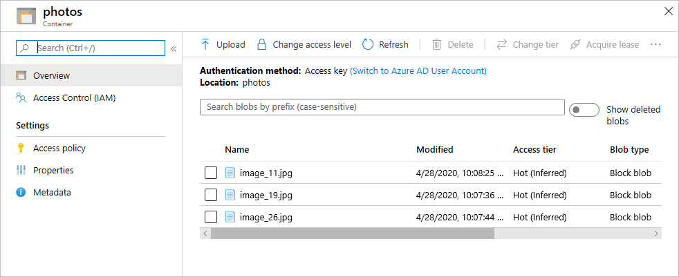
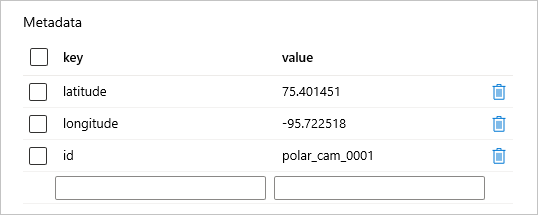

In this unit, you'll create an Azure Storage account and implement a simulated camera array in Node.js that uploads wildlife photos to the account. The storage account will store photographs taken by the cameras that you deploy.

Creating a storage account and uploading wildlife photos to the account are the first steps in building an end-to-end solution that demonstrates how you can combine Azure services to create sophisticated systems that incorporate cloud services and AI.

## Create a storage account

Let's begin by using Azure Cloud Shell to create an Azure Storage account. Cloud Shell provides a browser-based command line that you can use to run Azure commands. Cloud Shell is an alternative to installing the [Azure CLI](https://docs.microsoft.com/cli/azure/?view=azure-cli-latest&azure-portal=true) on your own computer.

> [!NOTE]
> Whether to use the CLI or Cloud Shell often is a matter of personal preference. One of the advantages of Cloud Shell is that it doesn't require you to install any software. Another is that you don't have to update Cloud Shell periodically as you do the CLI.

1. In your browser, go to the [Azure portal](https://portal.azure.com?azure-portal=true). If you're prompted to sign in, sign in with your Microsoft account.

1. In the portal global controls, select **Azure Cloud Shell**.

   

    _Open Azure Cloud Shell_

   If you're prompted to choose a programming language, select **Bash**. If you’re prompted to allow Cloud Shell to create a storage account (no storage is mounted), choose the option to create new storage. Cloud Shell will mount new storage for you and then open the Command Prompt window. You’ll see a welcome message and then the command prompt.

   You also can open Cloud Shell by going to [https://shell.azure.com](https://shell.azure.com?azure-portal=true) in a separate browser window.

1. The next task is to create a resource group to hold the storage account and other Azure resources that make up the solution. Make sure that the language selected in Cloud Shell is Bash. Then, create a resource group named `polar-bear-rg` in the Azure South Central US region:

   ```bash
   az group create --name polar-bear-rg --location southcentralus
   ```

   To paste commands into Cloud Shell, select Shift+Insert. To copy text from Cloud Shell to the clipboard, select Ctrl+Insert.

1. Run the following command to save the name you want to use for the storage account. In the command, replace `<account-name>` with the name you want to use. You'll reference the account name later in the `$ACCOUNT_NAME` field.

   ```bash
   ACCOUNT_NAME="<account-name>"
   ```

   > [!NOTE]
   > Storage account names must be between 3 and 24 characters in length and can contain only numbers and lowercase letters. The account name must be unique in Azure. If a command fails because the storage account name is already in use, change the name and try again.

1. Run the following command to create a storage account in the `polar-bear-rg` resource group:

   ```bash
   az storage account create --name $ACCOUNT_NAME --resource-group polar-bear-rg --location southcentralus --sku Standard_LRS
   ```

1. Azure Storage accounts support four types of storage: blobs, tables, files, and queues. Azure Blob Storage provides a massively scalable object store for text and binary data. Photos uploaded to your storage account will be stored as blobs. Before you can upload blobs to a storage account, you must create a container to store them in.

   Run the following command to create a container named `photos` in the storage account:

   ```bash
   az storage container create --name photos --account-name $ACCOUNT_NAME
   ```

1. In Cloud Shell, run the following command to list the access keys for the storage account:

   ```bash
   az storage account keys list --account-name $ACCOUNT_NAME
   ```

1. The primary access key is the `value` property that contains a long series of letters and number. Equate the *primary access key* value to the `key1` value. Then, copy the primary access key from the output and paste it in a text file so that you can retrieve the key later. 
  
   Remember that you can select Ctrl+Insert to copy text from Cloud Shell to the clipboard.

Now, you have a storage account for storing photos and a container to store them in. Next, let's deploy some cameras to capture photos of wildlife and upload them to Blob Storage.

## Deploy a simulated camera array

The next task is to create a Node.js app that simulates an array of motion-activated cameras. The cameras upload photos taken in the wild to the storage account's `photos` container.

1. If Node.js isn't installed on your computer, go to [https://nodejs.org/](https://nodejs.org/?azure-portal=true) and install it now. To check whether Node.js is installed and the version that's installed, in a Command Prompt or terminal window, run this command:

   ```console
   node -v
   ```

   If Node.js is installed, the output shows the version number. If the version number is less than 8.0, *download and install the latest version*.

1. Create a directory on your hard disk to be the project directory. Then, at the command line, run `cd` to change to that directory.

1. Run the following command to initialize the project directory to host a Node.js project and install a package:

    ```console
    npm init -y
    npm install azure-storage --save
    ```

    The [azure-storage](https://www.npmjs.com/package/azure-storage?azure-portal=true) package provides a programmatic interface to Azure Storage, including Blob Storage, for Node.js apps.

1. When the installation finishes, in the project directory, create a subdirectory named *photos*. Download a [.zip file of camera images](https://github.com/MicrosoftDocs/mslearn-build-ml-model-with-azure-stream-analytics/raw/master/camera-images.zip?azure-portal=true). Unzip the file, and then copy the 30 .jpg files that are in the .zip file to the *photos* subdirectory.  The simulated cameras will upload these images to Blob Storage. 

   The following images are a sample of the images in the set. Wildlife shown in the images includes Arctic foxes, polar bears, and walruses.

   

1. In the project directory, create a file named *cameras.json*. Paste the following JSON in the file:

   ```json
   [
       {
           "deviceId" : "polar_cam_0001",
           "latitude" : 75.401451,
           "longitude" : -95.722518
       },
       {
           "deviceId" : "polar_cam_0002",
           "latitude" : 75.027715,
           "longitude" : -96.041859
       },
       {
           "deviceId" : "polar_cam_0003",
           "latitude" : 74.996653,
           "longitude" : -96.601780
       },
       {
           "deviceId" : "polar_cam_0004",
           "latitude" : 75.247701,
           "longitude" : -96.074436
       },
       {
           "deviceId" : "polar_cam_0005",
           "latitude" : 75.044926,
           "longitude" : -93.651951
       },
       {
           "deviceId" : "polar_cam_0006",
           "latitude" : 75.601571,
           "longitude" : -95.294407
       },
       {
           "deviceId" : "polar_cam_0007",
           "latitude" : 74.763102,
           "longitude" : -95.091160
       },
       {
           "deviceId" : "polar_cam_0008",
           "latitude" : 75.473988,
           "longitude" : -94.069432
       },
       {
           "deviceId" : "polar_cam_0009",
           "latitude" : 75.232307,
           "longitude" : -96.277683
       },
       {
           "deviceId" : "polar_cam_0010",
           "latitude" : 74.658811,
           "longitude" : -93.783787
       }
   ]
   ```

   This file defines 10 virtual cameras to upload photos to Blob Storage. Each camera instance contains a device ID and latitude and longitude that specify the camera's location.

   The latitudes and longitudes correspond to points on the coast of Northern Canada's [Cornwallis Island](https://en.wikipedia.org/wiki/Cornwallis_Island_(Nunavut)?azure-portal=true), which is one of the best sites in Canada to spot polar bears. Cornwallis Island is next to [Bathurst Island](https://en.wikipedia.org/wiki/Bathurst_Island_(Nunavut)?azure-portal=true), which is home to the Polar Bear Pass National Wildlife Area.

1. In the project directory, create a file named *run.js*. Paste the following code in the file:

   ```javascript
   'use strict';

   // Connect to the storage account
   var storage = require('azure-storage');

   var blobService = storage.createBlobService(
       process.env.ACCOUNT_NAME,
       process.env.ACCOUNT_KEY
   );

   // Load image file names and create an array of cameras
   var fs = require('fs');

   fs.readdir('photos', (err, files) => {
       var cameras = JSON.parse(fs.readFileSync('cameras.json', 'utf8')).map(
           camera => new Camera(
               camera.deviceId,
               camera.latitude,
               camera.longitude,
               blobService,
               files
           )
       );

       // Start the cameras
       cameras.forEach(camera => {
           camera.start();
       });
   });

   class Camera {
       constructor(id, latitude, longitude, blobService, files) {
           this._id = id;
           this._latitude = latitude;
           this._longitude = longitude;
           this._blobService = blobService;
           this._files = files.slice(0);
           this._interval = 300000;
       }

       start() {
           // Register the first callback
           setTimeout(this.timer, Math.random() * this._interval, this);
           console.log('Started ' + this._id);
       }

       timer(self) {
           // Randomly select a photo
           var index = Math.floor(Math.random() * self._files.length);
           var filename = self._files[index]

           // Define the metadata to be written to the blob
           var metadata = {
               'latitude': self._latitude,
               'longitude': self._longitude,
               'id': self._id
           };

           // Upload the blob
           self._blobService.createBlockBlobFromLocalFile('photos', filename, 'photos/' + filename, { 'metadata': metadata }, (err, result) => {
               if (!err) {
                   console.log(self._id + ': Uploaded ' + filename);
               }
               else {
                   console.log(self._id + ': Error uploading ' + filename);
               }
           });

           // Register the next callback
           setTimeout(self.timer, Math.random() * self._interval, self);
       }
   }
   ```

   This code uses the [class support](http://es6-features.org/#ClassDefinition?azure-portal=true) in ECMAScript 6 (ES6) to define a class named `Camera`. Then, it creates 10 `Camera` instances and starts them. Each camera uses a random timer that fires once every few minutes to upload wildlife images to the `photos` container in Blob Storage. Images are randomly selected from the files in the project directory's *photos* subdirectory. Each blob that's created contains metadata that identifies the camera that uploaded the photo and the camera's location.

1. If you're running Windows, run the following commands to create a pair of environment variables. In the command, replace `STORAGE_ACCOUNT_NAME` with the name of the storage account you created earlier, and replace `STORAGE_ACCOUNT_KEY` with the storage account's access key:

   ```console
   set ACCOUNT_NAME=STORAGE_ACCOUNT_NAME
   set ACCOUNT_KEY=STORAGE_ACCOUNT_KEY
   ```

   If you're running Linux or macOS, use these commands instead:

   ```terminal
   export ACCOUNT_NAME=STORAGE_ACCOUNT_NAME
   export ACCOUNT_KEY=STORAGE_ACCOUNT_KEY
   ```

   At runtime, *run.js* reads these environment variables, and then uses the variables to connect to the storage account. Storing "secrets" like these in environment variables is more secure than embedding them in source code. If you closed the Command Prompt or terminal window in which you ran these commands, you'll need to run them again before you run *run.js*.

1. Run the following code to run *run.js*:

   ```bash
   node run.js
   ```

1. Confirm that you see output similar to the following example. The output indicates that all 10 cameras are running:

   ```output
   Started polar_cam_0001
   Started polar_cam_0002
   Started polar_cam_0003
   Started polar_cam_0004
   Started polar_cam_0005
   Started polar_cam_0006
   Started polar_cam_0007
   Started polar_cam_0008
   Started polar_cam_0009
   Started polar_cam_0010
   ```

1. Over the next minute or two, confirm that you see output similar to the following example. Each line corresponds to a photo uploaded to Blob Storage by one of the virtual cameras:

   ```output
   polar_cam_0001: Uploaded image_19.jpg
   polar_cam_0005: Uploaded image_26.jpg
   polar_cam_0003: Uploaded image_11.jpg
   ```

   Because *run.js* uses a random number generator to decide which photos to upload and when to upload them, your results will differ from the ones shown in the preceding example.

1. Let *run.js* run until three or more blobs have been uploaded. Then, return to the Command Prompt or terminal window in which *run.js* is running, and select Ctrl+C to stop *run.js*.

1. In your browser, go to the Azure portal. Open the storage account that you created earlier, and then open the `photos` container. Confirm that the container has several .jpg images as shown in this example:

    

    _Images uploaded to the photos container_

1. Select one of the blobs to show a blob detail and examine the blob's metadata. Confirm that the blob metadata contains properties named `latitude`, `longitude`, and `id`:

    

    _Viewing blob metadata_

1. Open a blob to view the actual image:
   - Select the ellipsis (**…**), and then select **View** > **Edit**. Repeat this action to view the images for several blobs.
   
   Which images contain polar bears, and which do not?
