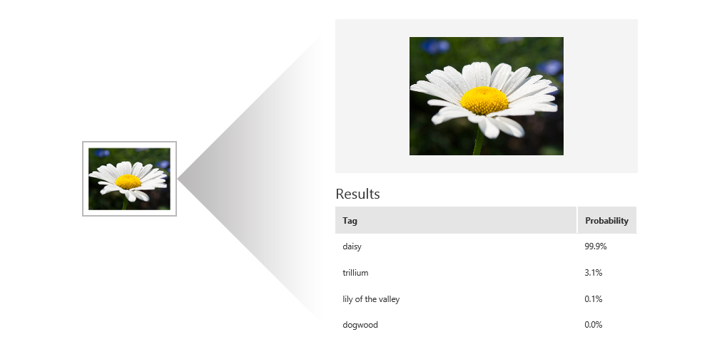
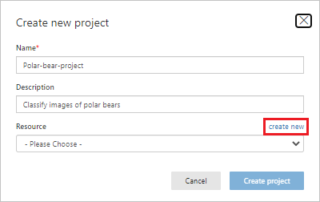
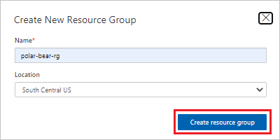
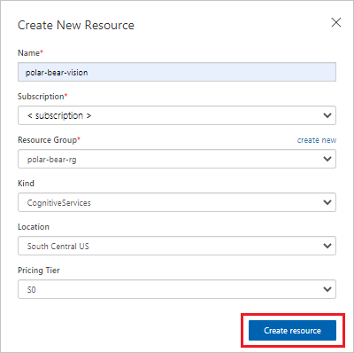
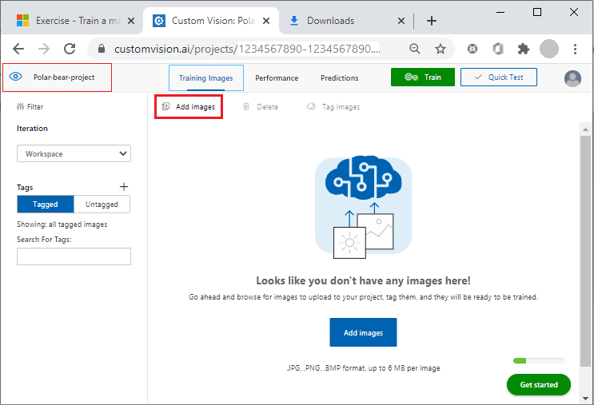
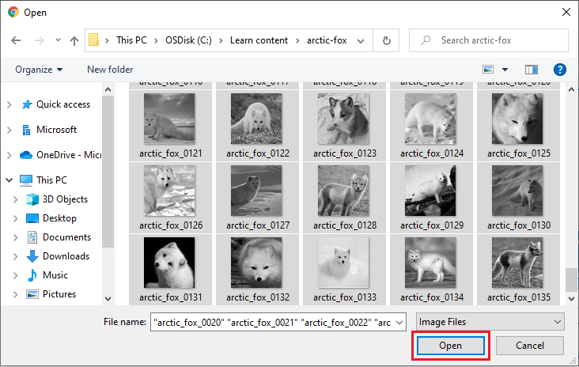

Azure Cognitive Services is a suite of more than 20 services and APIs that are backed by machine learning. Developers can use the APIs to incorporate intelligent features like facial recognition and sentiment analysis into their applications. Custom Vision is just one member of the Azure Cognitive Services family. Its purpose is to create image classification models that "learn" from labeled images you provide. Want to know whether a photo contains a picture of a flower? Train Custom Vision by using a collection of flower images. Then, it can tell you whether the next image includes a flower, or even what type of flower appears in an image.

The Custom Vision service exposes two APIs: the [Custom Vision Training API](https://southcentralus.dev.cognitive.microsoft.com/docs/services/d9a10a4a5f8549599f1ecafc435119fa/operations/58d5835bc8cb231380095be3?azure-portal=true) and the [Custom Vision Prediction API](https://southcentralus.dev.cognitive.microsoft.com/docs/services/eb68250e4e954d9bae0c2650db79c653/operations/58acd3c1ef062f0344a42814?azure-portal=true). You can build, train, and test image classification models by using the [Custom Vision portal](https://www.customvision.ai/?azure-portal=true), or you can build, train, and test the models by using the Custom Vision Training API.  After a model is trained, you can use the Custom Vision Prediction API to build apps that use the model. Both APIs are REST APIs that can be called from various programming languages.

In this unit, you'll create a Custom Vision model and train it to differentiate between various types of Arctic wildlife.

## Build a Custom Vision model

You'll begin by creating a new Custom Vision project. Then, you'll upload images of polar bears, Arctic foxes, and walruses and tag the images, so Custom Vision can learn to differentiate between them.

### Create a new project, resource, and resource group

1. In your browser, go to the [Custom Vision portal](https://www.customvision.ai/?azure-portal=true). Select **Sign In** and sign in with your Microsoft account. Accept any terms of service.

1. Select **New Project**.
1. In **Create new project**:
   1. Enter a project name and description.
   1. Next to **Resource**, select **create new** to create a new Cognitive Services resource.

   

   _Create a new Cognitive Services project_
   
1. In **Create New Resource**:
   1. For the resource name, enter *polar-bear-vision*.
   1. Select your subscription.
   1. Next to **Resource Group**, select **create new** to create a new Cognitive Services resource group.

   

   _Create a new Cognitive Services resource_

1. In **Create New Resource Group**:

   1. For the resource group name, enter *polar-bear-rg*.

   1. Make sure **Location** is set to *South Central US*, and then select **Create resource group**.

   

   _Create a new Cognitive Services resource group_

   The new resource group information is added in **Create New Resource**.

1. In **Create New Resource**, select **Create resource**.

   

    _Create the Cognitive Services resource_

1. In **Create new project**, make sure you have the following settings:

    - **Resource**: *polar-bear-vision*
    - **Project Types**: *Classification*
    - **Classification Types**: *Multiclass (Single tab per image)*
    - **Domains**: *General*

    > [!NOTE]
    > A domain optimizes a model for specific types of images. For example, if your goal is to classify food images by the types of food they contain or by the ethnicity of the dishes, it's helpful to select the **Food** domain. For scenarios that don't match any of the offered domains, or if you're unsure which domain to choose, select the **General** domain.

    

    _Verify your settings_

    When all settings are correct, select **Create project**. Your project opens.

### Get the images to use in the project

Now, you're ready to get the images to use in your project.

1. Download the .zip file of [Arctic fox training images](https://github.com/MicrosoftDocs/mslearn-build-ml-model-with-azure-stream-analytics/raw/master/training-images/arctic-fox.zip?azure-portal=true). Unzip the file.

1. To add the Arctic fox images to your project, select **Add images**.

   

   _Add images to the Custom Vision project_

1. In **Open**, select all the images of Arctic foxes found in the unzipped file folder. To choose the images, select **Open**.

   

   _Open the images to use in the project_

1. For the **My Tags** setting for the images, enter *arctic-fox*. Then, select **Upload 130 files**. Wait for the upload to finish.

   

   _Add the image tag and upload the images to the project_

   When the images are successfully uploaded, a summary is shown. Select **Done**.

Repeat these steps for the polar bear images:

1. Download the .zip file of [polar bear training images](https://github.com/MicrosoftDocs/mslearn-build-ml-model-with-azure-stream-analytics/raw/master/training-images/polar-bear.zip). Unzip the file.

1. To upload the polar bear images in the unzipped file folder to your project, select **Add images**. For these images, set **My Tags** to *polar-bear*. Wait for the upload to finish—there are 140 files in this folder. When the upload is finished, select **Done**.

Finally, repeat these steps for the walrus images:

1. Download the .zip file of [walrus training images](https://github.com/MicrosoftDocs/mslearn-build-ml-model-with-azure-stream-analytics/raw/master/training-images/walrus.zip). Unzip the file.

1. To upload the walrus images in the unzipped file folder to your project, select **Add images**. Set **My Tags** to *walrus*. Wait for the upload to finish—there are 138 files in this folder. When the upload is finished, select **Done**.

With the images tagged and uploaded, the next step is to train the model so that it can distinguish between Arctic foxes, polar bears, and walruses and determine whether an image contains one of these animals.

## Train and test the model

Now it's time to train the model by using the images that you tagged and uploaded. After you train the model, you'll test it to determine how adept it is at identifying Arctic wildlife in photos. After the model is trained, it can be refined by uploading more tagged images and retraining it.

1. To train the model, select **Train**. When you're prompted to select a training type, select **Quick Training**.

   

   _Train the model_

1. Wait for the training process to finish. (The process might take a few minutes.) Then, review the training statistics that are shown for iteration 1.

   > [!NOTE]
   > Each time you train the model, a new version (*iteration*) is created. Custom Vision maintains all your iterations, so you can choose which version of the model to use.

   

   _Results of training the model_

   *Precision* and *recall* are two separate but related measures of the model's accuracy. Suppose the model is presented with three polar bear images and three walrus images. It correctly identifies two of the images that contain polar bears as polar bear images, but it incorrectly identifies two of the walrus images as polar bear images. In this case, precision would be 50 percent (two of the four images it classified as polar bear images actually are polar bear images). Its recall would be 67 percent (it correctly identified two of the three polar bear images as polar bear images). Learn more about precision and recall in [Precision and recall](https://en.wikipedia.org/wiki/Precision_and_recall?azure-portal=true).

   *Average precision* (AP) is a third measurement of the model's accuracy. Whereas precision measures the false-positive rate and recall measures the false-negative rate, AP is the mean of false-positive rates computed across a range of thresholds. For more information, see [Understanding the mAP Evaluation Metric for Object Detection](https://medium.com/@timothycarlen/understanding-the-map-evaluation-metric-for-object-detection-a07fe6962cf3?azure-portal=true).

1. Now, test the model by using the portal's Quick Test feature. You can use Quick Test to submit images to the model and see how the model classifies the images by using the knowledge gained during training.

1. Download the [.zip file of test images](https://github.com/MicrosoftDocs/mslearn-build-ml-model-with-azure-stream-analytics/raw/master/testing-images/testing-images.zip?azure-portal=true). Unzip the file locally on your computer.

1. Select **Quick Test**.
 
1. Select **Browse local files**, and then go to the *testing-images/polar-bear* directory. Select any of the test images in that directory.

1. In **Quick Test**, examine the results of the test. What's the probability that the image contains a polar bear? What's the probability that the image contains an Arctic fox or a walrus?

1. Repeat this test by using one of the images in the *testing-images/arctic-fox* directory. How well is the model able to differentiate between Arctic foxes and polar bears?

1. The *testing-images* directory contains subdirectories that have a total of 30 different images for testing. Do more quick tests by using these images until you're satisfied that the model is reasonably adept at predicting whether an image contains a polar bear.

1. Return to your project. Select the **Performance** tab, and then select **Publish**.

1. In **Publish Model**, for **Prediction resource**, select `polar-bear-vision`, the name of your resource. Make sure you choose your resource name, not the resource *group* name. To publish the model, select **Publish**.

   

   _Publish the model_

1. Select **Prediction URL**.
1. In **How to use the Prediction API**, copy the following values and save them to use later:

   1. Under **If you have an image URL**, copy and then save the URL in your favorite text editor, so you can get it later.
   1. For **Set Prediction-Key Header to**, copy and then save the key value. This value must be passed in each call to the prediction URL.
   
   

   _Copy the Prediction API URL_
   

1. To finish, select **Got it!**.

Now, you have a machine learning model that can discern whether an image contains a polar bear, and you have a URL and API key to invoke the model. The next step is to invoke the model each time an image is uploaded to Blob Storage. Azure Functions is the perfect tool for this job.
