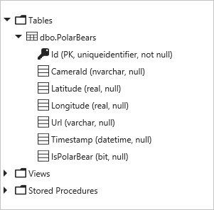
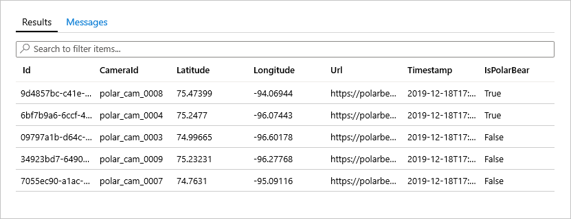

In the last unit, you wrote a function app in Azure that passes each photo uploaded to a blob container to the Custom Vision service to determine whether the photo contains a polar bear. The only output from the function app was log output that shows the verdict rendered by the Custom Vision service, and the ID and location of the camera that captured the photo. 

Now, you'll use Azure SQL Database to create a SQL database and modify the function app to write to the database. The SQL database sets the stage for visualizing polar bear sightings in Power BI, which draws information from the database.

## Create a SQL database

Let's begin by using Azure Cloud Shell to create a SQL database in Azure SQL Database. The database collects output from the function app you deployed. Later, you'll connect the SQL database to Power BI to show where cameras are capturing photos of polar bears.

1. In a browser, go to the [Azure portal](https://portal.azure.com?azure-portal=true). In the global controls, select the Cloud Shell icon.

    

    _Open Azure Cloud Shell_

   You also can open Cloud Shell by going to [https://shell.azure.com](https://shell.azure.com?azure-portal=true) in a separate browser window.

1. Run the following code to create values for the SQL database server, the admin username, the admin password, and the database name. Replace `<server-name>`, `<admin-username>`, `<admin-password>`, and `<database-name>` in the code example with your own values.

    Keep in mind the following constraints when you choose the values:
    
    - `SERVER_NAME` must be unique in Azure. The server name can use only lowercase letters, numbers, and hyphens. The first character and the last character in the name can't be a hyphen.
    - `ADMIN_USERNAME`  can't be a name that's reserved in SQL Server, such as `admin` or `sa`. You can use the name `adminuser`.
    - `ADMIN_PASSWORD`  must be at least 8 characters.

    ```bash
    SERVER_NAME="<server-name>"
    ADMIN_USERNAME="<admin-username>"
    ADMIN_PASSWORD="<admin-password>"
    DATABASE_NAME="<database-name>"
    ```

    > [!Note]
    > Copy and save the admin username and password values to use later.

1. In Cloud Shell, run the following command to create a SQL database server in the `polar-bear-rg` resource group. To paste commands in Cloud Shell, you can select Shift+Insert.

    ```bash
    az sql server create --name $SERVER_NAME --resource-group polar-bear-rg --location southcentralus --admin-user $ADMIN_USERNAME --admin-password $ADMIN_PASSWORD
    ```

1. Create a SQL database that's assigned to the [S0 service tier](https://docs.microsoft.com/azure/sql-database/sql-database-service-tiers?azure-portal=true).

    ```bash
    az sql db create --resource-group polar-bear-rg --server $SERVER_NAME --name $DATABASE_NAME --service-objective S0
    ```

1. In the [Azure portal](https://portal.azure.com?azure-portal=true), open your new SQL database server. Then, in the resource menu, under **Security**, select **Firewalls and virtual networks**:

    1. So you can connect to the database from Power BI Desktop later, select **Add client IP**.
    1. For **Allow Azure services and resources to access this server**, select **Yes**.
    1. Select **Save**. If prompted, select **OK**.

    

    _Configure the SQL database server_

1. Next, open the database. Then, in the resource menu, select **Query editor**, and enter the admin username and password you set in step 2. Select **OK**.

1. Copy the following code and paste it in the query window. Then, to create a SQL database table, select **Run** to run the code.

    ```sql
    CREATE TABLE [dbo].[PolarBears]
    (
        [Id] [uniqueidentifier] NOT NULL,
        [CameraId] [nvarchar](16) NULL,
        [Latitude] [real] NULL,
        [Longitude] [real] NULL,
        [Url] [varchar](max) NULL,
        [Timestamp] [datetime] NULL,
        [IsPolarBear] [bit] NULL,
        PRIMARY KEY CLUSTERED ([Id] ASC)
        WITH (STATISTICS_NORECOMPUTE = OFF, IGNORE_DUP_KEY = OFF) ON [PRIMARY]
    )
    ON [PRIMARY] TEXTIMAGE_ON [PRIMARY]
    GO

    ALTER TABLE [dbo].[PolarBears] ADD DEFAULT (newid()) FOR [Id]
    GO

    ALTER TABLE [dbo].[PolarBears] ADD DEFAULT (getdate()) FOR [Timestamp]
    GO

    ALTER TABLE [dbo].[PolarBears] ADD DEFAULT ((0)) FOR [IsPolarBear]
    GO
    ```

1. Select the **Tables** folder to check that the `dbo.PolarBears` table was created and that it has the following schema:

    

    _The dbo.PolarBears table_

    In the table, the `IsPolarBear` column is set to `1` or `0` to indicate whether the image in a row contains a polar bear. A value of `1` (True) means that the image shows a polar bear.

## Modify the function app

The next step is to modify the function app you created to write output to the SQL database.

1. In the [Azure portal](https://portal.azure.com?azure-portal=true), go to your `BlobTrigger` function. In the resource menu, under **Development Tools**, select **Console**.

    - In the function app console, run the following code to install the NPM [tedious](https://www.npmjs.com/package/tedious?azure-portal=true) package. You can ignore any warning messages. The `tedious` package provides an API that Node.js apps use to talk to SQL Server and Azure SQL Database.

    ```bash
    npm install tedious
    ```

1. In line 5 of the function, add the following code. Replace `DATABASE_SERVER_NAME` with the name you assigned to the database server, and replace `DATABASE_NAME` with the database name.

    ```javascript
    var databaseUserName = process.env.DATABASE_USER_NAME;
    var databasePassword = process.env.DATABASE_PASSWORD;
    var databaseServer = 'DATABASE_SERVER_NAME.database.windows.net';
    var databaseName = 'DATABASE_NAME';
    ```

    > [!NOTE]
    > In the code, don't replace the `DATABASE_ADMIN_NAME` or `DATABASE_PASSWORD` placeholders with other values. You'll create values for these placeholders in a later step.

1. Near the end of the function, find the following statements

    ```javascript
    if (isPolarBear) {
        context.log('POLAR BEAR detected by ' + id + ' at ' + latitude + ', ' + longitude);
    }
    else {
        context.log('Other wildlife detected by ' + id + ' at ' + latitude + ', ' + longitude);
    }

    context.done();
    ```

    Replace the statements with the following code. Adjust the code indentation as needed.

    ```javascript
    // Update the database
    var Connection = require('tedious').Connection;
    var Request = require('tedious').Request;

    var config =
    {
        authentication:
        {
            type: 'default',
            options:
            {
                userName: databaseUserName,
                password: databasePassword
            }
        },
        server: databaseServer,
        options:
        {
            database: databaseName,
            encrypt: true
        }
    };

    var dbConnection = new Connection(config);

    dbConnection.on('connect', err => {
        if (!err) {
            var query = "INSERT INTO dbo.PolarBears (CameraId, Latitude, Longitude, URL, Timestamp, IsPolarBear) " +
                "VALUES ('" + id + "', " + latitude + ", " + longitude + ", '" + blobUri + "', GETDATE(), " + (isPolarBear ? "1" : "0") + ")";

            var dbRequest = new Request(query, err => {
                // Called when request completes, with or without error
                if (err) {
                    context.log(err);
                }

                dbConnection.close();
                context.done();
            });

            dbConnection.execSql(dbRequest);
        }
        else {
            context.log(err);
            context.done();
        }
    });
    ```

    These statements connect to the database and execute an `INSERT` command to record the latest polar bear sighting. The row added to the database includes the ID, latitude, and longitude of the camera that took the photograph, the URL of the blob that contains the photograph, the current date and time, and an `IsPolarBear` value that indicates whether the photograph contains a polar bear.

    Select **Save**.

1. In the portal, return to your function app overview page. Add two application settings to the function app:

    1. In the resource menu, select **Settings**, and then select **Configuration**.
    1. Select **Application settings**, and then select **New application**.
    1. In **Add/Edit application setting**, add a setting named `DATABASE_ADMIN_NAME`. Set the value to the admin name you specified when you created the database server. Select **OK**.
    1. Repeat the preceding step to add a setting named `DATABASE_PASSWORD`. Set the value to the password you specified when you created the database server. Select **OK**.
    1. Select **Save**. If you're prompted, select **Continue**.

1. In a Command Prompt or terminal window, return to the project directory. Then, run *run.js*.

    ```bash
    node run.js
    ```

1. Let *run.js* run for a couple minutes. Then, return to the database in the portal. In the query editor, run this code:

    ```sql
    SELECT * FROM dbo.PolarBears
    ```

1. Check that the table contains a few rows that represent images that were submitted to Custom Vision for analysis. Look at the `IsPolarBear` column in each row. How many images that were analyzed contain a polar bear?

    

    _Rows written to the database by the function app_

1. Return to the Command Prompt or terminal window, and select Ctrl+C to stop *run.js*.

Next, you'll use Power BI to produce a more compelling graphical visualization of the data.
