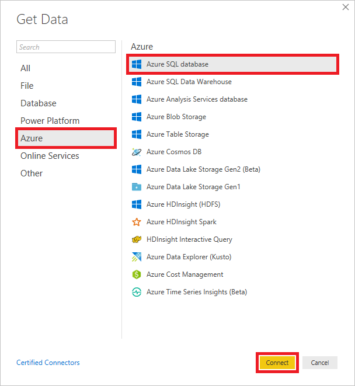
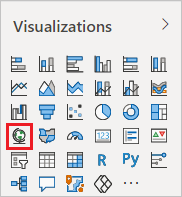
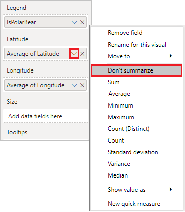
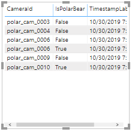
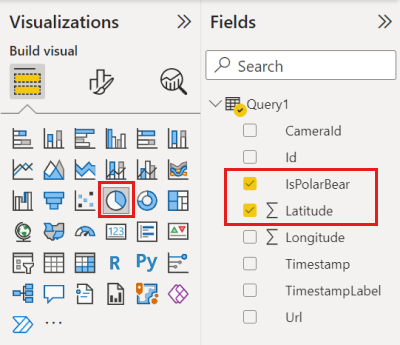
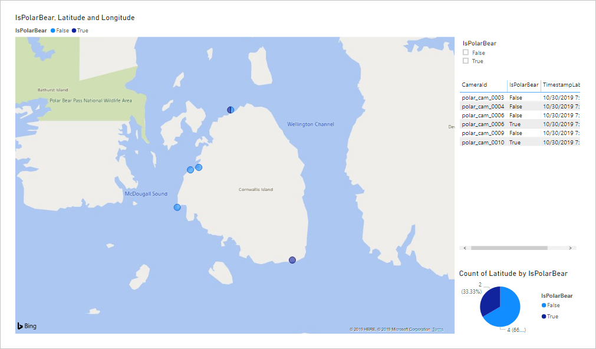
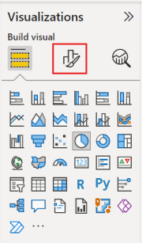
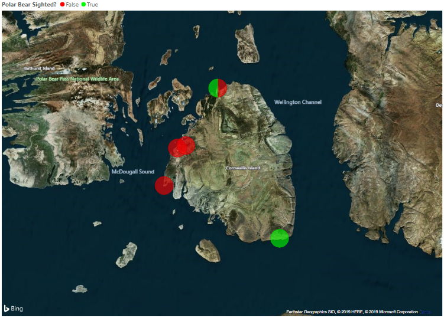

To complete the end-to-end solution for spotting polar bears in the wild, first, you'll connect Power BI to the SQL database you created in the last unit. Then, you'll build a report that shows in near real time where your cameras are spotting polar bears. You'll use Power BI Desktop to create a customizable report. 

Power BI Desktop runs only on Windows. If you aren't running Windows, an alternative is to create a Windows virtual machine in Azure and run Power BI Desktop in the virtual machine.

## Connect Power BI to the SQL database

You used Custom Vision to train an image classification model to differentiate between various types of Arctic wildlife. You modified the function app you wrote to write the results to a SQL database. The first step in using Power BI to explore and visualize this data is to connect Power BI to the SQL database.

In this exercise, you connect Power BI Desktop to the SQL database.

1. If Power BI Desktop isn't already installed on your computer, [install it](https://powerbi.microsoft.com/desktop/?azure-portal=true).

1. Open Power BI Desktop. If you're asked to sign in, sign in with your work or school account.

    > [!NOTE]
    > There are two types of Microsoft accounts: personal Microsoft accounts and work or school accounts. You can sign in to Power BI with a work or school account, but not with a personal account. A Microsoft 365 subscription uses your work or school account. But, you can have a work or school account without having a Microsoft 365 subscription. Learn about the [differences between Microsoft work and personal accounts](http://www.brucebnews.com/2016/06/finding-your-way-through-microsofts-maze-of-work-and-personal-accounts/?azure-portal=true).

1. On the ribbon, select **Get Data**. In the left menu, select **Azure**, and then select **Azure SQL database**. Select **Connect**.

    

    _Add a data source_

1. Enter the server's host name (the server name you specified in the preceding unit, with *.database.windows.net* added to the end of the server name) and the database name. Select **DirectQuery**, and then select **Advanced options**.
1. In **SQL Server database**, copy and then paste in the following code to select the 20 most recently added rows in the `dbo.PolarBears` table. Power BI uses this query to pull information from the database. Select **OK**.

    ```sql
    SELECT TOP 20 Id, CameraId, Latitude, Longitude, Url, Timestamp, FORMAT(Timestamp,'MM/dd/yyyy h:mm:ss tt') AS TimestampLabel, IsPolarBear FROM dbo.PolarBears ORDER BY Timestamp DESC
    ```

    

    _Connect to the database_

1. Select the **Database** tab. In **SQL Server database**:
   1. Enter the user name and password you specified when you created the database server.
   1. Select the database server from the drop-down list.
   1. Select **Connect**, and then select **Load**.

    

    _Enter the admin credentials_

After a short delay, Power BI connects to the database and retrieves a dataset by using the query you provided. The next step is to add visuals to bring that dataset to life.

## Build a report in Power BI Desktop

Visualizations (*visuals*) are the primary element in a Power BI report. In this exercise, you'll use the Power BI report designer to create visuals from the database you connected to, adjust filters and aggregates to refine the way the data is reported, and then format the visuals to produce compelling output.

1. In **Visualizations**, select **Map** to add a map visual to the report.

    

    _Add a map visual_

1. In **Fields**, select **IsPolarBear**, **Latitude**, and **Longitude**  to include these fields in the map visual.

    

    _Add fields to the map visual_

1. In **Visualizations**, next to **Average of Latitude**, select the down arrow,  and then select **Don't summarize**. Do the same for **Average of Longitude**.

    

    _Remove summary calculations_

1. Select the empty area outside the map to deselect the map.
1. In **Fields**, select **CameraId**, **IsPolarBear**, and **TimestampLabel** to add a table visual that contains those columns to the report.

    

    _Add a table visual_

1. Select an empty area to deselect the table visual.
1. In **Visualizations**, select **Pie Chart** to convert the table into a pie chart. Then, in **Fields**, select **IsPolarBear** and **Latitude** to add another table visual. 

    

    _Add a pie chart visual_

1. In **Visualizations**, under **Values**, next to **Average of Latitude**, select the down arrow, and select **Count**. This setting configures the pie chart to show a count of sightings and the proportion of sightings in which polar bears were detected. 

    

    _Refine the pie chart visual_

1. Clear the pie chart visual and select **Slicer** to add a slicer to the report. Slicers are a convenient way to filter information in a Power BI report by narrowing the data that's shown in other visuals.

   

    _Add a slicer_

    In **Fields**, select **IsPolarBear** so that the slicer shows check boxes labeled **True** and **False**.

1. Resize and reposition the visuals to achieve a layout similar to this example:

    

    _Adjust the layout_

1. With the report structure in place, the next task is to use some of the rich formatting options in Power BI to enhance the visuals. Start by selecting the map visual in the report designer. Then, in **Visualizations**, select **Format**.

    

    _Format the map visual_

1. In **Visualizations**, use the formatting controls to make the following changes to the map visual:

    * **Legend**: Set **Legend Name** to **Polar Bear Sighted?**
    * **Data colors**: Set the color for **True** to **00FF00 (pure green)** and set the color for **False** to **FF0000 (pure red)**.
    * **Bubbles**:  Set the bubble size to **30%**.
    * **Map styles**: Set the theme to **Aerial**.
    * **Title**: Select **Off**.

    Confirm that the resulting map looks something like this example:

    

    _Formatted map visual_

1. Select the pie chart visual and use the formatting controls in **Visualizations** to make the following changes:

    * **Data colors**: Set **True** to **00FF00**, and set **False** to **FF0000**.
    * **Detail  labels**: Set the label style to **Data value, percent of total**.
    * **Title**: Change the title text to **Sightings Proportion**.

1. Select the table visual and use the formatting controls in **Visualizations** to make the following changes:

    * **Style**: Change the table style to **Alternating rows**.
    * **Title**: Select the check box to add a title. Change the title text to **Camera Activity**. 

1. Select the slicer visual and use the formatting controls in **Visualizations** to make the following changes.

    * Under **Selection controls**, clear the **Multi-select with CTRL** check box. With this setting, you don't have to use the Ctrl key to select more than one check box.

1. In the bottom-left corner of the designer, double-click **Page 1**,  and change the report title to **Polar Bear Activity**.

1. Select **File** > **Save** to save the report.

Change and enhance the report as you like. When you're satisfied with the report layout and content, it's time to put it to work using a live data source.

## Run the end-to-end solution

Now that the report is prepared in Power BI, your final task is to run the end-to-end solution and check for polar bears!

1. In the [Azure portal](https://portal.azure.com?azure-portal=true), open your SQL database. Use the query editor to run the following query and delete all rows from the `dbo.PolarBears` table:

    ```sql
    DELETE FROM dbo.PolarBears
    ```

1. In a Command Prompt or terminal window, return to the project directory, and run *run.js*:

    ```bash
    node run.js
    ```

1. Return to Power BI Desktop. In the ribbon, select **Refresh**. Select it again every 15 seconds or so. The report refreshes automatically every few minutes, but you can refresh it manually as often as you like to update the visuals. 

1. Confirm that red and green bubbles appear at various locations around the island. Green bubbles indicate the presence of polar bears. Red bubbles represent locations where photos were taken but no polar bears were detected. Locations that have a mixture of sightings show red *and* green, as shown in the following screenshot:

    

    _There be polar bears!_

1. If you want to show *only* locations where polar bears were detected, in the slicer visual, select **True**. What happens in the map?

1. Continue running the report for a few minutes. Refresh the report once or twice a minute. Confirm that there are polar bears active on the island!

1. When you're satisfied that the solution is working as intended, return to the Command Prompt or terminal window, and select Ctrl+C to stop the cameras.

You now have a report that shows, in near real time, polar bear activity on the island. If you have a Power BI Pro or Power BI Premium account, you can share the report with other Power BI users so that they, too, can monitor polar bear activity. For more information about sharing your work, see [Share Power BI dashboards and reports](/power-bi/service-how-to-collaborate-distribute-dashboards-reports?azure-portal=true). You also can view reports in the [Power BI mobile apps](/power-bi/mobile-apps-for-mobile-devices?azure-portal=true), so you can keep track of polar bears on your Windows, Android, or iOS device—even on an Apple watch!