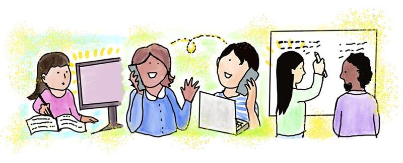

Congratulations on landing the interview! What are your next steps? When it comes to interviews, it is helpful to understand the different phases of the process that, depending on your performance, can impact the outcome.

> [!VIDEO https://www.microsoft.com/videoplayer/embed/RE4O7NF]

An interview is usually the last step before being offered a job.

You're likely to go through many them with an organization. Additionally, there are different types of interviews with different expectations.

## Scenario: Interview for an intern position in tech

As an aspiring software developer, you will encounter interviews that not only test your technical skills but also your ability to communicate in a professional manor. Your soft skills will also be appraised.

Remember, the interview process goes both ways.  While the company is assessing you through the interview process, you should also use this time to evaluate the company culture and whether the company or team is the right place for you and your career goals.

## What will you learn

By the end of this module, you will be able to:

- Describe what types of interviews exist
- Develop a plan to practice for the interviews
- Compose a follow-up email

## What is the main goal

This module is looking to provide you with strategies to best prepare for and carry out technical and non-technical interviews to increase your chances of landing an intern position at a tech company.