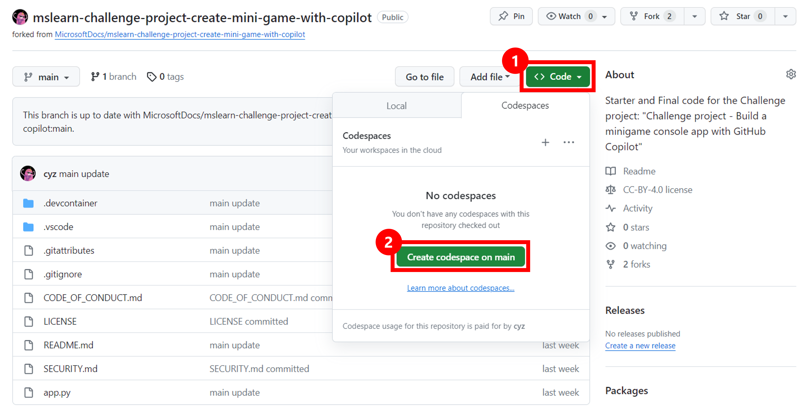
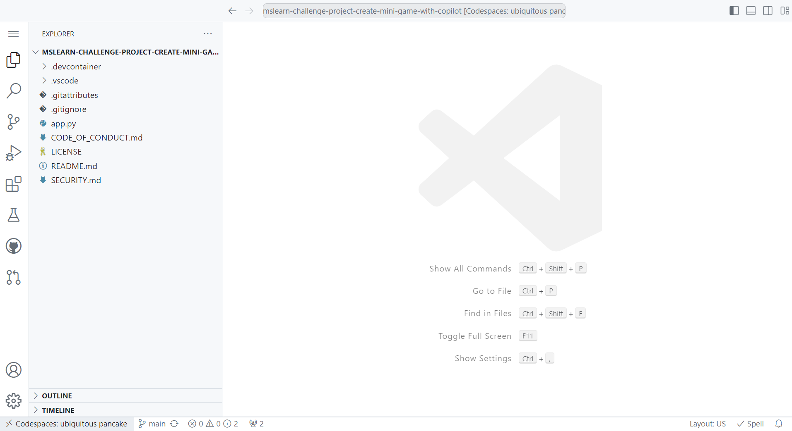

In this project, you can use GitHub Codespaces to develop the minigame application. GitHub Codespaces is a hosted development environment that allows you to quickly create a complete development environment for your project. You can use Codespaces to develop console applications in Python without having to install Python or any other tools on your local computer.

## 1. GitHub Account

To get started, you need a GitHub account. If you don't have an account, create one for free at [github.com](https://github.com/).

> [!NOTE]
> Students can claim the GitHub Student Developer Pack at [GitHub Student Developer Pack - GitHub Education](https://education.github.com/pack). This offer includes access to Codespaces, GitHub Copilot, and Azure for Students and other benefits.

## 2. Enabling GitHub Codespaces and setting up your environment

Enable the [GitHub Codespaces](https://docs.github.com/en/codespaces) service in your GitHub account. Codespaces offers 60 hours of free use per month.

You also need to make a copy of the [template repository](https://github.com/microsoft/vscode-remote-try-python) in your GitHub account using the `Fork` function. At the end of the repository fork, you have a copy of the template repository in your GitHub account. You use this repository to develop the minigame application.

> [!div class="mx-imgBorder"]
> 

On the repository page that was created, select the `Code` button and, in the Codespaces tab, select `Create codespace on main`. In a few moments, Codespaces creates a development environment for you.

> [!div class="mx-imgBorder"]
> 

When Codespaces finishes creating the development environment, you see a Visual Studio Code window in the browser. You can use Visual Studio Code in the browser to develop the minigame application.

> [!div class="mx-imgBorder"]
> 
