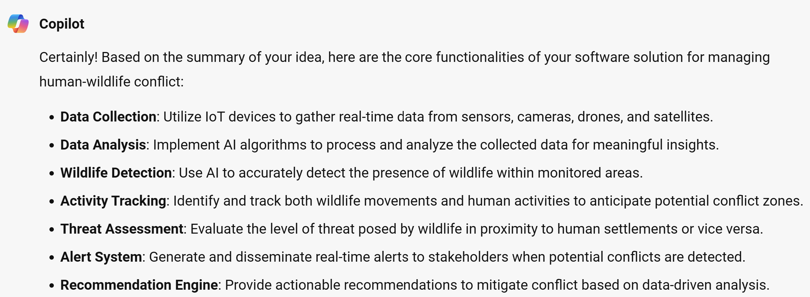
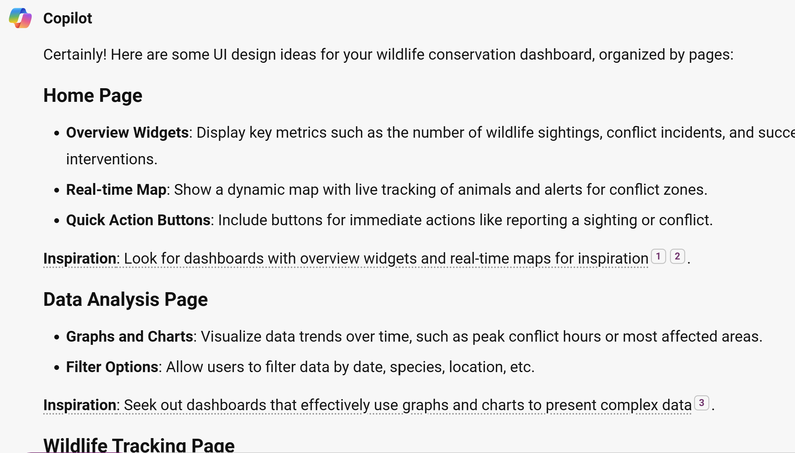
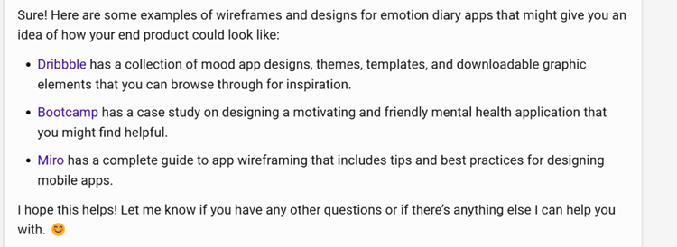

Now that you completed your brainstorming/ideation and used Bing Chat in the first challenge project, we're using it to guide us in generating a prototype.

## Identify the core functionalities of your software

### Steps

1. Copy the sample prompt provided and edit it to add your refined idea one-paragraph summary from unit 4 of the previous challenge.
1. Paste it into Bing Chat.

### Sample prompt

```text
Hello Bing, I have a paragraph summary of my idea that I'm planning to develop into a prototype and then begin building. Can you help me break down the core functionalities of my software solution (app/ website/ dashboard)? I'm looking for a concise list of its main functions in bullet points.

Human-wildlife conflict is a serious and growing problem that affects both wildlife conservation and human development. Current solutions are often inadequate, expensive, or unsustainable. They also lack real-time data that can enable proactive and preventive actions. Our solution is to use IoT and AI to create a smart system that can monitor, predict, and prevent human-wildlife conflict. The system can collect and analyze data from various devices, such as sensors, cameras, drones, and satellites. The system can then use AI to detect, identify, and track wildlife and human activities and threats. The system can also use AI to provide alerts, recommendations, or interventions to the relevant stakeholders, such as wildlife managers, farmers, or rangers. Our solution is unique and competitive because it uses IoT and AI to provide a comprehensive and adaptive solution that can address the diverse and dynamic challenges of human-wildlife coexistence. It is also scalable and customizable to different contexts and needs. Our solution has the potential to improve the conservation and welfare of wildlife species, as well as the livelihoods and security of people living with wildlife.
```

### Sample response



## Generate UI ideas for your project

### Steps to generate UI ideas

1. Copy the sample prompt provided and make any edits you want
2. Paste it into Bing chat

### Sample prompt for UI ideas

```text
Can you suggest some UI ideas that easily provide the core functionalities for the users? If the dashboard needs to be multi-page, you can separate the features for the respective pages. Include links UI designs with similar examples for more inspiration
```

### Sample response for UI ideas



> [!NOTE]
> Bing Chat will provide some links to the UI samples to inspire.


## Sketch your UI from the examples recommended by Bing Chat

Grab your pen and paper and try to sketch your UI.

> [!NOTE]
> With your users in mind, take some time to sketch the different pages of your solution whether a website, web app, dashboard and remember to consider using responsive designs.

### [Optional] Share your mock-up with Bing Chat for more visual inspiration





## Next steps

Bing Chat provided us with valuable insights and inspiration for creating our mock-up and prototype. We were able to use the tools and visual resources provided by Bing Chat to develop our ideas and refine our vision. Having created our prototype, we're now ready to move forward with the next phase of our project and begin building.
