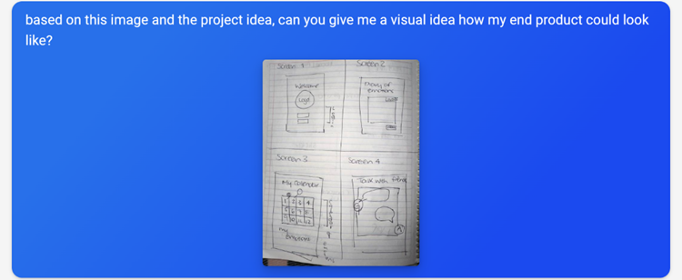

Now that you have completed your brainstorming/ ideation and with Bing Chat in the first challenge project, we will now use it to guide us in generating a prototype.

## Identify the core functionalities of your software

### Steps

Copy the sample prompt provided below and edit it to add your refined idea 1-paragraph summary from unit 4 of the previous challenge. Paste it into Bing Chat.

### Sample Prompt

> Hey Bing, here is a paragraph summary of my idea that I want to create a prototype for then implement/ start building. Can you help me break down the core functionalities of my software solution (app/ website/ dashboard). Suggest this in short bullet points.
>
> Human-wildlife conflict is a serious and growing problem that affects both wildlife conservation and human development. Current solutions are often inadequate, expensive, or unsustainable. They also lack real-time data that can enable proactive and preventive actions. Our solution is to use IoT and AI to create a smart system that can monitor, predict, and prevent human-wildlife conflict. The system can collect and analyze data from various devices, such as sensors, cameras, drones, and satellites. The system can then use AI to detect, identify, and track wildlife and human activities and threats. The system can also use AI to provide alerts, recommendations, or interventions to the relevant stakeholders, such as wildlife managers, farmers, or rangers. Our solution is unique and competitive because it uses IoT and AI to provide a comprehensive and adaptive solution that can address the diverse and dynamic challenges of human-wildlife coexistence. It is also scalable and customizable to different contexts and needs. Our solution has the potential to improve the conservation and welfare of wildlife species, as well as the livelihoods and security of people living with wildlife.

### Sample Response

_Your idea sounds innovative and promising! Here are some of the core functionalities of your software solution:_

_**Data collection** : The system can collect data from various devices, such as sensors, cameras, drones, and satellites._

_**Data analysis** : The system can analyze data in real-time using AI algorithms to detect, identify, and track wildlife and human activities and threats._

_**Alerts and notifications** : The system can provide alerts, recommendations, or interventions to the relevant stakeholders, such as wildlife managers, farmers, or rangers._

_**Customization** : The system is scalable and customizable to different contexts and needs._

_**Comprehensive solution** : The system provides a comprehensive and adaptive solution that can address the diverse and dynamic challenges of human-wildlife coexistence._

_I hope this helps you get started with your project!_

## Generate UI ideas for your project

### Steps to generate UI ideas

1. Copy the sample prompt provided below and make any edits you want
2. Paste it into Bing chat

### Sample Prompt for UI ideas

> Can you suggest some UI ideas that easily provide these core functionalities for the users? If the dashboard needs to be multi-page, you can separate the features for the respective pages. Please include links UI designs with similar examples for additional inspiration

### Sample Response for UI ideas

_Sure, I can suggest some UI ideas that can easily provide the core functionalities for your software solution. Based on your summary, I think your solution can be divided into four main pages: Dashboard, Devices, Alerts, and Settings. Here are some possible features and examples for each page:_

_**Devices** This page can show the list and status of the devices that are connected to your IoT and AI system. You can use different icons, colors, or labels to indicate the device type, status, or battery level..._

_**Alerts** This page can show the alerts, recommendations, or interventions that are generated by your AI system based on the data and analysis results..._

_**Settings** This page can show the settings and preferences of your IoT and AI system. You can use different menus, tabs, or sliders to allow users to customize the system according to their needs and contexts..._

_I hope these UI ideas can help you with your software solution. If you have any questions or feedback, please let me know. 😊_

> [!NOTE]
> Bing chat will provide some links to the UI samples to inspire.

## Sketch your UI from the examples recommended by Bing chat

Grab your pen and paper and try to sketch your UI.

> [!NOTE]
> With your users in mind, take some time to sketch the different pages of your solution whether a website, web app, dashboard and remember to consider using responsive designs.

### [Optional] Share your mock-up with Bing chat for more visual inspiration

## Next Steps

Bing Chat provided us with valuable insights and inspiration for creating our mock-up and prototype. We were able to leverage the tools and visual resources provided by Bing Chat to develop our ideas and refine our vision. With this solid foundation, we are now ready to move forward with the next phase of our project and begin building.