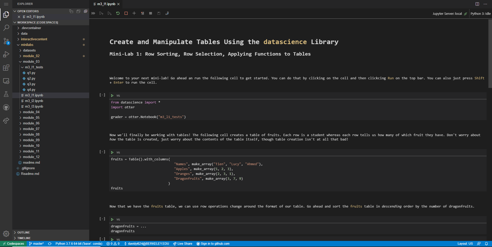

## Mini Labs 

**Note: You will need to set up your Online Visual Studio Code environment in the setup unit at the beginning of the module to access and interact with these mini labs**

For convenience, you can launch your VS Code environment by clicking the link below:

Open <a href = "https://online.visualstudio.com/environments/new?azure-portal=true&name=MicrosoftDocs&repo=MicrosoftDocs/inferentialthinking" target="_blank" rel="noopener">Visual Studio Online</a>

In your online Visual Studio Code environment, you will find "mini lab" jupyter notebooks that will allow you to apply the concepts that you've learned from this module. You will be able to code your solutions in the notebook directly and receive real-time feedback from our autograder by running the corresponding grader cells.

To access the mini labs for this module, you will need to do the following:

- Launch your Online Visual Studio Code Environment
- Open your Workspace and click the "minilabs" directory
- Click the corresponding module directory and you should be able to see all the mini labs available for this module

Here is what the mini-lab should look like in your virtual environment:

