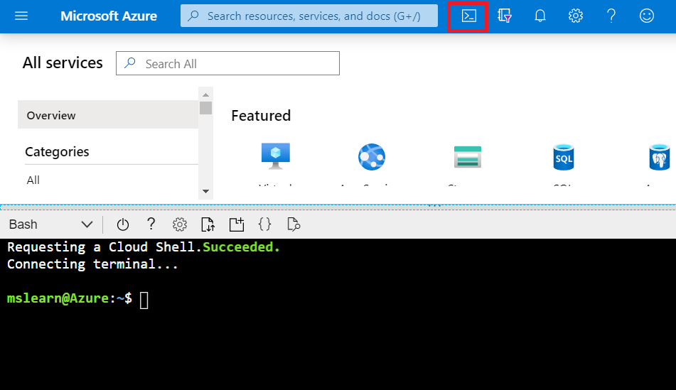
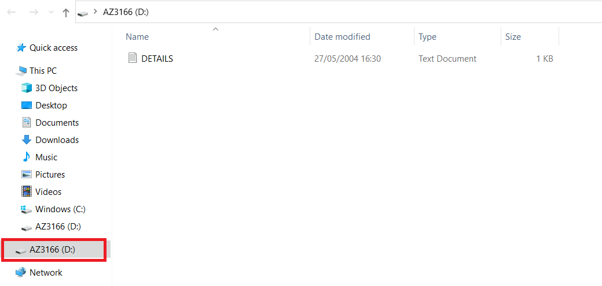
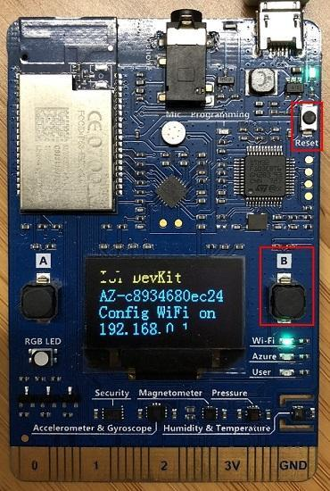
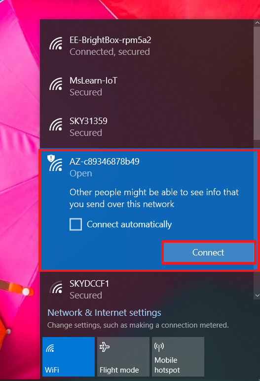
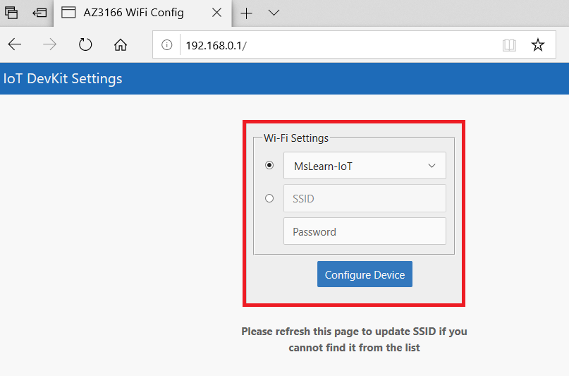

## Using the Azure Cloud Shell

To start Azure Cloud Shell,  
Launch Cloud Shell from the top navigation of the Azure portal.




You need to install the Azure IoT extension for Azure CLI using the following command. This extension manages Azure resources such as IoT Hub.

```azurecli
az extension add --name azure-cli-iot-ext
```

##  Creating a resource group

Create a resource group in the eastus2 location using the following command. Give a name to your resource group.

```azurecli
az group create --name <resource-group-name> --location eastus2 
```

##  Creating an IoT Hub

Create a F1 Tier IoT Hub using the following command. Give a name to your IoT Hub and replace with your resource group.

```azurecli
az iot hub create --resource-group <resource-group-name> --name <iot-hub-name> --sku F1 --partition-count 2
```

## Creating a device identity in your IoT Hub

A device must be registered with your IoT Hub before it can connect. Enter the following command to create a device identity in your IoT Hub. Give a name to your IoT device and replace with your IoT Hub.

```azurecli
az iot hub device-identity create --hub-name <iot-hub-name> --device-id <device-id>
```

## Connecting the IoT Devkit to your computer

To connect the DevKit to your computer,

1. Connect the USB end to your computer.

2. Connect the Micro-USB end to the DevKit.

3. Confirm that green LED for power is on.

 

## Download the DevKit firmware

Download [the firmware for IoT DevKit](https://aka.ms/devkit/prod/firmware/latest) which includes the bootloader. 

Drag and drop the .bin file you downloaded into the USB mass storage device called AZ3166. Then IoT DevKit will reboot to the firmware automatically.



You can check out the latest version of firmware from the following link: https://github.com/microsoft/devkit-sdk/releases/

**Note:** Firmware is a software program or set of instructions programmed on a hardware device. Firmware provides the necessary instructions for how the device communicates with the other computer hardware.

## Configuring the DevKit to connect to Wi-Fi 

On the IoT DevKit,

- Hold down button B
- Push and release the reset button
- Release button B

IoT DevKit enters AP mode for configuring the Wi-Fi connection. You'll see the service set identifier (SSID) of the IoT DevKit and the configuration portal IP address on the screen of the device.  



Use a Web browser on a different Wi-Fi enabled device (computer or mobile phone) to connect to the IoT DevKit SSID displayed in the previous step.



Browse **192.168.0.1**. Select the Wi-Fi network that you want the IoT DevKit to connect to, type the Wi-Fi password then click Save.



The IoT DevKit reboots in a few seconds. After done, you will see the firmware version on the screen of the kit if it has connected with Internet.