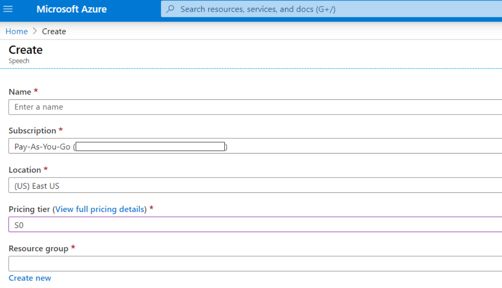
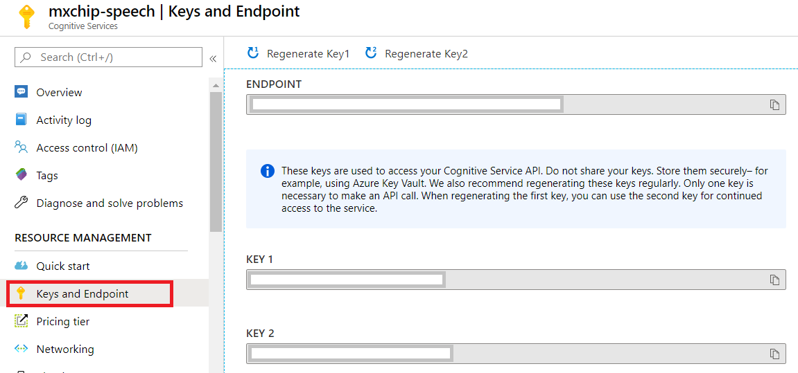
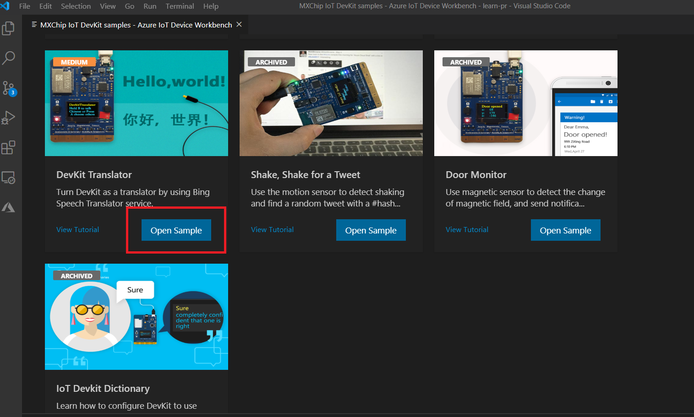
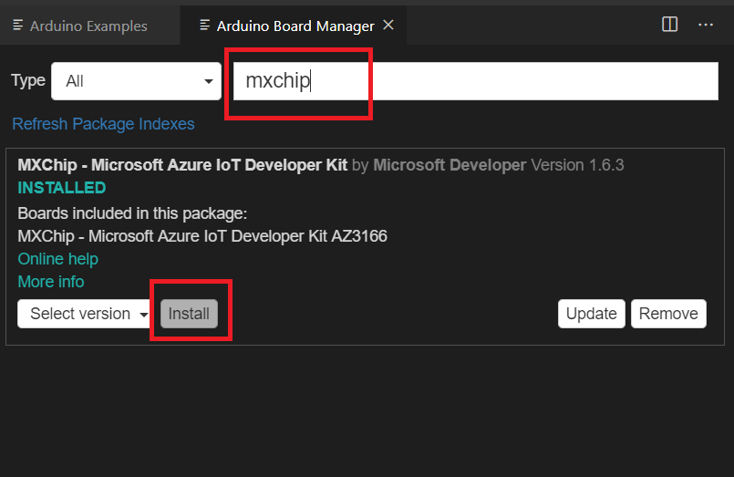
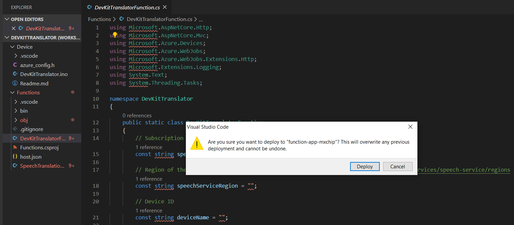
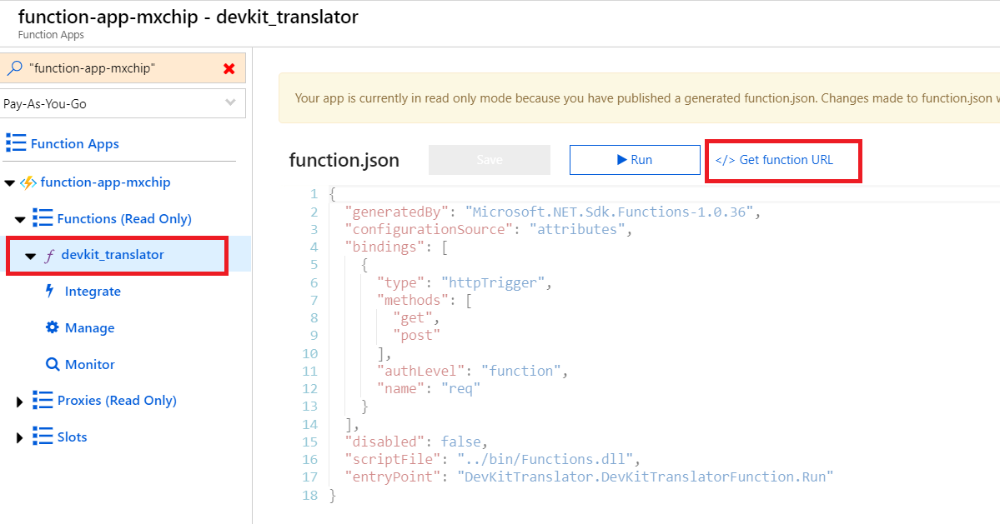
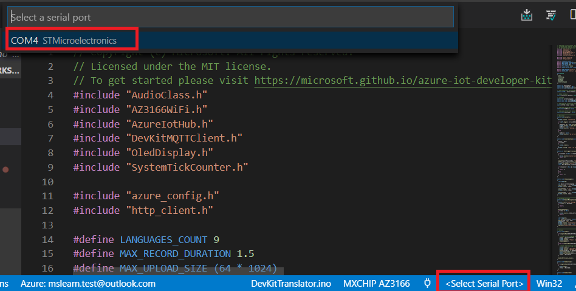
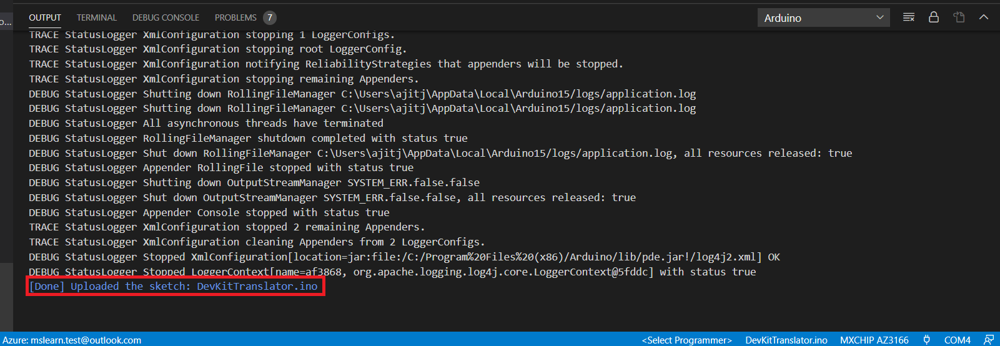

## Creating Azure Cognitive Service

In the Azure portal, click Create a resource and search for Speech.

Create a Speech Service. 

Fill out the form to create the Speech Service.

**Name:** Enter a name  

**Subscription:** Select your available subscription

**Location:** Select your location

**Pricing tier:** Select S0

**Resource group:** Select your resource group




Go to the Speech service you just created, click Keys section to copy and note down the Key1. You'll use it for IoT DevKit to access.




##  Installing extensions for VS Code

You need to install some extensions for the Visual Studio Code.

- Launch VS Code, search for Arduino in the extension marketplace, and install it. This extension provides enhanced experiences for developing on the Arduino platform.

- Search for [Azure IoT Tools](about:blank) in the extension marketplace and install it.

>[!NOTE]
>The Azure IoT Tools extension pack contains the [Azure IoT Device Workbench](https://marketplace.visualstudio.com/items?itemName=vsciot-vscode.vscode-iot-workbench), which is used to develop and debug on various IoT devkit devices. The [Azure IoT Hub extension](https://marketplace.visualstudio.com/items?itemName=vsciot-vscode.azure-iot-toolkit), also included with the Azure IoT Tools extension pack, is used to manage and interact with Azure IoT Hubs.

- Search for C# in the extension marketplace and install it.

## Configure VS Code with Arduino settings.

In Visual Studio Code, click File > Preference > Settings. Then click the ... and Open settings.json.

Add following lines to configure Arduino depending on your platform:

- **Windows**:

  ```json
  "arduino.path": "C:\\Program Files (x86)\\Arduino",
  "arduino.additionalUrls": "https://raw.githubusercontent.com/VSChina/azureiotdevkit_tools/master/package_azureboard_index.json"
  ```

- **macOS**:

  ```json
  "arduino.path": "/Applications",
  "arduino.additionalUrls": "https://raw.githubusercontent.com/VSChina/azureiotdevkit_tools/master/package_azureboard_index.json"
  ```

- **Ubuntu**:

  Replace the **{username}** placeholder below with your username.

  ```json
  "arduino.path": "/home/{username}/Downloads/arduino-1.8.8",
  "arduino.additionalUrls": "https://raw.githubusercontent.com/VSChina/azureiotdevkit_tools/master/package_azur
  ```


##  Opening sample project

First of all, start signing in your Azure account.
Click F1 to open the command palette, type, and select Azure: Sign in

Click F1 to open the command palette, type, and select Azure IoT Device Workbench: Open Examples.... Then select IoT DevKit as the board.


In the IoT Workbench Examples page, find DevKit Translator and click Open Sample. Then select the default path to download the sample code.

 

## Select the board

Click F1 to open the command palette, type, and select Arduino: Board Manager. Search for AZ3166 and install it.



**Install Serial Port: ST-Link drivers**

- **Windows:** Download and install the USB driver from [STMicroelectronics website](https://www.st.com/en/development-tools/stsw-link009.html).
- **macOS:** No driver is required for macOS.

- **Ubuntu**: Run the commands in terminal and sign out and sign in for the group change to take effect:

  ```bash
  # Copy the default rules. This grants permission to the group 'plugdev'
  sudo cp ~/.arduino15/packages/AZ3166/tools/openocd/0.10.0/linux/contrib/60-openocd.rules /etc/udev/rules.d/
  sudo udevadm control --reload-rules
  
  # Add yourself to the group 'plugdev'
  # Logout and log back in for the group to take effect
  sudo usermod -a -G plugdev $(whoami)
  ```

>[!NOTE]
>ST-Link/V2 is the USB interface that IoT DevKit uses to communicate with your development machine. You need to install it on Windows to flash the compiled device code to the DevKit. Follow the OS-specific steps to allow the machine access to your device.


##  Create Azure Function/Provision Azure Services

In VS Code, click F1, type, and select Azure IoT Device Workbench: Provision Azure Services....


Follow the steps to finish the provisioning of Azure IoT Hub and Azure Functions.


Take a note of the Azure IoT Hub device name you created.

Now you have Azure IoT Hub provisioned and device created in it. Also, the device connection string will be saved in VS Code for configuring the IoT DevKit later.


Open **Functions\DevKitTranslatorFunction.cs** and update the following lines of code with the device name and Speech Service key you noted down.

```csharp
// Subscription Key of Speech Service
const string speechSubscriptionKey = "";

// Region of the speech service, see https://docs.microsoft.com/azure/cognitive-services/speech-service/regions for more details.
const string speechServiceRegion = "";

// Device ID
const string deviceName = "";
```


##  Deploying Azure Function

Click F1, type, and select Azure IoT Device Workbench: Deploy to Azure.... If VS Code asks for confirmation for redeployment, click Yes.



Make sure the deployment is successful. 


In the Azure portal, go to the Functions Apps section, find the Azure Function app created. Click **devkit_translator**, then click **Get Function URL** to copy the URL.



Paste the URL into **azure_config.h** file.  


##  Configuring Device Settings

In the bottom-right status bar, check the MXCHIP AZ3166 is shown as a selected board, and serial port with STMicroelectronics is used.

 

Click F1, type, and select Azure IoT Device Workbench: Configure Device Settings... > Config Device Connection String. Select IoT Hub Device Connection String to configure it to the DevKit.

 

On DevKit, hold down button A, push and release the reset button, and then release button A. Your DevKit enters configuration mode and saves the connection string.

You'll see the notification once it's done successfully.  


##  Uploading device code


Click F1 again, type, and select Azure IoT Device Workbench: Upload Device Code. It starts to compile and upload the code to DevKit.




The DevKit reboots and starts running the code.


##  Test the project


After app initialization, follow the instructions on the DevKit screen. The default source language is Chinese.

To select another language for translation:

1. Press button A to enter setup mode.
3. Press button B to scroll all supported source languages.
5. Press button A to confirm your choice of the source language.
7. Press and hold button B while speaking, then release button B to initiate the translation.
9. The translated text in English shows on the screen.


On the translation result screen, you can:

1. Press buttons A and B to scroll and select the source language.
3. Press the B button to talk. To send the voice and get the translation text, release the B button.
