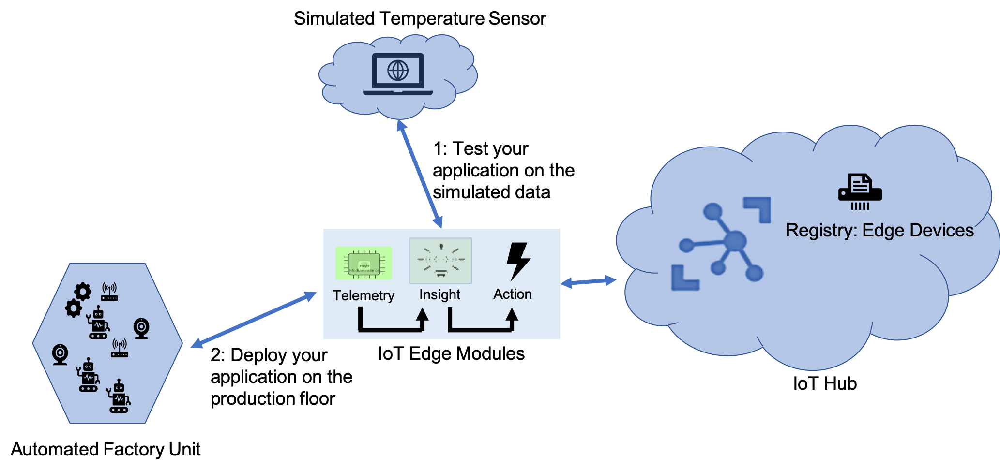

When deployed in the field, IoT devices typically generate a continuous stream of data. This data is aggerated in the cloud for analysis. The analysis of IoT data requires you to study data from multiple streams simultaneously. In the development phase of an IoT project, this data is not easy to acquire or simulate.  To simulate IoT data from an IoT Edge device, you can choose a pre-built module as an executable package and deploy this module as a container on an IoT Edge device.

Suppose you are a developer who is deploying IoT applications in a cloud for a factory automation application. You want to capture data about the machines running on the factory floor - for example, the server room or the wind turbine. But you also want to capture data about the environment around the machine. For example, you may want to record the ambient temperature around the machine. It is not easy to acquire and visualise this data from the factory floor before the application is live. Hence, you need a way to simulate the data which mimics your scenarios to test your application.

This module is a part of the AI Edge Engineer learning path.  In this module, we explore the following engineering led themes.

- Forecasting behaviour of a component or system
- Design of solutions
- Anticipating constraints/tolerances and specific operating conditions
- Safety and security considerations
- Building tools which help to create the solution  

In this module, you will register an IoT Edge device to your IoT hub. You will then start the IoT Edge runtime on your virtual device. Next, you will remotely deploy a pre-built module to an IoT Edge device which simulates the running of sensors from that device. Finally, you will view the generated data from the module to verify that the module is running on the device. Note that in this module, we are using the Azure IoT Edge on an Ubuntu virtual machine. In this case, your device already has the IoT Edge runtime installed. You are not running IoT Edge on your local machine or an ARM32 or ARM64 device.

## Learning objectives

In this module, you will:
- Launch a module from Azure Portal to IoT Edge  
- Generate simulated data from an edge device
- Verify data generated from the edge device

## Prerequisites

- Ability to use IoT Hub in Azure
- Ability to use Azure Cloud Shell
- Experience creating and managing resources using the Azure portal or Azure Cloud Shell at the beginner level
- Basic knowledge of Azure IoT Edge