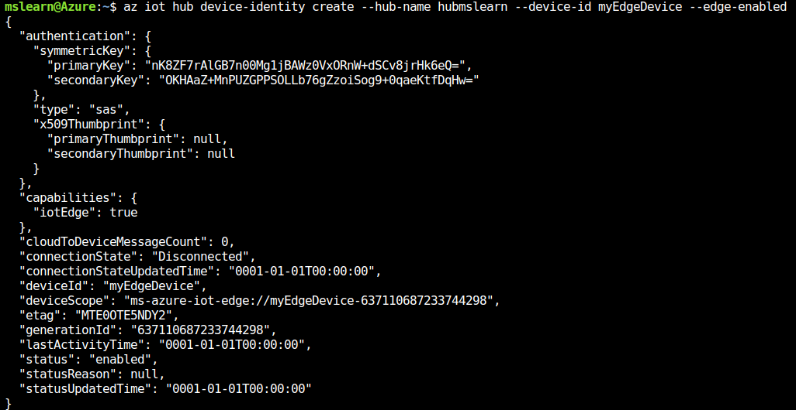
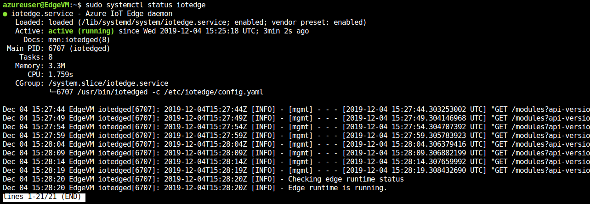

This exercise uses Azure CLI in Azure Cloud Shell to issue the required commands. 

   [](../media/cloud-shell.png)

## Install Azure IoT extension

You need to add the Azure IoT extension to the Cloud Shell instance Azure CLI.

```
az extension add --name azure-iot
```

> [!NOTE]
> This article uses the newest version of the Azure IoT extension, called `azure-iot`. The legacy version is called `azure-cli-iot-ext`.You should only have one version installed at a time. To see what extensions you have installed, use `az extension list`.
> 
> Use `az extension remove --name azure-cli-iot-ext` to remove the legacy version of the extension.
>
> Use `az extension add --name azure-iot` to add the new version of the extension.

## Create a resource group

Create a resource group called "IoTEdgeResources" using the following command:

```azurecli
az group create --name IoTEdgeResources --location eastus2
```

The resulting output should be similar to this:

[](../media/resource-group.png)

## Create an IoT hub

The following code creates a free **F1 tier** hub in the resource group "IoTEdgeResources". Replace `{hub_name}` with a unique name for your IoT Hub.

```azurecli
az iot hub create --resource-group IoTEdgeResources --name {hub_name} --sku F1 --partition-count 2
```

> [!NOTE]
> If you get an error because there's already one free hub in your subscription, change the SKU to **S1**. Each subscription can only have one free IoT hub. If you get an error that the IoT hub name isn't available, it means that someone else already has a hub with that name. 

## Register an IoT Edge device

In the Azure Cloud Shell, use the following instructions to create a device named "myEdgeDevice" in your hub.

### Create a device identity

Since IoT Edge devices behave and can be managed differently compared to typical IoT devices, declare this identity to be for an IoT Edge device with the `--edge-enabled` flag.

> [!IMPORTANT]
> If you get an error about "iothubowner policy keys", make sure that your Cloud Shell is running the latest version of the `azure-iot` extension.

The following command creates the device identity:

```azurecli
az iot hub device-identity create --hub-name {hub_name} --device-id myEdgeDevice --edge-enabled
```

[](../media/create-device-id.png)

### Retrieve the connection string

To retrieve the connection string for your device, which links your physical device with its identity in IoT Hub, use this command:

```azurecli
az iot hub device-identity connection-string show --device-id myEdgeDevice --hub-name {hub_name} --output table
```

The resulting output should be similar to this:

   `HostName={YourIoTHubName}.azure-devices.net;DeviceId=MyNodeDevice;SharedAccessKey={YourSharedAccessKey}`

Copy the value of the `connectionString` key from the JSON output and save it. This value is the **device connection string**. You use this to configure the IoT Edge runtime in the next section.

## Deploy the IoT Edge device

Use the following CLI command to create your IoT Edge device based on the prebuilt [iotedge-vm-deploy](https://github.com/Azure/iotedge-vm-deploy) template. Copy the following command into a text editor, replace the placeholder text with your information, then copy into your bash or Cloud Shell window:

```azurecli
az deployment group create \
--resource-group IoTEdgeResources \
--template-uri "https://aka.ms/iotedge-vm-deploy" \
--parameters dnsLabelPrefix='<REPLACE_WITH_VM_NAME>' \
--parameters adminUsername='azureuser' \
--parameters deviceConnectionString=$(az iot hub device-identity connection-string show --device-id myEdgeDevice --hub-name
<REPLACE_WITH_HUB_NAME> -o tsv) \
--parameters authenticationType='password' \
--parameters adminPasswordOrKey="<REPLACE_WITH_PASSWORD>"
```

Make sure that your password(**adminPasswordOrKey**) must be at least 12 characters long and have three of four of the following: lowercase characters, uppercase characters, digits, and special characters.

It may take a few minutes to create and start the new virtual machine. Once the deployment is complete, you should receive JSON-formatted output in the CLI that contains the SSH information to connect to the virtual machine. Copy the value of the **public SSH** entry of the **outputs** section:

## View the IoT Edge runtime status

Use the following command to connect to your virtual machine. Replace `azureuser` if you used a different username than the one suggested during the deployment of the VM. Replace `{DNS name}` with your machine's DNS name.

```bash
ssh {admin username}@{DNS name}
```

## Check if the IoT Edge device is configured

To verify that the IoT Edge security daemon is running as a system service, we use `iotedge` commands. 

> [!IMPORTANT]
> You need elevated privileges to run iotedge commands.  

Run the following commands to test the status of the IoT Edge device:

```bash
sudo systemctl status iotedge
```

The resulting output should be similar to this:




**Your IoT Edge device is now configured.** It's ready to run cloud-deployed modules.

If you need to troubleshoot the service, retrieve the service logs.

```bash
journalctl -u iotedge
```

View all the modules running on your IoT Edge device. Since the service just started for the first time, you should only see the **edgeAgent** module running. The edgeAgent module runs by default and helps to install and start any additional modules that you deploy to your device.

```bash
sudo iotedge list
```