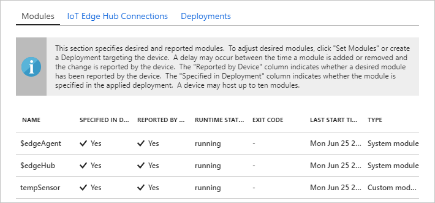

To deploy the "Simulated Temperature Sensor" module from the Azure Marketplace, use the following steps:

1. In the Azure portal, enter "Simulated Temperature Sensor" into the search and open the **Marketplace** result.

1. Choose an IoT Edge device to receive this module. On the "Target Devices for IoT Edge Module" page, provide the following information:
    * **Subscription:** Select the subscription containing the IoT hub you're using
    * **IoT Hub:** Select the name of the IoT hub you're using
    * **IoT Edge Device Name:** As selected before  

1. Click "Create".

1. Using the three-step wizard, define precisely how to deploy the module.
    * **Add Modules**: The "Simulated Temperature Sensor" module should be auto-populated.
    * **Specify Routes**: Define how messages are passed between modules and to IoT Hub. If this setting isn't auto-populated to `$upstream`, add the following code:

    ```JSON
    {
      "routes": {
        "route": "FROM /messages/* INTO $upstream"
      }
    }
    ```

    * **Review Deployment:** preview the deployment manifest JSON file that defines all the modules deployed to your IoT Edge device. Ensure it includes the "Simulated Temperature Sensor" module.  

1. Select your device from the list of IoT Edge devices to see its details.
    * On the device details page, scroll down to the Modules section.
    * Three modules should be listed: `$edgeAgent`, `$edgeHub`, and `SimulatedTemperatureSensor`. The list should look similar to the screenshot below.

    > [!IMPORTANT]
    > If a **module is listed as "in deployment"** but not reported by the device, your IoT Edge device is still starting it. **Wait a few moments and click "Refresh"** at the top of the page.

    

1. Open the command prompt on your IoT Edge device, or use the SSH connection from Azure CLI.
1. Confirm that the module deployed from the cloud is running on your IoT Edge device using the `sudo iotedge list` command.
1. View the messages being sent from the temperature sensor module using the command `sudo iotedge logs SimulatedTemperatureSensor -f`. 

    > [!IMPORTANT]
    > Note that IoT Edge commands are case-sensitive when referring to module names.

1. Clean up resources
