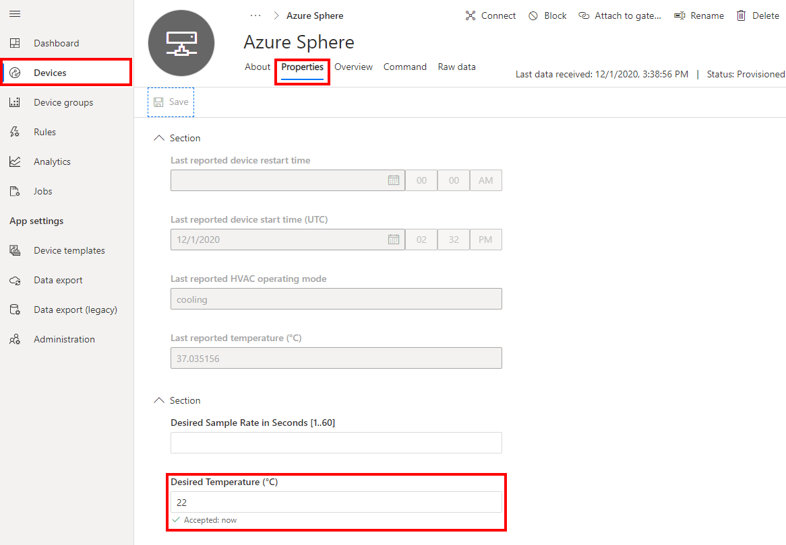

## Step 1: Open the project

1. Start Visual Studio Code to open your project.
2. Click **Open folder**.
3. Open the **Azure-Sphere lab** folder.
4. Open the **Lab_3_Device_Twins** folder.
5. Click **Select Folder** or the **OK** button to open the project.

------

## Step 2: Set your developer board configuration

These labs support developer boards from Avnet and Seeed Studio. You need to set the configuration that matches your developer board.

The default developer board configuration is for the Avnet Azure Sphere Starter Kit. If you have this board, there's no additional configuration required.

1. Open the **CMakeList.txt** file.
2. Add a `#` at the beginning of the set Avnet line to disable it.
3. Uncomment the `set` command that corresponds to your Azure Sphere device developer board.

   ```text
   set(AVNET TRUE "AVNET Azure Sphere Starter Kit")
   # set(SEEED_STUDIO_RDB TRUE "Seeed Studio Azure Sphere MT3620 Development Kit (aka Reference Design Board or rdb)")
   # set(SEEED_STUDIO_MINI TRUE "Seeed Studio Azure Sphere MT3620 Mini Dev Board")
   ```

4. Save the file. This will auto-generate the CMake cache.

------

## Step 3: Configure the Azure IoT connection information

1. Open the **app_manifest.json** file.
2. You'll need to redo the settings for the **app_manifest.json** file. Either copy the settings from Notepad if you still have it open or copy them from the **app_manifest.json** file you created in the previous exercise.
3. Paste the contents of the clipboard into **app_manifest.json** and save the file.

------

## Step 4: Start the app build deploy process

1. Ensure main.c is open.
2. Select **CMake: [Debug]: Ready** from the Visual Studio Code Status Bar.
3. From Visual Studio Code, press F5 to build, deploy, start, and attach the remote debugger to the application that's now running the Azure Sphere device.

------

## Step 5: Expected device behavior

### Avnet Azure Sphere MT3620 Starter Kit


1. The WLAN LED will blink every 5 seconds when connected to Azure.
1. The RGB LED will turn red if the measured temperature is less than the desired temperature, blue if the measured temperature is greater than the desired temperature and green if the measured temperature is the same as the desired temperature.

### Seeed Studio Azure Sphere MT3620 Development Kit


1. The WLAN LED will blink every 5 seconds when connected to Azure.
1. The RGB LED will turn red if the measured temperature is less than the desired temperature, blue if the measured temperature is greater than the desired temperature and green if the measured temperature is the same as the desired temperature.

### Seeed Studio MT3620 Mini Dev Board


1. The User LED will blink every 5 seconds when connected to Azure.

------

## Step 6: Display the actual temperature property

1. Switch to Azure IoT Central in your browser.

2. Select **Devices**, then the **Azure Sphere** template, then your device.

3. Select the **Properties** tab.

    > [!NOTE]
    > Azure IoT Central does not update immediately. It might take a minute or two for the device telemetry to be displayed.


------

## Step 7: Set the desired temperature

Setting the desired temperature is like setting a thermostat in a room. A device twin property message for desired temperature is sent to Azure Sphere, where it will be acted upon.

When the temperature sensor is read on the Azure Sphere, it is compared to the desired temperature.

- If the temperature is greater than the desired temperature, the RGB LED will turn blue to indicate the cooler needs be turned on.
- If the temperature is less than the desired temperature, the RGB LED will turn red to indicate the heater needs to be turned on.
- If the temperature is the same as the desired temperature, the RGB LED will turn green to indicate no action required.

> The Avnet Azure Sphere Starter Kit has a built-in temperature sensor. For other boards, a random temperature of 25 +/- 5 degrees Celsius is generated.

To set the desired temperature:

1. Update the **Desired Temperature** value.
2. Save the property. This will send the desired temperature property to Azure Sphere. The RGB LED color will change depending on the desired temperature chosen.



------

## Close Visual Studio

Now close Visual Studio.
