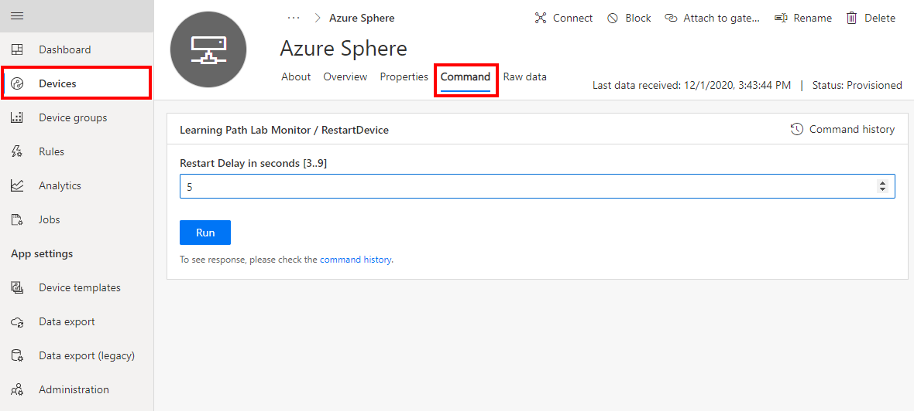

## Step 1: Build and deploy your application

1. Start Visual Studio Code to open your project.

2. Click **Open folder**.

3. Open the Azure-Sphere lab folder.

4. Open the **Lab_3_Device_Twins** folder.

5. Click **Select Folder** or the **OK** button to open the project.

6. Set your developer board configuration

   1. Open CMakeList.txt
   2. Uncomment the **set** command that corresponds to your Azure Sphere developer board.
   3. Save the file. This will autogenerate the CMake cache.

7. Configure the Azure IoT Central connection information

   1. Open the **app_manifest.json** file.
   2. You'll need to redo the settings for the **app_manifest.json** file. Either copy from **Notepad** if you still have it open or copy from the **app_manifest.json** file you created in the previous exercise.
   3. Paste the contents of the clipboard into **app_manifest.json** and save the file.

8. Ensure main.c is open.

9. Select **CMake: [Debug]: Ready** from the Visual Studio Code Status Bar.

10. From Visual Studio Code, press F5 to build, deploy, start, and attached the remote debugger to the application now running the Azure Sphere device.

## Expected Device Behavior

### Avnet Azure Sphere MT3620 Starter Kit

1. The RGB LED5 will start to blink. In the next section, you will be setting the desired temperature which will determine the RGB LED colour.
2. LED4 will turn yellow when connected to Azure.
3. LED3 will blink when telemetry is sent to IoT Central
4. Press **Button A** or **Button B** on the device to change the blink rate of LED5 and to update the **Actual Temperature** Device twin property in IoT Central.

### Seeed Studio Azure Sphere MT3620 Development Kit

1. The RGB LED 1 will start to blink. In the next section, you will be setting the desired temperature which will determine the RGB LED colour.
2. The network LED will turn red when connected to Azure.
3. LED 4 will blink blue when telemetry is sent to IoT Central
4. Press **Button A** or **Button B** on the device to change the blink rate of RGB LED 1 and to update the **Actual Temperature** Device twin property in IoT Central.

### Seeed Studio MT3620 Mini Dev Board

1. The green LED closest to the USB connector will start to blink
2. Given this device has no builtin buttons then virtual **Button A** and **Button B** presses will be generated every 10 seconds. The blink rate will change and the **Actual Temperature** Device twin property in IoT Central will be updated.

## Testing Azure IoT Central Commands

1. From Visual Studio, ensure the Azure Sphere is running the application and set a breakpoint in the **ResetDirectMethod** handler function.

2. Switch to Azure IoT Central in your web browser.

3. Select the Azure IoT Central **Commands** tab.

4. Set the **Reset Azure Sphere** time in seconds, then click **Run**.

5. Observer the device rebooting. The LEDs will turn off for a few seconds.

   

6. Switch back to Visual Studio. The application execution should have stopped where you set the breakpoint. Step over code F10, step into code F11, and continue code execution F5.

7. Switch back to Azure IoT Central, and click the Command History button to view the result of the command.

    > [!NOTE]
    > You may see a timed out message in the history depending on how long it took you to step through the code in Visual Studio.
