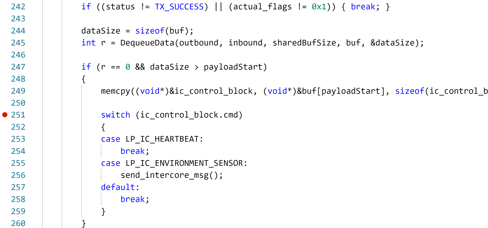

## Step 1: Delete the existing applications on the Azure Sphere

1. There will be some GPIO pin reassignments between the existing High-Level application that is running on the Azure Sphere and the new Real-Time application that will be deployed to the Azure Sphere in this exercise. So you need to delete any existing applications on the Azure Sphere to avoid clashes.

    From the **Azure Sphere Developer Command Prompt**, delete the existing application by running

    ```bash
    azsphere device sideload delete
    ```

2. You must restart the Azure Sphere device to clear existing the existing silicon firewall settings. From the **Azure Sphere Developer Command Prompt**, run

    ```bash
    azsphere device restart
    ```

------

## Step 2: Open the project

1. Start Visual Studio Code to open your project.
2. Click **Open folder**.
3. Open the **Azure-Sphere lab** folder.
4. Open the **Lab_6_AzureRTOS_Integration** folder.
5. Click **Select Folder** or the **OK** button to open the project.

    

------

## Step 3: Set your developer board configuration

These labs support developer boards from AVNET and Seeed Studio. You need to set the configuration that matches your developer board.

The default developer board configuration is for the AVENT Azure Sphere Starter Kit. If you have this board, there is no additional configuration required.

1. Open CMakeList.txt
2. Add a # at the beginning of the set AVNET line to disable it.
3. Uncomment the **set** command that corresponds to your Azure Sphere developer board.

    ```text
    set(AVNET TRUE "AVNET Azure Sphere Starter Kit")
    # set(SEEED_STUDIO_RDB TRUE "Seeed Studio Azure Sphere MT3620 Development Kit (aka Reference Design Board or rdb)")
    # set(SEEED_STUDIO_MINI TRUE "Seeed Studio Azure Sphere MT3620 Mini Dev Board")
    ```

4. Save the file. This will auto-generate the CMake cache.

------

## Step 4: Deploy the Azure RTOS Application to Azure Sphere

1. Ensure main.c is open.
2. Select **CMake: [Debug]: Ready** from the Visual Studio Code Status Bar.

    

3. From Visual Studio Code, press <kbd>F5</kbd> to build, deploy, start, and attached the remote debugger to the application now running the Azure Sphere device.

------

## Step 5: Debugging Real-Time Core Applications

You can Debug the Azure RTOS application running on Azure Sphere Cortex M4 Real-Time Core.

1. From Visual Studio Code, navigate to the **demo_threadx** directory, and open the **demo_azure_rtos.c** file.
2. Scroll down to the function named **intercore_thread**.
3. Set a [Visual Studio Code Breakpoint](https://code.visualstudio.com/docs/editor/debugging#_breakpoints&WT.mc_id=julyot-azd-dglover) in the intercore_thread function on the line that reads **switch (ic_control_block.cmd)**

    

4. Leave Visual Studio Code and the app running with the breakpoint set. Next we are going to deploy a High Level app application to the Cortex A7 core which will request environment telemetry from the Real Time app running on the Cortex M4 core.
