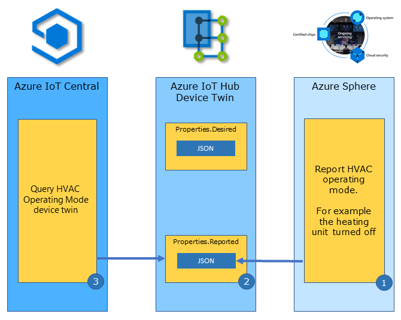
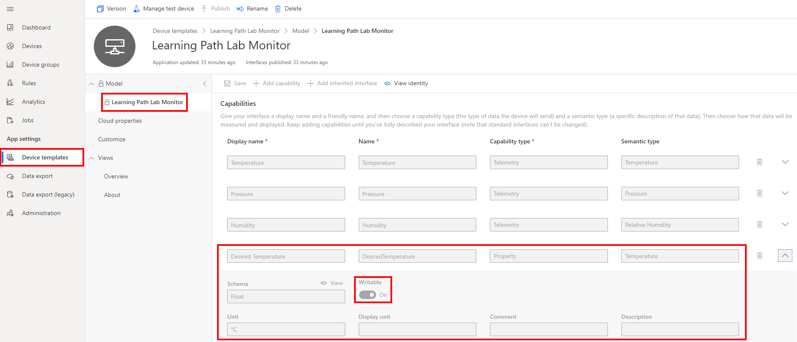

In this unit, you will learn how to partner a High-level application with a Real-time core application.

------

## Solution architecture

In this unit we will learn how to partner a high level application with a Azure RTOS Real-time application running on one of the Azure Sphere Cortex-M4 cores.


To recap the solution architecture introduced in the Azure RTOS lab.

1. The Azure RTOS Real-time environment sensor thread runs every 2 seconds. The thread stores in memory the latest environment temperature, humidity, and pressure data.
2. The High-level telemetry streaming app requests from the Real-time core the latest environment data.
3. The Azure RTOS Real-time environment service thread responses with the latest environment data.
4. The High-level application serializes the environment data as JSON and sends as a telemetry message to IoT Hub
5. Azure IoT Central subscribes to telemetry messages sent to IoT Hub by the device and displays the data to the user.
6. The IoT Central user can also set the desired temperature for the room by setting a property. The property is set on the device via an IoT Hub device twin message.
7. The Azure Sphere then sets the HVAC operating mode to meet the desired temperature.

------

## Intercore message contract

There needs to be a contract that describes the shape of the data being passed between the cores. The following structure declares the intercore contract used in this unit. You can find this contact in the **IntercoreContract** directory.

```c
typedef enum
{
  LP_IC_UNKNOWN,
  LP_IC_HEARTBEAT,
  LP_IC_ENVIRONMENT_SENSOR,
} LP_INTER_CORE_CMD;

typedef struct
{
  LP_INTER_CORE_CMD cmd;
  float temperature;
  float pressure;
  float humidity;
} LP_INTER_CORE_BLOCK;
```

------

## Intercore security

To communicate, applications running across cores must be configured with corresponding Component IDs.

The Component ID for the Real-time application can be found in its **app_manifest.json** file.

```json
{
  "SchemaVersion": 1,
  "Name": "AzureSphereIoTCentral",
  "ComponentId": "25025d2c-66da-4448-bae1-ac26fcdd3627",
  ...
}
```

### High-Level intercore capabilities

The following is the High-Level **app_manifest.json** file, the **AllowedApplicationConnections** property is set to the Component ID of the Azure RTOS Real-Time application.

```json
{
  "SchemaVersion": 1,
  "Name": "AzureSphereIoTCentral",
  "ComponentId": "25025d2c-66da-4448-bae1-ac26fcdd3627",
  "EntryPoint": "/bin/app",
  "CmdArgs": [
    "--ConnectionType", "DPS", "--ScopeID", "Your_ID_Scope",
    "--RTComponentId", "6583cf17-d321-4d72-8283-0b7c5b56442b"
  ],
  "Capabilities": {
    "Gpio": [
      "$NETWORK_CONNECTED_LED",
      "$LED_RED",
      "$LED_GREEN",
      "$LED_BLUE"
    ],
    "PowerControls": [
      "ForceReboot"
    ],
    "AllowedConnections": [
      "global.azure-devices-provisioning.net"
    ],
    "DeviceAuthentication": "Replace_with_your_Azure_Sphere_Tenant_ID",
    "AllowedApplicationConnections": [ "6583cf17-d321-4d72-8283-0b7c5b56442b" ]
  },
  "ApplicationType": "Default"
}
```

------

## Requesting the environment data from the Real-time core application

### Initializing intercore communications.

In the **InitPeripheralAndHandlers** a call is made to **lp_interCoreCommunicationsEnable**. The Component ID of the Real-time as well as the name of the function that will be called when a message is received from the Real-time core.

```c

```

### Sending a request to the Real-time core

To request the envireonment data from the Real-time core then:

1. Set the intercore control block command to LP_IC_ENVIRONMENT_SENSOR.
2. Send the request message by calling lp_interCoreSendMessage and passing the intercore control block.

```c
/// <summary>
/// Read sensor and send to Azure IoT
/// </summary>
static void MeasureSensorHandler(EventLoopTimer* eventLoopTimer)
{
    if (ConsumeEventLoopTimerEvent(eventLoopTimer) != 0)
    {
        lp_terminate(ExitCode_ConsumeEventLoopTimeEvent);
    }
    else {
        // send request to Real-Time core app to read temperature, pressure, and humidity
        ic_control_block.cmd = LP_IC_ENVIRONMENT_SENSOR;
        lp_interCoreSendMessage(&ic_control_block, sizeof(ic_control_block));
    }
}
```

------

## Responding to an intercore message

When the High-level application received a message the intercore callback function is called along with a reference to the intercore control block containing the environment data.

```c
/// <summary>
/// Callback handler for Inter-Core Messaging - Does Device Twin Update, and Event Message
/// </summary>
static void InterCoreHandler(LP_INTER_CORE_BLOCK* ic_message_block)
{
    static int msgId = 0;

    switch (ic_message_block->cmd)
    {
    case LP_IC_ENVIRONMENT_SENSOR:
        if (snprintf(msgBuffer, JSON_MESSAGE_BYTES, msgTemplate, ic_message_block->temperature,
            ic_message_block->humidity, ic_message_block->pressure, msgId++) > 0) {

            Log_Debug("%s\n", msgBuffer);
            lp_azureMsgSendWithProperties(msgBuffer, telemetryMessageProperties, NELEMS(telemetryMessageProperties));

            SetHvacStatusColour((int)ic_message_block->temperature);

            // If the previous temperature not equal to the new temperature then update ReportedTemperature device twin
            if (previous_temperature != (int)ic_message_block->temperature) {
                lp_deviceTwinReportState(&dt_reportedTemperature, &ic_message_block->temperature);
            }
            previous_temperature = (int)ic_message_block->temperature;
        }
        break;
    default:
        break;
    }
}
```


## Understanding IoT Central properties

Azure IoT Central uses properties to represent point-in-time values. IoT Central can use properties to set state on a device, for example, set the desired room temperature. A device can also use properties to report its current state, for example, report the operating mode of an HVAC (Heating, Ventilation, and Air Conditioning) unit, is it currently heating, cooling, or turned off.

IoT Central is an Azure IoT Hub application and it sets device properties using IoT Hub device twins. Device twins are JSON documents that Azure IoT Hub keeps in the cloud for all devices and is used for storing device information, including metadata, configurations, and conditions. IoT Hub device twins are often used for long-running commands intended to put the device into a certain state and return it to that state after a device restart. For example, setting the desired room temperature.

Properties can be used in the following ways:

- Cloud-to-device updates
- Device-to-cloud updates
- Querying reported properties

<!-- ### Using device twins

- Cloud-to-device updates.

    A user sets an Azure IoT Central device property such as setting the desired temperature of the room. Azure IoT Central requests Azure IoT Hub to send a device twin message to the device. The device actions and acknowledges the request. Azure IoT Hub updates the device twin reported property and IoT Central can then query and display this reported property.

- Device-to-cloud updates.

    A device can send a device twin message for a reported property to Azure IoT Hub, such as reporting its firmware level on startup. Azure IoT Hub stores the reported property.

- Querying reported properties.

    With the reported state of device twins stored in Azure, it is possible to query the stored device twin properties on the cloud side. For example, list all devices with a firmware version less than 2.0, as these devices require an update. Or, list all rooms with a temperature setting higher than 25 degrees Celsius. -->

------

## Controlling the heating, ventilation, and air conditioning unit (HVAC) using Azure IoT Central properties

From the IoT Central device properties tab, you can set the desired temperature property. Azure IoT Central requests Azure IoT Hub to send a device twin message to the device. The device actions and acknowledges the request. Azure IoT Hub updates the device twin reported property and IoT Central then queries and display this reported property.


### Steps to controlling the HVAC unit from IoT Central

The following steps outline how Azure IoT Central uses device twins to set properties on a device:

1. A user sets the desired room temperature property in Azure IoT Central. IoT Central then requests IoT Hub to update the property.
1. Azure IoT Hub updates the device twin desired property and sends a device twin message to the device.
1. The corresponding device twin handler function is called.
1. The device implements the desired property; in this case, turn on the heater or cooler to bring the room to the desired temperature.
1. The device acknowledges the updated configuration to Azure IoT Hub. Azure IoT Hub updates the device twin reported property.
1. IoT Central queries and displays the device twin reported property data to the user.

------


## Getting started with device twin bindings

Remember, Azure IoT Central properties are implemented using Azure IoT Hub device twins. A device twin binding maps a device twin property name with a handler function that will be called to implement the action.

The following example declares a Device Twin Binding to set the desired room temperature. This declaration maps the Azure IoT Central `DesiredTemperature` property with a handler function named `DeviceTwinSetTemperatureHandler`.

```c
static LP_DEVICE_TWIN_BINDING dt_desiredTemperature = {
    .twinProperty = "DesiredTemperature",
    .twinType = LP_TYPE_FLOAT,
    .handler = DeviceTwinSetTemperatureHandler };
```

### Setting the desired temperature

The following is the implementation of the handler function `DeviceTwinSetTemperatureHandler`. The handler function is called when the device receives a `DesiredTemperature` desired property message from Azure IoT Hub.

> [!NOTE]
> As part of the [IoT Plug and Play](https://docs.microsoft.com/en-us/azure/iot-pnp/concepts-convention) conventions, the device should acknowledge the device twin update with a call to **lp_deviceTwinAckDesiredState**.

```c
/// <summary>
/// Device Twin Handler to set the desired temperature value
/// </summary>
static void DeviceTwinSetTemperatureHandler(LP_DEVICE_TWIN_BINDING* deviceTwinBinding)
{
    // validate data is sensible range before applying
    if (deviceTwinBinding->twinType == LP_TYPE_FLOAT && *(float*)deviceTwinBinding->twinState >= -20.0f && *(float*)deviceTwinBinding->twinState <= 80.0f)
    {
        lp_deviceTwinAckDesiredState(deviceTwinBinding, deviceTwinBinding->twinState, LP_DEVICE_TWIN_COMPLETED);
        SetHvacStatusColour((int)previous_temperature);
    }
    else {
        lp_deviceTwinAckDesiredState(deviceTwinBinding, deviceTwinBinding->twinState, LP_DEVICE_TWIN_ERROR);
    }
}
```

------

## Reporting the current HVAC operating mode

The HVAC operating mode depends on the room temperature, it can be heating, or cooling, or turned off. We can use a device-to-cloud device twin update to report the current operating mode of the HVAC unit.

### Device-to-cloud updates



1. The Azure Sphere detects the HVAC operating mode has changed.
1. The Azure Sphere sends a device twin message to report the new operating mode of the HVAC to Azure IoT Hub.
1. IoT Central queries and displays the updated operating mode of the HVAC unit.

The following example declares a **ReportedHvacState** device twin property of type **string**. A handler function is not required as this is a one-way device-to-cloud binding.

```c
static LP_DEVICE_TWIN_BINDING dt_reportedHvacState = {
    .twinProperty = "ReportedHvacState",
    .twinType = LP_TYPE_STRING };
```

The device updates the **ReportedHvacState** property by calling the **lp_deviceTwinReportState** function. You must pass a property of the correct type.

```c
lp_deviceTwinReportState(&dt_reportedHvacState, (void*)hvacState[(int)current_led]);
```

------

## How device twin messages are mapped to handlers

All declared device twin bindings must be added by reference to the deviceTwinBindingSet array. When a device twin message is received by the device from Azure IoT Hub it is checked for a matching *twinProperty* name in the deviceTwinBindingSet array. When a match is found, the corresponding handler function is called.

```c
LP_DEVICE_TWIN_BINDING* deviceTwinBindingSet[] = { &dt_desiredTemperature, &dt_reportedTemperature, &dt_reportedHvacState };
```

### Opening the device twin binding set

Device twin binding sets are initialized in the **InitPeripheralsAndHandlers** function in **main.c**.

```c
lp_deviceTwinSetOpen(deviceTwinBindingSet, NELEMS(deviceTwinBindingSet));
```

### Closing the device twin binding set

Device twin bindings sets are closed in the **ClosePeripheralsAndHandlers** function in **main.c**.

```c
lp_deviceTwinSetClose();
```

------

## Azure IoT Central device properties

Azure IoT Central device properties are defined in device templates.

[](../media/iot-central-device-template-interface-led1.png)

### Review the IoT Central property definition

1. From Azure IoT Central web portal, navigate to **Device templates**, and select the **Azure Sphere** template.
2. Click on **Interface** to list the interface capabilities.
3. Scroll down and expand the **Desired Temperature** capability.
4. Review the definition of **Desired Temperature**. The capability type is **Property**, the schema type is **Float**, and the property is **Writeable**. Writeable means this property is enabled for cloud-to-device updates.
5. This must match the DesiredTemperature Device Twin Binding declaration on the Azure Sphere.
