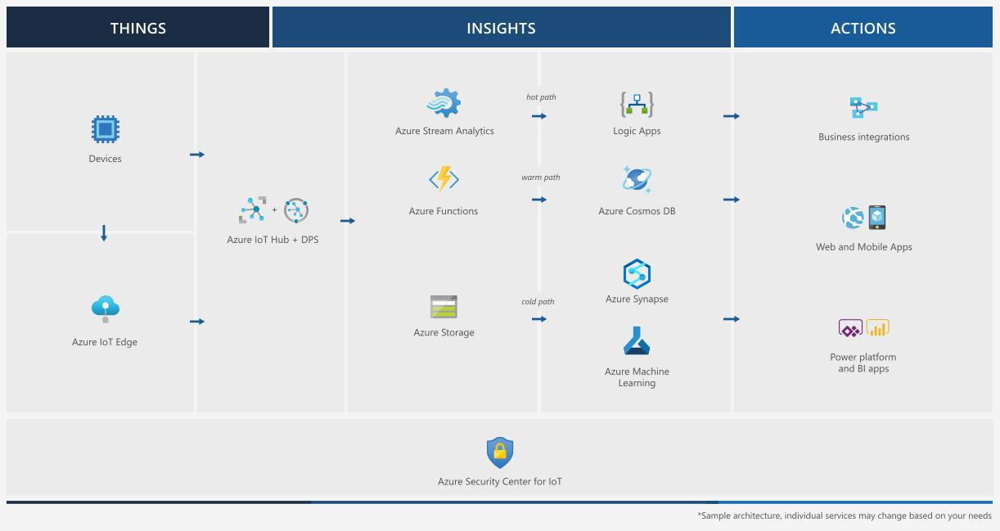

You run applications on the Azure Sphere to stream room environment data to the cloud to IoT Central. From IoT Central you were able to monitor and control your Azure Sphere.

We learnt that Azure Sphere is secure by default, with ongoing updates, and multiple layers of security. Azure Sphere protects our IoT devices, our networks, and our solutions, and it also helps to protect against software bugs and mistakes we make in our applications.

We also learnt that Azure Sphere is flexible and supports a wide range of application scenarios. Azure Sphere has three developer-accessible cores. You ran a high-level application while running time sensitive applications on the real-time Cortex-M4 cores.

Internet of Things security was critical for this microbiology lab. Without this Azure Sphere-based application, you would need to manually record room conditions at regular intervals. Using this solution, you can record accurate and secure results in near real time.

## Azure IoT reference architecture

Azure Sphere and IoT Hub are only part of an Internet of Things solution. You can learn more about IoT solutions by reviewing the [Azure IoT reference architecture](/azure/architecture/reference-architectures/iot?azure-portal=true) guide.

## Next steps

To learn more about Azure Sphere and IoT Hub then review the following resources.

1. [Azure Sphere documentation](/azure-sphere?azure-portal=true)
1. [Azure IoT Central documentation](/azure/iot-central/?azure-portal=true)
1. [Azure IoT reference architecture](/azure/architecture/reference-architectures/iot?azure-portal=true)
1. [Microsoft Certified: Azure IoT Developer Specialty](/learn/certifications/azure-iot-developer-specialty?azure-portal=true)

## Learning module feedback

Take a moment to rate this learning module and provide feedback to help us improve the learning experience. Thank you.